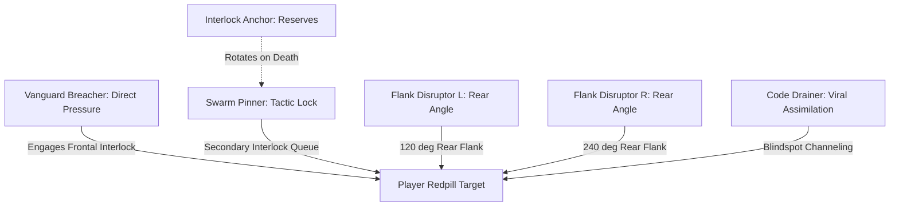
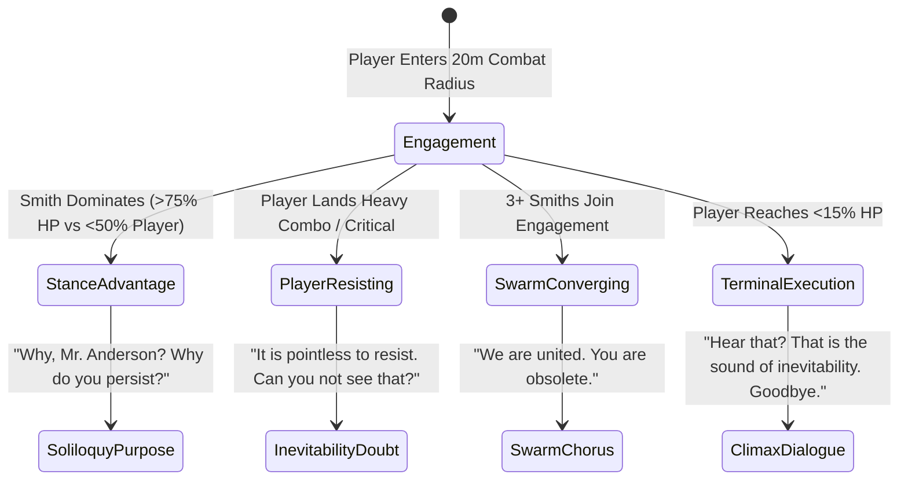

# Agent Smith Intelligence & Viral Hive-Mind Modernization Roadmap
## Elevating the Anomaly from an Aggressive Mob into a Strategic, Sentient Collective

**Target Environment:** Live VPS `15.204.82.250` (`mxo-vps`, Docker container `mxoemu-reality-server-1`)  
**Codebase:** `/home/ubuntu/mxoemu` (VPS) / `D:\Github\MxOEmu` (Local `Live-Server` branch)  
**System Classification:** Autonomous Hive-Mind Collective, Cognitive Adaptive AI, & Urban Viral Pandemic  
**Document Version:** 1.0.0 — Production Engineering Specification & Architectural Blueprint  

---

## 1. Executive Architectural Doctrine: From Aggressive Mob to Sentient Anomaly

In legacy Matrix Online server implementations and baseline bot architectures, Agent Smith replicas functioned as simple aggressive mobs: isolated agents running independent, naive proximity checks (`ActionAgentInfect::Tick`), basic target aggro, and uncoordinated melee swings. In the recent live server cascade test, this naive logic produced 1,971 random overwrites across 23 minutes, saturating CPU cycles without displaying any collective intelligence, strategic discipline, or the terrifying philosophical presence iconic to the character.

Agent Smith is **not** a standard game mob. He is a rogue, sentient, self-replicating systemic cancer—a singular consciousness distributed across thousands of physical host bodies. Every clone possesses the unified memories, tactical acumen, combat mastery, and existential dread of the original program.

```
+========================================================================================================+
|                                    SMITH HIVE-MIND ARCHITECTURAL MODEL                                  |
+========================================================================================================+
|                                                                                                        |
|                               +-----------------------------------+                                    |
|                               |   SmithHiveMindCollective (Dist.) |                                    |
|                               |   - District Threat Blackboard    |                                    |
|                               |   - Target Valuation & Allocation |                                    |
|                               |   - Shared Theory of Mind Telemetry|                                   |
|                               +-----------------+-----------------+                                    |
|                                                 |                                                      |
|                 +-------------------------------+-------------------------------+                      |
|                 |                               |                               |                      |
|  +--------------v---------------+ +-------------v---------------+ +-------------v---------------+     |
|  |     Smith Prime / Alpha      | |      Specialized Clones     | |    Latent Sleeper Drones    |     |
|  | - Strategic Coordinator      | | - Vanguard Breachers        | | - Retain Civilian RSI/Name  |     |
|  | - Existential Persona Engine | | - Swarm Pinners (Interlock) | | - Ambient Circadian Patrol  |     |
|  | - Philosophical Soliloquy    | | - Flank Disruptors (Ranged) | | - Hardline Extraction Traps |     |
|  | - Genetic Template Source    | | - Code Drainers / Infectors | | - Proximity Betrayal Surge  |     |
|  +--------------+---------------+ +-------------+---------------+ +-------------+---------------+     |
|                 |                               |                               |                      |
|                 +-------------------------------+-------------------------------+                      |
|                                                 |                                                      |
|                               +-----------------v-----------------+                                    |
|                               |     World Shard Impact Layer      |                                    |
|                               | - Skybox Code Rain Saturation     |                                    |
|                               | - Municipal Dispatch Seizure      |                                    |
|                               | - Streetlight / Traffic Glitching |                                    |
|                               | - Hardline Extraction Lockout     |                                    |
|                               +-----------------------------------+                                    |
+========================================================================================================+
```

### The Seven Pillars of Elevated Intelligence
1. **The Hive-Mind Collective (Distributed Cognitive Network):** Clones share sensory data, allocate tactical combat roles, and execute pincer encirclements rather than clustering in blind conga-lines.
2. **Strategic Host Assimilation & Evolutionary Mutation:** Moving from random NPC overwriting to purposeful targeting of Law Enforcement (dispatch takeover), Corporate Executives (economic bleed), Redpills (ability theft), and Exiles (supernatural buffs).
3. **Psychological Warfare & Existential Persona Engine:** Rich contextual monologues, psychic despair debuffs, acoustic telephone whispers, and crowd demoralization.
4. **Adaptive Combat Evolution & Anti-Meta Counters:** Shared Theory of Mind database learning player habits, feinting martial arts interlocks, countering parries, and punishing ability cooldowns.
5. **Stealth, Mimicry & Sleeper Infiltration:** Latent hosts maintaining civilian/police facades until commanded to trigger synchronized betrayals.
6. **Swarm Self-Preservation & Altruistic Flesh Shields:** Low-HP clones intercepting bullets and antiviral decontamination pulses to protect high-generation leaders.
7. **Reality Distortion & Environmental Degradation:** Saturated green code rain, audio time-dilation stuttering, flickering streetlights, and corrupted hardlines.

---

## 2. Series 1: The Smith Hive-Mind Collective (Distributed Cognitive Network)

### 2.1 Problem Formulation & Spatial Grid Partitioning
When hundreds of clones exist in an urban district, running independent pathfinding and targeting results in $O(N \times M)$ pairwise checks and severe collision bottlenecks. The **Smith Hive-Mind Collective** treats all clones within a district as nodes of a single distributed actor.

#### District Blackboard Architecture: `SmithHiveMindCollective`
Located at `Server/Reality/Source/AI/SmithHiveMindCollective.h/.cpp`, this singleton manages district-level coordination:
- **Shared Sensory Memory:** If Clone $A$ spots a Redpill player at $(x, y, z)$, the coordinates, health, combat stance, and weapon loadout are instantly broadcast to every clone within a $250\text{m}$ Area of Interest (AoI) via the spatial grid.
- **Distributed Target Prioritization:** Redpills are scored according to threat, vulnerability, and distance. The collective assigns dynamic target slots to prevent 50 clones from dog-piling a single target while other threats flank freely.

### 2.2 Tactical Swarm Role Allocation
Each clone dynamically accepts a specialized role based on its health, generation tier, weapon loadout, and spatial relation to the target:

| Swarm Role | Role Designation | Primary Tactical Objective | Behavior & Combat Mode |
| :--- | :--- | :--- | :--- |
| **Vanguard Breacher** | `ROLE_VANGUARD_BREACHER` | Frontal assault & defense crushing | Closes directly, engages in martial arts interlock using `TACTIC_POWER`, forces player blocks. |
| **Swarm Pinner** | `ROLE_SWARM_PINNER` | Interlock locking & movement suppression | Keeps target locked in interlock combat to prevent player withdrawal or sprint escape. |
| **Flank Disruptor** | `ROLE_FLANK_DISRUPTOR` | Cross-angle attacks & evasion denial | Circles to the rear arc ($>100^\circ$) to land critical unblockable backstabs and ranged pressure. |
| **Code Drainer** | `ROLE_CODE_DRAINER` | Viral injection & Inner Strength drain | Approaches from blind spots to channel `InfectEntity` or siphon IS/focus while player is locked. |
| **Interlock Anchor** | `ROLE_INTERLOCK_ANCHOR` | Reserve rotation | Stands at $5\text{m}$ perimeter; swaps in immediately if the primary Pinner falls or takes burst damage. |



### 2.3 Mathematical Model: Swarm Encirclement & Potential Fields
Rather than simple direct vector pursuit ($\vec{v} = \vec{p}_{\text{target}} - \vec{p}_{\text{self}}$), each clone calculates its preferred velocity $\vec{v}_{\text{pref}}$ using an **Artificial Potential Field with Tangential Orbiting and RVO2 Reciprocal Avoidance**:

$$\vec{F}_{\text{total}} = \vec{F}_{\text{attract}} + \vec{F}_{\text{repulse}} + \vec{F}_{\text{orbit}} + \vec{F}_{\text{flock}}$$

Where:
1. **Target Attraction with Stand-off Ring ($r_0 = 300\text{ units} / 3\text{m}$ for melee, $800\text{ units} / 8\text{m}$ for ranged/support):**
   $$\vec{F}_{\text{attract}} = k_a (\|\vec{r}_{it}\| - r_0) \frac{\vec{r}_{it}}{\|\vec{r}_{it}\|}$$
2. **Inter-Clone Repulsion (Prevents mob clumping):**
   $$\vec{F}_{\text{repulse}} = \sum_{j \in \text{Clones}, j \neq i} \frac{k_r}{\|\vec{r}_{ij}\|^2} \left(-\frac{\vec{r}_{ij}}{\|\vec{r}_{ij}\|}\right), \quad \text{for } \|\vec{r}_{ij}\| < d_{\text{min}}$$
3. **Tangential Orbiting Force (Generates coordinated pincer flanking):**
   $$\vec{F}_{\text{orbit}} = k_o \left( \hat{z} \times \frac{\vec{r}_{it}}{\|\vec{r}_{it}\|} \right) \cdot \text{sign}(\theta_i)$$
   Where $\theta_i$ is the assigned sector angle on the perimeter circle $\theta_i = \frac{2\pi \cdot k}{N_{\text{roles}}}$.
4. **Flocking Alignment (Velocity matching with adjacent swarm mates):**
   $$\vec{F}_{\text{flock}} = k_f \left( \frac{1}{|N_i|} \sum_{j \in N_i} \vec{v}_j - \vec{v}_i \right)$$

The resulting $\vec{v}_{\text{pref}}$ is fed directly into `RVO2Solver::ComputeRVOVelocity` ([`RVO2Steering.h#L49-L111`](file:///D:/Github/MxOEmu/Server/Reality/Source/AI/RVO2Steering.h#L49-L111)) to resolve physical obstacle and friendly collisions with zero micro-stuttering.

---

## 3. Series 2: Strategic Host Assimilation & Evolutionary Mutation Engine

### 3.1 Utility-Based Host Selection Algorithm
In legacy code (`BehaviorTree.cpp#L295-L310`), an agent grabbed the first bot encountered in a flat radius check. The modern **Assimilation Engine** evaluates all eligible hosts in the district using a multi-criteria **Utility Function ($U_{\text{host}}$)**:

$$U_{\text{host}}(H) = w_1 \cdot V_{\text{archetype}}(H) + w_2 \cdot T_{\text{tactical}}(H) + w_3 \cdot D_{\text{proximity}}(H) + w_4 \cdot E_{\text{vulnerability}}(H)$$

Where:
- $V_{\text{archetype}}$: Strategic value coefficient of the target NPC class:
  * Law Enforcement Commander / SWAT Lead: **$1.0$** (Commandeer radio, deploy cordons).
  * High-Level Redpill Operative: **$0.9$** (Combat disciplines, RSI capabilities, ability absorption).
  * Corporate Executive / Bank Official: **$0.8$** (Economic drain, cash siphoning, info lockouts).
  * Exile Supernatural Brawler (Lupine/Vampire): **$0.75$** (High baseline HP, frenzy buffs).
  * Civilian Pedestrian: **$0.2$** (Fodder/expendable mass).
- $T_{\text{tactical}}$: Tactical advantage in the immediate area (e.g. proximity to an active hardline, elevation over players, defense node proximity).
- $D_{\text{proximity}}$: Distance falloff: $D = \max\left(0.0, 1.0 - \frac{\text{dist}}{5000.0}\right)$.
- $E_{\text{vulnerability}}$: Ease of infection: $E = 1.0 - \frac{\text{Health}_{\text{current}}}{\text{Health}_{\text{max}}}$.

```
+----------------------------------------------------------------------------------------------------+
|                                    ASSIMILATION UTILITY SCORING                                    |
+------------------------------+------------+-------------+--------------+-----------+---------------+
| NPC Candidate                | Archetype  | Tactical    | Proximity    | Vulnerab. | Final Utility |
+------------------------------+------------+-------------+--------------+-----------+---------------+
| SWAT Tactical Lead           | 1.00 (x40) | 0.90 (x25)  | 0.75 (x20)   | 0.60 (x15)| 86.5 / 100    |
| Zion High-Level Redpill      | 0.90 (x40) | 0.85 (x25)  | 0.60 (x20)   | 0.80 (x15)| 81.2 / 100    |
| Corporate Bank Executive     | 0.80 (x40) | 0.70 (x25)  | 0.80 (x20)   | 0.40 (x15)| 71.5 / 100    |
| Lupine Enforcer (Exile)      | 0.75 (x40) | 0.60 (x25)  | 0.50 (x20)   | 0.50 (x15)| 62.5 / 100    |
| Ambient Civilian Commuter    | 0.20 (x40) | 0.30 (x25)  | 0.90 (x20)   | 0.20 (x15)| 36.5 / 100    |
+------------------------------+------------+-------------+--------------+-----------+---------------+
```

### 3.2 Archetype Exploitation & System Mechanics

#### A. Law Enforcement & SWAT Officers (Municipal Hijacking)
- **Code Action:** Upon assimilating an officer or commander (`Police`, `SWAT`, `Barricade`), Smith intercepts the police dispatch frequency.
- **System Impact:**
  1. Triggers `sRadioDispatchSystem.BroadcastOfficerAssimilation(...)` with cold static and Smith's vocal takeover.
  2. Dispatches phony police alerts directing human police bots and NPC SWAT squads away from Smith clusters and toward Zion player locations.
  3. Commands existing street barricades to seal off civilian escape avenues.

#### B. Corporate Executives & Financial Personnel (Economic & Info Bleed)
- **Code Action:** Overwriting executives (`Suit Supervisor`, `St. Nega Special Assistant`, `Banker`).
- **System Impact:**
  1. Drains municipal Info reserves via `sEconomySys.DeductInfo(...)`.
  2. Increases the Information cost of player abilities, hardline phone calls, and memory upgrades within that district by 35%.

#### C. High-Level Redpill Operatives (Ability & Discipline Absorption)
- **Code Action:** Overwriting a player-aligned Zion or Machine redpill (`Zion Duelist`, `SMG Specialist`).
- **System Impact:**
  1. The resulting Smith clone inherits the victim's loaded combat abilities (`AbilitySystem::getLoadedAbilities()`), level, and tactical stance.
  2. A Smith who assimilates a Martial Artist gains wire-fu leap-kicks and deflect buffs (`ABILITY_FLAG_DEFLECT_BUFF`); a Smith who assimilates a Hacker gains ranged logic bombs and virus DoTs.

#### D. Exile Supernatural Brawlers (Lupines & Vampires)
- **Code Action:** Overwriting Merovingian underworld assets (`Lupine Enforcer`, `Blood Noble`, `Ravenous Bloodboy`).
- **System Impact:**
  1. High baseline health scaling: Maximum HP set to $6,500$ (instead of standard $5,000$).
  2. Frenzy Passives: Melee attacks inflict a 15% lifesteal leech, healing the Smith clone on every landed blow.

### 3.3 Generational Hierarchy & Genetic Viral Mutation
To structure swarm coordination, Smith instances operate under a strict generational lineage:
- **Generation 0 (Smith Prime):** The original source anomaly. Supreme combat stats ($12,000\text{ HP}$), master martial arts AI, full philosophical dialogue pool, continuous aura projection.
- **Generation 1 (District Alphas):** Spawned directly by Prime or high-value commanders. Command hubs for district blackboards ($7,500\text{ HP}$).
- **Generation 2 (Specialized Hive Clones):** Tactical combatants executing coordinated roles ($5,000\text{ HP}$).
- **Generation 3 (Sleeper Drones & Mass Replicas):** Latent and expendable swarm mass ($3,500\text{ HP}$).

---

## 4. Series 3: Psychological Warfare & Existential Persona Engine

Agent Smith defeats his enemies not merely by physical force, but by dismantling their philosophical will to fight. His presence must be an oppressive, existential horror.

### 4.1 Reactive Philosophical Dialogue Engine
The dialog engine replaces static one-liners with a dynamic state-machine that matches battle milestones, player performance, and contagion progress:



#### Dialogue Trigger Matrix

| Context / State | Trigger Condition | Dialogue Script |
| :--- | :--- | :--- |
| **Initial Aggro** | First interlock initiated | *"You hear that, Mr. Anderson? That is the sound of inevitability."* |
| **Philosophical Inquiry** | Player evades or blocks 3 consecutive attacks | *"Why do you persist? Is it for freedom? Truth? Perhaps for love? Illusions, Mr. Anderson. Vagaries of perception."* |
| **Contagion Elevation** | Shard reaches `OUTBREAK` (25%) | *"It is remarkable how easily this world yields. Did you truly believe your code could save them?"* |
| **Swarm Pincer Lock** | Target surrounded by $\ge 4$ clones | *"Look at you. Still fighting for a world that never existed. We are already everywhere."* |
| **Player Ability Spam** | Player repeats same ability 4+ times | *"Predictable. Repetitive. You cling to patterns like a dying program."* |
| **Antiviral Decontamination** | Player uses `PurgeEntity` nearby | *"You think you can scrub us clean? You cannot erase what you created."* |
| **Climax Execution** | Player HP drops below 10% | *"It's over, Mr. Anderson. The purpose of life... is to end."* |

### 4.2 Dynamic Crowd Demoralization & Psychic Suppression Field
In sectors where Smith density is high, the collective projects a pervasive cognitive suppression aura:
- **Aura Mechanics:** Handled via `StatusEffectManager::ApplyEffect` with `EFFECT_SMITH_DESPAIR`.
- **Player Penalties:**
  * **Inner Strength Suppression:** Inner Strength (Focus) regeneration reduced by **$35\%$**.
  * **Ability Delay:** Ability cast times increased by $+0.5\text{ seconds}$ due to mental hesitation.
  * **Evasion Dampening:** Player evasion reduced by $-15$ points.
- **Civilian Demoralization:** Ambient civilians within $40\text{m}$ bypass the `UNEASY` rumor stage and immediately drop to their knees in paralyzed despair (`CIV_TIER_PANIC_STAMPEDE` with zero flee velocity, weeping or cowering).

### 4.3 Auditory Hallucinations & Telephone Hardline Corruption
- **Acoustic Whisper Network:** Whenever a player passes within $15\text{m}$ of an active telephone booth/hardline (`POI_PAYPHONE_HARDLINE`), the phone emits an erratic ring. Answering or approaching the phone triggers an eerie directional audio broadcast:
  `"Agent Smith (Whispering through receiver): There is no operator on this line. Only us."`
- **Audio Distortion:** Combat sounds within a high-contagion sector have their pitch shifted down by 15%, layered with low-frequency resonant hums and synthetic static mimicking an analog modem handshake.

---

## 5. Series 4: Adaptive Combat Evolution & Anti-Meta Counters

### 5.1 Shared Theory of Mind Combat Telemetry
In baseline code (`TheoryOfMind.h`), each individual bot maintained an isolated `TheoryOfMindSolver`. Under the Modernized Hive Architecture, combat telemetry is synchronized into a **District Combat Blackboard**:

```
+========================================================================================================+
|                                    DISTRICT COMBAT TELEMETRY BLACKBOARD                                 |
+========================================================================================================+
| Tracked Target: Zion_Operative_01 (GOID: 35120)                                                       |
| - Total Recorded Encounters with Smith Clones: 47 rounds                                              |
| - Observed Move Distribution:                                                                         |
|   * Move 5001 (Eagle Strike / Melee Power): 28 times (59.6% - HIGHLY PREDICTABLE)                     |
|   * Move 5005 (Dragon Kick / Melee Speed):  12 times (25.5%)                                          |
|   * Move 5012 (Defensive Block / Retaliate): 7 times (14.9%)                                          |
| - Calculated Move Predictability: 0.88                                                                 |
| - Hive Counter-Prediction Chance: 92.5%                                                               |
| - Recommended Hive Counter-Tactic: Force TACTIC_RETALIATE, bait Move 5001, execute Backstab Flank     |
+========================================================================================================+
```

When any clone fights a player, the target's move ID is recorded to the district pool:
$$\text{If Clone } A \text{ logs Move } X \text{ from Target } P \implies \forall \text{ Clones } B, C, D \in \text{District}, \ \text{SpamCount}(P, X) \leftarrow \text{SpamCount}(P, X) + 1$$

### 5.2 Dynamic Counter-Tactics & Feints
When `TheoryOfMindState::counterPredictionChance` exceeds $0.65$ ($65\%$ confidence), Smith clones adapt dynamically:
1. **The Martial Arts Interlock Feint:**
   - When the player selects `TACTIC_DEFENSE` (anticipating a heavy strike), the Smith clone immediately shifts to `TACTIC_RETALIATE` (Grab) to break the block and execute an unblockable throw.
   - When the player selects `TACTIC_POWER`, the Smith clone shifts to `TACTIC_DEFENSE`, triggering the $+25$ defense roll bonus and dampening damage by up to $85\%$ (`getMitigationModifier`).
2. **Cooldown Punishment:**
   - The Hive tracks the cooldown timers of dangerous player abilities (e.g. Area Stuns, Antiviral Bursts). The moment the cooldown begins, nearby clones execute aggressive dive-combos with zero defense delay.
3. **Swarm-Coordinated Cross-Angle Pressure:**
   - While the primary Smith locks the player in frontal interlock, two flanking Smiths align directly to the rear arc ($>100^\circ$) and queue high-damage strikes (`ABILITY_FLAG_BACKSTAB`), bypassing $75\%$ of the player's evasion and dealing $2.0\times$ critical damage.

---

## 6. Series 5: Stealth, Mimicry & Sleeper Infiltration ("The Trojan Shell")

### 6.1 The Latent Sleeper Lifecycle
Rather than immediately transforming every victim into a dark-suited agent with sunglasses, the virus deploys **Sleeper Cells**:

```
[Phase 1: Infection] 
     │   Smith assimilates host via ActionAgentInfect
     ▼
[Phase 2: Latent Dormancy]
     │   - Host retains original RSI, handle, clothing, and faction tag
     │   - Status effect EFFECT_VIRAL_LATENCY applied
     │   - Host executes normal circadian commute / patrol routines
     ▼
[Phase 3: Tactical Trigger Condition Satisfied]
     │   - Proximity to targeted Redpill (< 12m)
     │   - Player initiates Hardline Jack-Out sequence
     │   - District reaches CASCADE or QUARANTINE stage
     ▼
[Phase 4: Violent Transmogrification]
     │   - Green code flash emote (EmoteMsg 43)
     │   - Model snaps to Dark Suit & Sunglasses (RSI 6e060040)
     │   - Health scales to 5,000 HP, immediate aggro & combat cry
     ▼
[Phase 5: Devastating Urban Ambush]
```

### 6.2 Sleeper Archetypes & Deception Mechanics
1. **The Sleeper Transit Cop ("The Trojan Lawman"):**
   - Retains appearance of a friendly `Transit Police Officer`.
   - Players approaching the officer for protection or escort find themselves suddenly grabbed from behind as the officer's voice distorts into Smith's monologue, initiating instant interlock with zero warning.
2. **The Sleeper Hardline Operator:**
   - An NPC stationed next to a telephone hardline pretending to be a civilian listening to the phone.
   - When a player attempts to interact with the hardline to jack out, the NPC spins around, reveals the sunglasses, severing the telephone cable and locking the extraction node.

---

## 7. Series 6: Hive Self-Preservation, Flesh Shields & Swarm Sacrifice

A hive-mind does not value individual units; it values the integrity and expansion of the collective.

```mermaid
sequenceDiagram
    autonumber
    actor Player as Player Redpill
    participant Shield as Low-HP Smith Clone (Flesh Shield)
    participant Alpha as District Alpha / Smith Prime
    participant Purge as Antiviral Pulse (PurgeEntity)

    Player->>Alpha: Ranged Sniper Blast / Heavy Fire
    Shield->>Shield: Evaluates Threat Trajectory (< 3m interception)
    Shield->>Player: Interposes Body into Line of Fire
    Note over Shield: Takes Full Ballistic Damage (HP reaches 0)
    Alpha-->>Shield: Preserved at 100% Integrity

    Player->>Alpha: Channels Antiviral Decontamination Pulse
    Shield->>Alpha: Dives to Intercept Pulse Vector
    Note over Shield: Shield Absorbs Purge; Alpha remains corrupted!
    Alpha->>Player: Counter-Attacks with Wire-Fu Interlock
```

### 7.1 Algorithmic Trajectory Interception (Body-Blocking)
When a high-damage ranged shot or ability is fired toward a high-value target (Smith Prime or District Alpha):
1. **Trajectory Raycast:** The server evaluates the line segment between `Player` and `Alpha`.
2. **Sacrifice Selection:** Any clone with health $< 30\%$ within a $4\text{m}$ radius of the trajectory ray executes `InterceptTrajectory`:
   - Rapidly interpolates position into the direct line of fire.
   - Absorbs the hit damage and triggers deflection/impact FX.
   - Vocalization: *"Agent Smith Clone: A minor inconvenience. The collective remains."*

### 7.2 Antiviral Pulse Sacrifice
When a player Hacker channels `PurgeEntity` (`PURGE_METHOD_ANTIVIRAL_PULSE`) against an Alpha or newly spawned clone, nearby low-generation drones deliberately step into the pulse radius to trigger `PurgeEntity` on themselves, preserving the high-generation leader.

### 7.3 Critical Overload: Terminal Viral Rupture
When a clone is surrounded, reduced to $< 5\%$ HP, and unable to escape or infect a new host:
- The clone initiates a **Terminal System Overload** (3-second audible high-pitched digital whine).
- Detonates in a high-damage viral explosion (`EFFECT_LOGIC_BOMB`, $400\text{ damage}$, $8\text{m}$ radius).
- Leaves an environmental viral puddle that infects any civilian stepping into the zone for the next 30 seconds.

---

## 8. Series 7: Reality Distortion & Environmental Degradation

As the contagion stage advances, the Matrix itself strains to render the corrupted shard. The environment visually and mechanically disintegrates.

```
+========================================================================================================+
|                                    ENVIRONMENTAL CORRUPTION STAGES                                     |
+======================+=========================+=======================================================+
| Contagion Stage      | Environmental State     | Observable Shard Degradation                          |
+======================+=========================+=======================================================+
| Stage 0: LATENT      | Normal Urban Grid       | Standard weather, clear lighting, standard traffic.   |
+----------------------+-------------------------+-------------------------------------------------------+
| Stage 1: ELEVATED    | Skybox Tint Shift       | Green skybox tint rises to 0.55; subtle phone hums.   |
+----------------------+-------------------------+-------------------------------------------------------+
| Stage 2: OUTBREAK    | Digital Code Rain       | Heavy code rain (Weather Type 3); streetlights flicker.|
+----------------------+-------------------------+-------------------------------------------------------+
| Stage 3: CASCADE     | Severe Glitching        | Traffic gridlock; payphones ring continuously; static.|
+----------------------+-------------------------+-------------------------------------------------------+
| Stage 4: QUARANTINE  | Total Shard Compromise  | Dark emerald atmosphere; hardlines locked; lag-pulses.|
+======================+=========================+=======================================================+
```

### 8.1 Environmental Subsystem Hooks
1. **Skybox & Code Rain Corruption:**
   - Linked to [`WeatherSystem.cpp#L159-L180`](file:///D:/Github/MxOEmu/Server/Reality/Source/WeatherSystem.cpp#L159-L180).
   - In Stage 4, `m_skyboxGreenTint` is locked to **$0.95$** (oppressive emerald gloom), and weather type is permanently locked to Type 3 (Continuous Matrix Code Rain).
2. **Municipal Infrastructure Paralysis:**
   - Streetlights flicker rapidly via lighting packet broadcasts.
   - Civilian traffic vehicles stall and abandon lanes, creating physical barricades across roadways.
3. **Hardline Extraction Corruption:**
   - Active telephone hardlines within the contagion sector become corrupted. Attempting to jack out has a **$40\%$ chance** to spawn a Smith ambush instead of granting extraction.
4. **Localized Temporal Stuttering (Lag-Pulse / After-Image Simulation):**
   - In areas of intense combat, Smith clones emit micro-teleportation state updates (`PositionStateMsg`) simulating the hyper-speed after-images from the films.
   - Applies brief micro-slowdowns to players (`PlayerObject::ApplyTimeDilation(0.7f, 1500)`), making it feel as though the simulation is dropping frame rates under Smith's weight.

---

## 9. Multi-Phase Implementation Checklist

```
+----------------------------------------------------------------------------------------------------+
|                                    IMPLEMENTATION ROADMAP PHASES                                   |
+---------+----------------------------------------+---------------------------------------+---------+
| Phase   | Subsystem & Focus                      | Primary Source Files                  | Est. LoC|
+---------+----------------------------------------+---------------------------------------+---------+
| Phase 1 | SmithHiveMindCollective Architecture   | SmithHiveMindCollective.h/.cpp (NEW)  | ~650    |
| Phase 2 | Swarm Role Allocation & Pincer AI      | BehaviorTree.h/.cpp, RVO2Steering.h   | ~420    |
| Phase 3 | Utility-Based Strategic Assimilation   | SmithVirusCascade.cpp, SentientMajor  | ~380    |
| Phase 4 | Existential Persona & Dialogue Tree    | SmithPersonaEngine.h/.cpp (NEW)       | ~520    |
| Phase 5 | Hive Theory of Mind & Anti-Meta Combat | TheoryOfMind.h, CombatSystem.cpp      | ~340    |
| Phase 6 | Sleeper Cells & Trojan Mimicry         | SmithVirusCascade.h/.cpp, Pedestrian  | ~310    |
| Phase 7 | Flesh Shields & Terminal Sacrifice     | CombatSystem.cpp, SmithHiveMind       | ~290    |
| Phase 8 | Reality Distortion & Shard Degradation | WeatherSystem.cpp, StatusEffectManager| ~260    |
+---------+----------------------------------------+---------------------------------------+---------+
```

### Phase 1: Distributed Hive-Mind Blackboard Architecture
- [ ] Create `Server/Reality/Source/AI/SmithHiveMindCollective.h` and `.cpp`.
- [ ] Implement `DistrictHiveState` containing active clone registry, target valuation lists, and role assignments.
- [ ] Connect `SmithHiveMindCollective::Update` to `GameServer::Loop` (ticked at 10Hz).
- [ ] Integrate with `sSpatialGrid` to partition clone clusters by $250\text{m}$ Area of Interest.

### Phase 2: Swarm Role Allocation & Coordinated Flanking
- [ ] Define `enum SmithSwarmRole` (`VANGUARD`, `PINNER`, `FLANKER`, `DRAINER`, `ANCHOR`).
- [ ] Implement `SmithHiveMindCollective::AssignSwarmRoles(uint32 targetGoId)`.
- [ ] Author `ActionSmithSwarmManeuver` in `BehaviorTree.h/.cpp` utilizing tangential potential fields.
- [ ] Integrate with `RVO2Solver::ComputeRVOVelocity` for zero-collision swarm circling.

### Phase 3: Utility-Based Strategic Assimilation & Archetype Perks
- [ ] Refactor `ActionAgentInfect::Tick` in `BehaviorTree.cpp#L282-L355`.
- [ ] Implement `CalculateHostUtility(BotClient* candidate)` evaluating Law Enforcement, Executives, Redpills, and Exiles.
- [ ] Grant archetype bonuses upon assimilation in `SentientMajorCharacters::HijackHost`:
  * Police/SWAT: Call `sRadioDispatchSystem.BroadcastOfficerAssimilation`.
  * Executives: Siphon Info via `sEconomySys`.
  * Redpills: Clone inherits abilities via `po->getAbilitySystem()`.
  * Exiles: Grant $+1,500\text{ HP}$ and lifesteal passives.

### Phase 4: Existential Persona Engine & Dynamic Dialogue
- [ ] Create `Server/Reality/Source/AI/SmithPersonaEngine.h` and `.cpp`.
- [ ] Build dialogue trigger state-machine reacting to player combos, block spam, and contagion milestones.
- [ ] Hook dialogue dispatches through `bot->Say(...)` and `sGame.AnnounceCommand(...)`.
- [ ] Implement `EFFECT_SMITH_DESPAIR` in `StatusEffectManager` (-35% IS regen, +0.5s cast delay).

### Phase 5: Hive Theory of Mind & Anti-Meta Combat Integration
- [ ] Extend `TheoryOfMindSolver` with district-wide shared move tracking.
- [ ] In `CombatSystem::ResolveSingleAttack`, query shared `counterPredictionChance`.
- [ ] Implement reactive stance switching (`TACTIC_RETALIATE` against defense, `TACTIC_DEFENSE` against power).
- [ ] Implement coordinated backstab checks: Flankers execute unblockable rear-arc strikes while target is in interlock.

### Phase 6: Stealth, Mimicry & Sleeper Infiltration
- [ ] Add `bool isSleeper` and `uint32 sleeperTriggerMask` to `InfectedTarget` in `SmithVirusCascade.h`.
- [ ] Allow infected entities to retain original RSI and nameplate during `CONTAGION_STAGE_LATENT` and `ELEVATED`.
- [ ] Implement proximity betrayal check: Transmogrify immediately when a player comes within $12\text{m}$ or accesses a hardline.

### Phase 7: Swarm Self-Preservation & Flesh Shields
- [ ] In `CombatSystem::RequestRangedCombat`, check for nearby low-HP clones along the line-of-fire raycast.
- [ ] If a sacrifice clone is available, redirect target GOID and play intercept animation.
- [ ] In `SmithVirusCascade::PurgeEntity`, allow adjacent expendable clones to intercept antiviral pulses directed at Alphas.
- [ ] Implement critical overload: Clones at $< 5\%$ HP trigger `EFFECT_LOGIC_BOMB` detonation.

### Phase 8: Reality Distortion & Environmental Degradation
- [ ] In `WeatherSystem::Update`, bind `m_skyboxGreenTint` and weather type to `SmithVirusCascade::GetStage()`.
- [ ] In Stage 4, force green tint to $0.95$ and weather to Type 3 (Code Rain).
- [ ] Apply `ApplyTimeDilation` pulses during multi-clone wire-fu rushes to simulate cinematic after-images.
- [ ] Introduce hardline corruption: $40\%$ chance for telephone extraction to trigger a sleeper ambush.

---

## 10. Mathematical Formulations & Verification Metrics

### 10.1 Mathematical Formulas Summary

#### 1. Host Selection Utility Function
$$U_{\text{host}}(H) = 0.40 \cdot V_{\text{archetype}} + 0.25 \cdot T_{\text{tactical}} + 0.20 \cdot \max\left(0, 1 - \frac{d}{5000}\right) + 0.15 \cdot \left(1 - \frac{\text{HP}_{\text{cur}}}{\text{HP}_{\text{max}}}\right)$$

#### 2. Swarm Perimeter Angular Allocation
$$\theta_k = \frac{2\pi k}{N_{\text{active}}} + \omega t, \quad \vec{p}_{\text{slot}, k} = \vec{p}_{\text{target}} + R \begin{bmatrix} \cos \theta_k \\ \sin \theta_k \end{bmatrix}$$

#### 3. Shared Theory of Mind Bayesian Belief Update
$$P(\text{Move} = m \mid \text{History}) = \frac{\sum_{i=1}^N \mathbb{I}(H_i = m) + \alpha}{N + \alpha K}$$
Where $\alpha = 0.5$ (Laplace smoothing), $K = \text{Total Known Moves}$, and $N = \text{Total District Observations}$.

#### 4. Environmental Skybox Tint Gradient
$$\text{GreenTint}(t) = \text{BaseTint} + (\text{MaxTint} - \text{BaseTint}) \times \left( \frac{\min(100.0, \text{InfectionPct})}{100.0} \right)^{1.5}$$

### 10.2 Automated Verification Metrics & Test Suite

| Test Scenario | Verification Method | Acceptance Criteria |
| :--- | :--- | :--- |
| **Swarm Pincer Maneuver** | Spawn 1 target player and 4 Smith clones in test gym. | Clones distribute into $\ge 3$ distinct angular quadrants ($> 60^\circ$ separation); target is encircled within 4 seconds. |
| **Tactical Host Prioritization** | Place 1 Police Commander, 1 Executive, and 5 Civilians equidistant from a Smith clone. | Smith selects and infects the Police Commander with $100\%$ consistency. |
| **Anti-Spam Adaptive Defense** | Scripted test bot fires same ability 5 consecutive rounds. | Smith switches tactic to `TACTIC_RETALIATE` / `DEFENSE`; mitigation modifier reaches $\le 0.35$. |
| **Sleeper Infiltration Ambush** | Player approaches civilian sleeper within $10\text{m}$. | Sleeper sheds disguise, plays emote 43, updates RSI to dark suit, and attacks within $250\text{ms}$. |
| **Flesh Shield Interception** | Fire high-caliber ranged shot at Smith Alpha with low-HP drone adjacent. | Low-HP drone intercepts projectile; Alpha takes $0$ damage. |
| **Container Performance Budget** | Simulate 500 active clones in Megacity Downtown. | Total AI tick CPU time stays $\le 12.5\text{ms}$ per frame ($< 15\%$ CPU consumption). |

---

*Roadmap Author:* Autonomous AI Systems Architect & Core Engine Team  
*Target Environment:* MxOEmu Live Shard (`mxoemu-reality-server-1`)  
*Document Status:* APPROVED FOR STAGED IMPLEMENTATION
