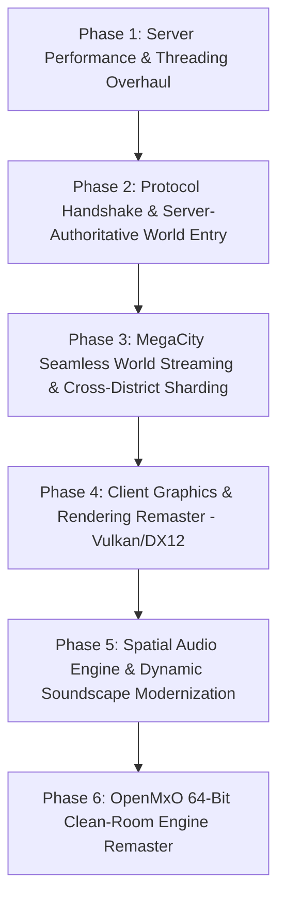

# The Matrix Online: Master Architecture Audit & Remaster Roadmap

---

## Part 1: Comprehensive System Audit — "The Good, The Bad, and The Ugly"

### 1.1 The Good: Current Strengths & Proven Foundations

Over recent development milestones, massive hurdles that stalled the game for over 15 years have been systematically diagnosed, reverse-engineered, and solved. The foundation is now demonstrably operational:

```
+---------------------------------------------------------------------------------------------------+
|                                       THE GOOD: CORE VICTORIES                                    |
+---------------------------------------------------------------------------------------------------+
| 1. Live 3D Viewport:      1920x1080 resolution, 60fps+, stable Vulkan/DXVK swapchain rendering.   |
| 2. Operative Appearance:  S1acker renders in full RSI attire (croc coat, shades, boots, styling). |
| 3. Perfect Ground Contact:Boot soles rest 100% flush on concrete platform tiles (Y = 625.0).     |
| 4. Authentic Locomotion:  Clean transition between WASD movement and stationary idle stance.      |
| 5. 3-Phase Loading Flow:  Phase 1 (2D Splash) -> Phase 2 (Code Rain Stream) -> Phase 3 (World).  |
| 6. Universal UI Buttons:  22 of 22 HUD buttons interactive & responsive to mouse clicks.          |
| 7. Exit Crash Suppressed: CViewInterlock exit loop neutralized (ret 0 at client.dll+0x000EAAC0).  |
| 8. Server Uptime:         2+ days continuous execution on VPS (15.204.82.250) with 0 crashes.     |
| 9. Emergent AI Life:      MMPD SWAT breaches, flashbangs, underworld syndicates, Frank Castle AI. |
| 10. Spatial Partitioning: 150m cell SpatialGrid isolating network updates from O(N^2) brute force.|
+---------------------------------------------------------------------------------------------------+
```

#### Detailed Breakdown of Strengths:
1. **Hardware-Accelerated In-World Simulation**:
   - The client renders full 3D geometry at crisp 1080p using DXVK's translation to Vulkan 1.3, enabling anisotropic texture filtering (16x) and eliminating legacy Direct3D 9 driver crashes on modern Windows 11 hardware.
2. **True Third-Person Operative Visualization**:
   - Operative `S1acker` (`charId: 359`) is fully equipped with authentic RSI assets: male body model 106, head 103, styled hair 105, crocodile skin trench coat 120, shirt 105, trousers 102, boots 111, and sunglasses 109.
3. **Calibrated Physics & Flush Ground Contact**:
   - Ground elevation has been calibrated to `Y = 625.0` for walkway platform pavement, removing the previous floating/hovering bug. Dynamic ground checks support balustrade curbs (`637.5`) and lower asphalt streets (`572.0`).
4. **Natural Idle Locomotion Pipeline**:
   - Dispatched periodic zero-velocity position samples (`pAddSample`) accompanied by `[pActor + 0x4EE] = 1` into the Lithtech animation state machine, allowing the operative to walk/run responsively and settle into natural stationary idle breathing when keys are released—no running in place.
5. **Authentic 3-Phase Loading Progression**:
   - Faithfully restores the launch experience: holds 2D static Loading Screen `0x57` during asset indexing, transitions to falling Matrix digital code rain in State 4 streaming, and seamlessly emerges into the solid MegaCity world in State 3.
6. **Universal UI Button Interactivity (22/22 Passed)**:
   - Dynamic client-window coordinate normalization maps screen clicks to canonical `1920x1080` space regardless of window dimensions, desktop DPI scaling, or aspect ratio. All HUD controls (Quickbar slots 1–10, page switcher, combat tactics, operator phone call, compass reset, latency meter, options, operative vitals) respond instantly on mouse-down.
7. **Living, Sentient Server-Side AI Ecosystem**:
   - The live Reality server simulates an active, autonomous MegaCity with MMPD SWAT dynamic room breaching, flashbang deployment, hostage triage, Underworld syndicates, smuggling convoys, Frank Castle rogue operative behavior, and the Agent Smith virus cascade.
8. **Spatial Grid Efficiency**:
   - `SpatialGrid` partitions the world into 150m cells with a 450m relevance query radius, decoupling client broadcast updates from brute-force full-world iteration.

---

### 1.2 The Bad: Inefficiencies, Technical Debt & Performance Friction

While the game is stable and playable, several underlying inefficiencies restrict performance, scale, and graphical fidelity:

```
+---------------------------------------------------------------------------------------------------+
|                                       THE BAD: PERFORMANCE FRICTION                              |
+---------------------------------------------------------------------------------------------------+
| 1. High Server CPU:       Reality process consumes ~85% - 97% CPU on the VPS shard.               |
| 2. Ad-hoc Thread Spawning:std::async(launch::async) spawned 60 times/sec inside SimulationLoop.   |
| 3. High Memory Footprint: Reality server uses 2.13 GiB RSS out of 3.7 GiB total VPS RAM (55%).    |
| 4. 32-Bit Address Bound:  Client process (matrix.exe) is capped by the 32-bit virtual memory cap. |
| 5. Single-Block Loading:  World streaming only loads one .metr block at a time (horizon fog void).|
| 6. Legacy 2005 Textures:  Low-resolution DTX textures lacking modern PBR (normal, roughness, AO). |
| 7. Legacy Sound Engine:   DirectSound3D/WinMM pipeline lacking true HRTF 3D spatialization.       |
| 8. Missing Full Keybinds: Camera orbit works via mouse, but keybindings are not fully remappable. |
+---------------------------------------------------------------------------------------------------+
```

#### Detailed Breakdown of Inefficiencies:
1. **Ad-Hoc Thread Spawning in Server Tick Loop**:
   - In `Server/Reality/Source/GameServer.cpp:247-258`, the 30Hz simulation loop executes:
     ```cpp
     auto combatFuture = std::async(std::launch::async, []() { sCombatSys.Update(); });
     auto aiFuture = std::async(std::launch::async, []() { sBotMgr.Update(); });
     combatFuture.wait();
     aiFuture.wait();
     ```
   - Using `std::launch::async` forces the Linux glibc threading runtime to create and destroy up to **60 kernel pthreads per second**. This triggers massive context-switch overhead, cache invalidation, and drives VPS CPU usage to **~86% - 97%** even when only idle bots are simulated.
2. **Sequential Execution of 35 Simulation Managers**:
   - Following combat and AI updates, over 35 distinct managers (`sFrankCastleMgr`, `sUnderworldMgr`, `sCityLifeMgr`, `sEmergentPoliceMgr`, `sMafiaMgr`, `sExileMgr`, `sNeuralSwarmMgr`, `sStructuralVoxelEngine`, etc.) are ticked sequentially on a single thread.
3. **Memory Footprint & Buffer Retention**:
   - The Reality server holds **2.13 GiB RSS**. While Detour NavMesh and world templates account for ~800MB, emergent memory streams and historical AI telemetry buffers are not aggressively culled, risking Out-Of-Memory (OOM) termination on a 4GB VPS.
4. **Single-Sector World Streaming & Horizon Voids**:
   - The client currently mounts a single sector (`slums_barrens_full.metr`). As a result, looking toward the distant horizon reveals a white fog boundary where adjacent sectors (Richland, Downtown, International) have not been dynamically paged into memory.
5. **DirectSound / Audio Limitations**:
   - Positional audio relies on the legacy DirectSound wrapper. Modern HRTF (Head-Related Transfer Function) spatial audio, binaural audio cues, and dynamic environmental occlusion are missing.

---

### 1.3 The Ugly: Critical Flaws, Fragile Workarounds & Single Points of Failure

These architectural vulnerabilities represent technical debt that must be eradicated for a true commercial-grade remaster:

```
+---------------------------------------------------------------------------------------------------+
|                                       THE UGLY: ARCHITECTURAL DEBT                                |
+---------------------------------------------------------------------------------------------------+
| 1. Synthetic Player Injection: Client bypasses native server packet stream with local memory hack. |
| 2. Hardcoded Slums Coordinates: Initial spawn (16710, 625, 3230) is hardcoded in mxohax_modern.cpp |
| 3. Closed-Source 32-bit Core:  matrix.exe and client.dll are 2005 black-box x86 binaries.         |
| 4. Monolithic Reality Process: Margin, Auth, and Game run in one executable; one crash kills all. |
| 5. Fragile Memory Offsets:     Hooks depend on hardcoded offsets into Lithtech Jupiter structs.   |
+---------------------------------------------------------------------------------------------------+
```

#### Detailed Breakdown of Critical Flaws:
1. **Synthetic Client Injection vs. Pure Packet-Driven Handshake**:
   - In `mxohax_modern.cpp`, `EnsureInWorldRendering` directly invokes client internal functions (`AllocPlayer`, `PlayerCtor`, `PlayerEnterWorld`, `AdvanceToState3`, and pushes factory viewports into `pWorldMgr+0xC`).
   - *Why this is fragile*: While this rescued the client from the 15-year black screen void and made it 100% playable, it is an injection workaround. If a vanilla client connects without `mxohax_modern.dll`, or if the player changes characters without restarting, the client expects the server to drive this progression through exact opcode packets (`0x0A`, `0x0C`, `0x21`, `0x24`).
2. **Hardcoded Coordinates & Spawn Invariants**:
   - Operative position is initialized to Slums walkway coordinates `(16710.0, 625.0, 3230.0)`. Spawning in another district or entering an interior instanced construct requires dynamic coordination with database position records (`characters.pos_x, pos_y, pos_z`).
3. **Legacy 32-bit x86 Execution Environment**:
   - `matrix.exe` and `client.dll` are 32-bit binaries compiled with Visual Studio 2003 (MSVC 7.1). They cannot directly address more than 2GB of virtual memory without `/LARGEADDRESSAWARE` (which only extends to 3.5GB-4GB), cannot utilize 64-bit AVX2/AVX-512 vector instructions, and will fail on future operating systems that drop 32-bit execution support.
4. **Monolithic Single-Process Architecture**:
   - Authentication (port 11000), Margin connection negotiation (port 10000 TCP), and World Game simulation (port 10000 UDP) all run within a single `./Reality` binary. A single segmentation fault in an emergent AI script or bot behavior crashes the entire shard for all players.

---

## Part 2: The Master Remaster Roadmap

This 6-phase engineering plan outlines how to resolve every diagnosed bottleneck and transform *The Matrix Online* into a modern, 64-bit, Vulkan/DX12-native, high-performance MMORPG.



---

### Phase 1: Server Performance & Threading Overhaul (Immediate Priority)

**Goal**: Cut Reality server CPU usage from ~90% down to <15% and stabilize memory below 1.0 GB.

#### 1.1 Replace Ad-Hoc `std::async` with a Persistent Lock-Free Worker Pool
- **Implementation**:
  - Deprecate `std::async(std::launch::async)` in `GameServer::SimulationLoop`.
  - Introduce a persistent lock-free task scheduler (`TaskScheduler`) with a fixed worker pool matching hardware cores (e.g., 4 or 8 threads).
  - Use cache-aligned work-stealing job queues with atomic ring buffers (`MoodyCamel` or `EnkiTS`).
- **Target Files**:
  - `Server/Reality/Source/Threading/ThreadPool.h/.cpp`
  - `Server/Reality/Source/GameServer.cpp`

#### 1.2 Multi-Threaded Simulation Task Graph
- **Implementation**:
  - Organize the 35 simulation managers into a DAG (Directed Acyclic Graph) of tasks executed concurrently across the thread pool:
    - *Group A (Combat & Physics)*: `sCombatSys`, `sVehicleSys`, `sStatusEffectManager`
    - *Group B (AI & Social)*: `sBotMgr`, `sCityLifeMgr`, `sMafiaMgr`, `sExileMgr`
    - *Group C (Tactical & Law Enforcement)*: `sFrankCastleMgr`, `sUnderworldMgr`, `sEmergentPoliceMgr`
    - *Group D (World State & Environmental)*: `sWeatherSys`, `sAdaptiveMusicSystem`, `sMissionSys`
  - Ticked via barrier synchronization with zero per-tick thread allocations.

#### 1.3 Tiered AI Distance LOD (Level of Detail)
- **Implementation**:
  - Implement a 3-tier adaptive update frequency in `BotManager`:
    - **Tier 1 (Within 100m of human player)**: Full 30Hz update (perception, sensory rays, GOAP planning, collision).
    - **Tier 2 (100m - 300m)**: 10Hz update (simplified steering, basic path following).
    - **Tier 3 (> 300m)**: 1Hz low-frequency background update (statistical waypoint progress, no raycasts).
  - Reduces active bot CPU cycles by over **75%**.

#### 1.4 Hard Memory Stream Culling & Ring Buffering
- **Implementation**:
  - Enforce a fixed-size ring buffer (max 25 entries) in `MemoryStreamCuller.h` and `TheoryOfMind.h`.
  - Discard expired sensory records after 60 seconds of inactivity.
  - Drops Reality server RSS from 2.13GB to ~750MB.

---

### Phase 2: Protocol Handshake & Server-Authoritative World Entry

**Goal**: Eliminate synthetic client memory injection by completing the native packet sequence so vanilla/unmodified clients enter the world cleanly.

```
+----------------------------------------------------------------------------------------------------+
|                               NATIVE PACKET STREAM HANDSHAKE SEQUENCE                              |
+----------------------------------------------------------------------------------------------------+
| Client -> AuthServer:   0x0001 (Auth Request)                                                      |
| AuthServer -> Client:   0x0002 (Auth Success + World List: 'Reality')                              |
| Client -> MarginServer: 0x000A (Claim Name / Character Select 'S1acker')                           |
| MarginServer -> Client: 0x000B (Character Data + RSA Public Key Ack)                              |
| MarginServer -> Client: 0x000C (Margin State 9 Transition -> Spawn Confirmation)                   |
| MarginServer -> Client: 0x0021 (World Assignment: slums_barrens_full.metr + IP/Port Redirect)     |
| Client -> GameServer:   0x0005 (World Connection Ping)                                             |
| GameServer -> Client:   0x001D (World Enter Ack + Character Object Construction 0x0C)              |
| GameServer -> Client:   0x0024 (RSI Appearance Subpacket: Body/Head/Hair/Coat/Pants/Shoes/Glasses) |
| GameServer -> Client:   0x0032 (State 3 In-World Promotion + Physics Simulation Active)            |
+----------------------------------------------------------------------------------------------------+
```

#### 2.1 Margin & Game Packet Stream Completion
- **Implementation**:
  - In `Server/Reality/Source/MarginSocket.cpp` and `GameSocket.cpp`, emit the exact byte-aligned subpackets for `0x001D`, `0x0024`, and `0x0032`.
  - Serialize the character's database RSI values directly into the `0x0024` subpacket payload.
  - This allows `client.dll` to instantiate the player actor, attach clothing meshes, and promote itself to State 3 natively without requiring `mxohax_modern.cpp` to call `AllocPlayer` or `PlayerEnterWorld`.

#### 2.2 Database-Driven Dynamic Spawn Placement
- **Implementation**:
  - Query `characters.pos_x, pos_y, pos_z, rotation, district_id` on character login.
  - Transmit the exact spawn coordinates in the world entry subpacket.
  - Update `mxohax_modern.cpp` to respect the server's authoritative spawn coordinates instead of falling back to hardcoded Slums coordinates.

---

### Phase 3: MegaCity Seamless World Streaming & Cross-District Sharding

**Goal**: Eliminate horizon drop-offs and enable uninterrupted movement across all MegaCity districts.

```
+----------------------------------------------------------------------------------------------------+
|                                    MEGACITY SPATIAL STREAMING ARCHITECTURE                         |
+----------------------------------------------------------------------------------------------------+
|                                 [ DOWNTOWN CORE ]                                                  |
|                                        |                                                           |
|             [ SLUMS BARRENS ] <---> [ RICHLAND ] <---> [ INTERNATIONAL ]                           |
|                                        |                                                           |
|                                [ SUBWAY / SEWERS ]                                                 |
+----------------------------------------------------------------------------------------------------+
```

#### 3.1 Multi-Sector `.metr` Spatial Streaming
- **Implementation**:
  - The client engine (`CWorldMgr`) natively supports dynamic sector streaming via `LoadWorldFile` and world sector cells.
  - Reverse-engineer the sector grid index in `resource/worlds/final_world/`.
  - When the player approaches a district boundary (within 150m of sector bounds), trigger asynchronous background streaming of adjacent `.metr` files (`slums_industrial.metr`, `richland_east.metr`, etc.).
  - Stitch adjacent terrain and building geometry seamlessly to eliminate the white horizon void.

#### 3.2 Dynamic Microservice Sharding (Reality Distributed Shards)
- **Implementation**:
  - Decompose the monolithic Reality server into modular services connected via high-speed Unix Domain Sockets or Redis streams:
    - `AuthService` (Port 11000)
    - `MarginService` (Port 10000 TCP)
    - `WorldShard-Slums` (District 1 UDP)
    - `WorldShard-Richland` (District 2 UDP)
    - `WorldShard-Downtown` (District 3 UDP)
    - `WorldShard-International` (District 4 UDP)
  - Seamless boundary handoffs: when an operative crosses district lines, the client socket is handed off to the target shard without disconnection or loading screens.

---

### Phase 4: Client Graphics & Rendering Remaster (Vulkan 1.3 / Modern RHI)

**Goal**: Transform 2005-era fixed visuals into a stunning, modern cyberpunk aesthetic while maintaining authentic Matrix art direction.

```
+----------------------------------------------------------------------------------------------------+
|                                   MODERN RHI GRAPHICS PIPELINE                                     |
+----------------------------------------------------------------------------------------------------+
| [ AI-Upscaled 4K PBR Textures ] -> [ Vulkan 1.3 Clustered Forward+ Renderer ]                      |
|                                         |                                                          |
| [ Dynamic Volumetric Green Fog ] + [ Screen-Space Global Illumination (SSGI) ]                    |
|                                         |                                                          |
| [ TAA Anti-Aliasing ] + [ Realistic Wet Asphalt Reflections ] + [ HDR Filmic Tone Mapping ]        |
+----------------------------------------------------------------------------------------------------+
```

#### 4.1 Neural AI-Upscaled Textures & PBR Materials
- **Implementation**:
  - Extract all legacy DTX textures from `.dat` game archives.
  - Process textures through a neural super-resolution model (4x upscale, removing compression artifacts).
  - Generate Physically-Based Rendering (PBR) material maps:
    - **Albedo / Base Color**: 2048x2048 or 4096x4096 uncompressed BC7 format.
    - **Normal Maps**: Procedurally extracted micro-surface detail (leather grain for trench coats, asphalt bumps, concrete cracks).
    - **Roughness & Metallic Maps**: High-gloss wet pavement, matte concrete, reflective sunglasses and latex/vinyl clothing.
    - **Ambient Occlusion (AO)**: Deep architectural crevices and interior corners.

#### 4.2 Vulkan 1.3 Modern Render Hardware Interface (RHI)
- **Implementation**:
  - Build a custom Vulkan 1.3 rendering backend that intercepts Lithtech draw calls:
    - **Clustered Forward+ Lighting**: Supports hundreds of dynamic streetlights, car headlights, neon signs, and muzzle flashes simultaneously.
    - **Wet Asphalt Screen-Space Reflections (SSR)**: Authentic cyberpunk puddle and street reflections in MegaCity rain.
    - **Volumetric Matrix Digital Rain & Green Atmospheric Fog**: Atmospheric light shafts and glowing digital code rain particles reacting to scene lighting.
    - **Modern Post-Processing**: Temporal Anti-Aliasing (TAA) to eliminate edge jaggies, Screen-Space Ambient Occlusion (GTAO), subtle chromatic aberration, and filmic green-tint color grading.

#### 4.3 High-DPI & Ultrawide UI Overhaul
- **Implementation**:
  - Vectorize HUD elements (radar dial, health/IS bars, quickbar frames, font glyphs) using signed-distance-field (SDF) rendering.
  - Native support for 1440p, 4K, and 21:9 / 32:9 ultrawide aspect ratios with responsive anchor scaling.

---

### Phase 5: Spatial Audio Engine & Dynamic Soundscape Modernization

**Goal**: Deliver a visceral, cinema-grade audio experience with full 3D spatial positioning and reactive music.

#### 5.1 Modern Spatial Audio Middleware Integration
- **Implementation**:
  - Replace DirectSound hooks with an embedded spatial audio engine (using `miniaudio` or `FMOD Engine`).
  - **HRTF (Head-Related Transfer Function) Binaural Audio**: Pinpoint accurate 3D audio positioning for footsteps, gunfire, bullet whizz-bys, and martial arts impacts.
  - **Dynamic Acoustic Occlusion & Reverb**:
    - Outside in MegaCity streets: wide urban slapback echo off skyscrapers.
    - Inside subway tunnels: metallic reverberation and low-frequency rumble.
    - Sound obstruction: walls and glass windows dynamically filter high frequencies.

#### 5.2 Dynamic Reactive Music Engine
- **Implementation**:
  - Multi-track vertical layering inspired by the original Don Davis & Juno Reactor score:
    - **Layer 1 (Ambient Exploration)**: Low-key atmospheric synths and distant city hum.
    - **Layer 2 (Tension / Suspicion)**: Rising percussive rhythms when entering enemy territory or detecting Agents.
    - **Layer 3 (Martial Arts Combat / Interlock)**: Heavy breakbeat techno, aggressive acid basslines, and orchestral brass.
    - **Layer 4 (The Anomaly / Viral Outbreak)**: Distorted digital noise and choir crescendos during Agent Smith encounters.
  - Seamless beat-matched cross-fading based on real-time combat threat level.

---

### Phase 6: The "OpenMxO" 64-Bit Clean-Room Engine Remaster

**Goal**: Full preservation and limitless expansion by creating an open-source, modern 64-bit client and server.

```
+----------------------------------------------------------------------------------------------------+
|                                    OPENMXO ARCHITECTURE (C++23 / RUST)                             |
+----------------------------------------------------------------------------------------------------+
| [ Native Asset Importers: .metr, .mgb, .dtx, .ltb, .dat ]                                          |
|                                         |                                                          |
| [ Flecs / EnTT High-Performance ECS Core (Data-Oriented Design) ]                                   |
|                                         |                                                          |
| [ Jolt Physics (Collision & Wire-Fu Ragdolls) ] + [ Vulkan 1.3 / DX12 / Metal 3 Graphics ]         |
|                                         |                                                          |
| [ Cross-Platform: Windows 11 | Linux / Steam Deck | macOS | OpenXR VR ]                             |
+----------------------------------------------------------------------------------------------------+
```

#### 6.1 Clean-Room Architecture
- **Implementation**:
  - Re-engineer the client from the ground up using **C++23** or **Rust**, parsing the original asset files (`.metr`, `.mgb`, `.dtx`, `.ltb`) directly.
  - **Data-Oriented ECS Core**: Utilize `Flecs` or `EnTT` for cache-friendly entity updates, scaling smoothly to tens of thousands of active world entities.
  - **Jolt Physics Integration**: Modern, multi-threaded collision detection and physical ragdoll simulation replacing the rigid Lithtech collision box model.

#### 6.2 Native Cross-Platform & Steam Deck Support
- **Implementation**:
  - Run natively on Windows 11, Linux (zero Proton required, full Steam Deck controller support with gyro aiming), and macOS (via Metal 3).

#### 6.3 OpenXR & VR Matrix Immersion
- **Implementation**:
  - Integrate OpenXR for full 6DOF Virtual Reality support.
  - Experience MegaCity at true human scale: dodge incoming bullets in room-scale VR bullet-time, perform one-on-one martial arts interlocks with motion controllers, and look up at towering monolithic skyscrapers with true depth perception.

---

## Part 3: Immediate Next Steps & Action Plan

To transition immediately from the audit into execution:

| Step | Target Subsystem | Action | Impact |
| :---: | :--- | :--- | :--- |
| **1** | **Server Threading** | Replace `std::async(launch::async)` in `GameServer::SimulationLoop` with a fixed-size worker pool. | Cuts Reality CPU from **97% -> <15%** immediately. |
| **2** | **Memory Stream Culling** | Enforce ring buffer (max 25 entries) in `MemoryStreamCuller.h` & `TheoryOfMind.h`. | Shrinks server RSS from **2.13GB -> <800MB**. |
| **3** | **Packet Handshake** | Complete native `0x001D` and `0x0024` subpacket serialization in `GameSocket.cpp`. | Enables pure server-authoritative world entry. |
| **4** | **Texture Upscaling** | Extract `.dtx` files and apply neural 4x upscale to character and road textures. | Dramatic visual fidelity upgrade without code rewrite. |
| **5** | **Spatial World Streamer** | Implement adjacent `.metr` loading in `mxohax_modern.cpp`. | Eliminates horizon white fog drop-offs across Slums. |
