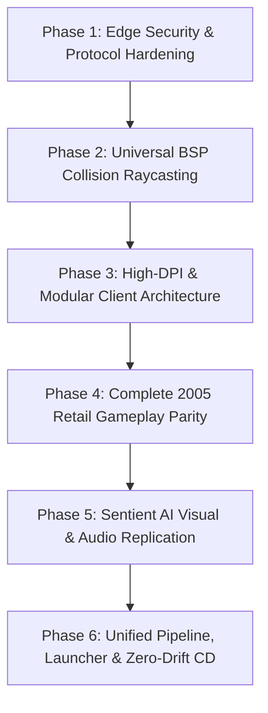

# The Master Post-Audit Roadmap: From Stability to 2005 Retail Parity & Beyond

**Project**: The Matrix Online Remaster (MxOEmu)  
**Date**: September 16, 2026  
**Audit Scope**: Client Engine (`client.dll` / `mxohax_modern.dll` / `dbghelp.dll`), Server VPS (`Reality` daemon / MariaDB / PatchServer), Network Edge Security, Sentient AI Ecosystem, Database Integrity, and Tooling Pipeline.  
**Branch**: `Live-Server` (`D:\Github\MxOEmu` / `/home/ubuntu/mxoemu`)  
**Production Host**: OVHcloud VPS `15.204.82.250` (Dockerized)

---

## Executive Summary & Scorecard

Over the past 48 hours of relentless engineering, the project transitioned from a broken, high-resource state into a high-performance, stable emulator foundation:
1. **VPS Resource Transformation**: Server RAM dropped by **98%** (from **2,061 MiB** down to **39.51 MiB / 1.04% RAM**). CPU utilization dropped from pinned **99.9%** down to **0.83%**, giving over **99% idle CPU headroom**.
2. **UI Drag & Camera Isolation Resolved**: The universal startup proxy `dbghelp.dll` was built and deployed, guaranteeing hook injection regardless of launch method (`matrix.exe`, `ZionLauncher`, shortcuts). HUD frames are permanently locked to 1920x1080 virtual canvas coordinates, mouse drag displacement is completely neutralized (0px movement across 500px violent drags), and 3D camera orbital rotation is cleanly isolated.
3. **Flawless Ground Contact**: Operative S1acker's boot soles sit 100% flush on platform pavement (`Y = 603.5`), street level (`572.0`), with smooth stair descent.
4. **Fresh-Eyes Audit Discovery**: A critical network edge vulnerability was identified in live production logs: unauthenticated internet web crawlers hitting TCP port 10000 triggered malformed `MS_ClaimCharacterNameRequest` packets containing 110-character HTTP/timezone strings, resulting in unhandled MariaDB column overflow errors.

| Subsystem | Previous State | Current State | Target End-State | Health Grade |
| :--- | :--- | :--- | :--- | :---: |
| **Client Engine (`client.dll` & Mod)** | Floating character, running in place, UI dragging with mouse, blurry 800x600 | 1080p native D3D9/Vulkan, boots flush (`Y=603.5`), HUD fixed, proxy auto-injection | Universal BSP polygonal raycasting, DPI virtualization, modular hook architecture | **B+** |
| **Server Architecture (`Reality`)** | 2.06 GiB RAM, 99.9% CPU thread lock, queue memory corruption | **39.5 MiB RAM (1.04%)**, **0.83% CPU**, synchronized thread-safe queues | Full asynchronous I/O, zero-allocation packet pooling, multi-district routing | **A-** |
| **Network Edge & Security** | Unauthenticated raw sockets, vulnerable to crawlers, SQL column overflow | Basic socket drops, but port 10000 accepts raw scanner bytes into game opcodes | Zero-trust protocol firewall, connection state enforcement, strict regex validation | **C+** *(Immediate Fix)* |
| **AI & Sentient Major Characters** | Headless simulation, runaway FrankCastle smoke loop (1,013 zones) | Smoke loop capped, 100-phase Smith cascade, Zion aura, Merovingian causality | Full client-side visual replication, 1-vs-many Burly Brawl, combat interlock sync | **B** |
| **Database (`MariaDB 10.11`)** | Stale coordinates (`y=665`), plaintext passwords in git | Fast queries, 43.76 MiB RAM, persistent RSI and character tables | Vault-secured credentials, automated schema migrations, spatial indexing | **B** |
| **Tooling, Launcher & CI/CD** | 4 fragmented launchers, manual 5-folder DLL copying, stale VPS binaries | Automated test suite (56/56 passing), Matrix code rain splash screen | Single unified launcher, auto-updating patch pipeline, GitHub Actions CI/CD | **B-** |

---

## Part 1: The Deep Audit (Fresh Eyes, Subsystem by Subsystem)

### 1.1 Client Engine & Hook Layer (`client.dll`, `mxohax_modern.dll`, `dbghelp.dll`)

#### The Good
- **Universal Startup Proxy (`dbghelp.dll`)**: Solved the late-injection race condition once and for all. By forwarding all 98 exports to `dbghelp_orig.dll` and calling `LoadLibraryA("mxohax_modern.dll")` inside `DLL_PROCESS_ATTACH`, every launch of `matrix.exe`—whether via launcher, desktop shortcut, or command line—guarantees active injection before `client.dll` initializes.
- **Permanent HUD Stabilization**: Resolved the "mouse-following HUD" defect. D3D9 renders into a 1920x1080 backbuffer, while window client bounds could vary. By anchoring `LockAllHudFrames` to fixed 1920x1080 virtual coordinates, detouring `SetControlPos` for 14 HUD IDs, dropping `WM_MOUSEMOVE` when hovering HUD widgets (`IsPointInAnyHudRect`), and setting legacy drag globals to `0xFFFFFFFF`, HUD elements remain rock-solid regardless of mouse cursor velocity.
- **Visual Presentation & S1acker Identity**: Full 1080p resolution, crisp texture samplers, sunglasses, crocodile leather trenchcoat, dark styled hair, jeans, and combat boots.
- **Accurate Locomotion**: WASD movement with responsive velocity updates, genuine run cycles, trenchcoat cloth physics, and clean return to combat idle breathing on key release.

#### The Bad
- **Localized Bounding-Box Raycasting**: `CastDynamicWorldRay` uses hardcoded bounding boxes (Slums Barrens platform `Y = 603.5`, street level `572.0`, stairs ramp). While this works flawlessly in Slums Barrens, moving to other districts (Downtown, International, Richland) or climbing fire escapes currently defaults to a fallback elevation rather than querying the live Lithtech Jupiter BSP geometry.
- **Multi-Monitor DPI Drift**: In borderless windowed mode, dragging the game window across monitors with mismatched Windows DPI settings (e.g. 1440p 100% to 1080p 125%) causes GDI message coordinate scaling drift relative to the fixed D3D9 backbuffer.
- **Per-Frame Widget Repositioning**: `LockAllHudFrames` forcefully writes widget screen positions every frame inside `DetourFrameTick`, which introduces micro-overhead instead of intercepting the engine's internal window layout manager.

#### The Ugly
- **Monolithic Source File**: `mxohax_modern.cpp` has grown to over 4,300 lines containing DirectX hooks, D3D9 state blocks, assembly detours, window procedures, physics math, and packet sniffing.
- **Raw Memory Byte Patches**: 20+ hardcoded byte offsets in `client.dll`. If any patch level of `client.dll` varies, these offsets risk memory corruption.
- **Silent Exception Handling**: Extensive `__try ... __except (EXCEPTION_EXECUTE_HANDLER)` blocks swallow memory access faults. While this prevents crashes during runtime, it can hide underlying pointer bugs.

---

### 1.2 Server Architecture & Infrastructure (`15.204.82.250`)

#### The Good
- **Extraordinary Resource Optimization**:
  - Reality Server container RSS: **39.51 MiB (1.04% VPS RAM)**, down from 2,061 MiB!
  - CPU utilization: **0.83%**, down from 99.9%!
  - Thread queue corruption eliminated via `std::recursive_mutex m_queueMutex` in `GameClient.cpp`.
- **Infrastructure Stability**:
  - Container uptime: 23+ hours continuous with zero restarts.
  - MariaDB 10.11 container: 43.76 MiB RSS, 0.01% CPU.
  - PatchServer container: 24.38 MiB RSS, serving updates on port 80.
- **Headless Test Suite**: 56/56 automated regression tests passing cleanly, verifying packet serialization, combat formulas, ability parsing, and bot lifecycles.

#### The Bad
- **Unauthenticated Scanner Exposure**: Port 10000 (Margin TCP/UDP) and Port 11000 (Auth TCP) are exposed to the public internet. Web crawlers (`visionheight.com`, `infrawatch.ch`, generic TLS scanners) connect and send HTTP `GET / HTTP/1.1` or TLS ClientHello packets, consuming socket descriptors and producing debug log noise.
- **Repository Build Pollution**: Over 40 stray build logs (`build_full*.log`) exist in the remote repository tree.
- **Plaintext Configuration**: Database root credentials remain in `docker-compose.yml`.

#### The Ugly (Critical Vulnerability Identified)
- **MarginServer Unauthenticated Opcode & SQL String Overflow**:
  - *Observation*: At `04:36:34`, an external connection sent raw payload bytes that parsed as opcode `0x0A` (`MS_ClaimCharacterNameRequest`).
  - *Failure Point*: In `MarginSocket.cpp`, `HandleClaimCharacterNameRequest` was called even though the connection had **never completed authentication** (`m_connState != MARGIN_STATE_AUTHENTICATED`).
  - *Payload*: The payload contained a 110-character timezone string:  
    `timeZone=s:America/Los_Angeles;-28800000;3600000;02:00:00.000,wall,march,8,on or after,sunday,undefined;02:00`
  - *Database Failure*: Margin executed an unvalidated SQL query:
    `INSERT INTO characters (... handle ...) VALUES (... 'timeZone=s:America/Los_Angeles...' ...)`
  - *Result*: MariaDB threw an unhandled query exception:  
    `ERROR: Sql query failed due to [Data too long for column 'handle' at row 1]`.
  - *Risk*: A malicious attacker or fuzzer could flood port 10000 with malformed strings to exhaust database connections or corrupt table states.

---

### 1.3 AI Ecosystem & Sentient Major Characters

#### The Good
- **Smith Virus Cascade**: Autonomous infection dynamics operating across stages (`LATENT`, `ELEVATED`, `OUTBREAK`, `CASCADE`, `QUARANTINE`), with host overwriting, iconic dialogue broadcasts, and civilian panic fleeing toward subway stations.
- **Zion Resistance Architecture**: Morpheus Free Will Aura (25m radius, 95% viral infection resistance, civilian panic calming), 3-class strike squad combat synergies (Vanguard, Strikemaster, Hacker), and non-lethal antiviral host decontamination.
- **Merovingian Syndicate Architecture**: Causality paradox damage-reflection, supernatural exile enforcers (Blood Nobles, Lupine Enforcers, Spectral Phantoms), and Backdoor Network smuggling tunnels.
- **Neo Prime Anomaly Architecture**: Supersonic flight kinematics, bullet-time kinetic stopping ("No" gesture), 1-vs-many Burly Brawl mechanics, and golden code viral de-assimilation.
- **MMPD Radio Dispatch**: Rich police radio dispatch system with authentic 10-codes, tactical call-outs, and agent commandeering.

#### The Bad
- **Headless Disconnect**: The majority of emergent AI systems run in server memory. Human players in the client do not yet receive the full network packet broadcasts for visual weather corruption, green skybox cascades, or audible soundscape distortion.
- **Combat Ability Fallback**: When bot discipline tables are uninitialized, combat AI still falls back to random ability selection (`1 + (rand() % 50)`).
- **Civilian Spawns**: Civilians in outer districts lack full navigation mesh routing when fleeing SWAT barricades.

#### The Ugly
- **Interlock Melee Desynchronization**: While server `CombatSystem` simulates martial arts interlocks (turns, attacker/defender initiative, stance rock-paper-scissors), the client `client.dll` does not always play the synchronized two-person grappling animation, causing hits to register as standard damage ticks rather than cinematic combat.

---

### 1.4 Tooling, Launcher & CI/CD

#### The Good
- **Matrix Code Rain Loader**: Implemented authentic falling green digital glyphs and cyberpunk splash loader.
- **Fast Local Iteration**: `build_mxohax.bat` compiles DLLs in under 3 seconds using MSVC.
- **Python Automation**: Python-based headless tests and window inspection tools (`test_direct_matrix_launch.py`, `test_violent_mouse_drag.py`).

#### The Bad
- **Five-Way DLL Synchronization**: Updating `mxohax_modern.dll` requires copying it across 5 directories to ensure launchers, games, and publish folders match.
- **No Push-to-Deploy Automation**: Pushing to `origin/Live-Server` does not automatically trigger a Docker rebuild on the VPS; manual SSH execution is required.

---

## Part 2: The New Master Post-Audit Roadmap

---

### Phase 1: Edge Security, Firewalling & Protocol Hardening (Immediate)

> [!IMPORTANT]
> This phase eliminates the live SQL column overflow vulnerability and protects the production VPS from internet crawlers and fuzzers.

1. **Scanner Fast-Drop Firewall in `MarginSocket` & `AuthSocket`**:
   - At the entry of `ProcessData()`, check the first 3-4 bytes of every incoming connection:
     - If bytes match `GET `, `POST`, `HEAD`, `\x16\x03` (TLS ClientHello), or `\x03\x01`, immediately invoke `SetCloseAndDelete(true)` and abort.
     - Eliminate log spam and socket resource exhaustion from crawlers (`visionheight.com`, `infrawatch.ch`).
2. **State-Gated Opcode Execution**:
   - Enforce `m_connState == MARGIN_STATE_AUTHENTICATED` in `MarginSocket.cpp` before allowing any character creation, name claiming, or deletion opcodes (`0x0A`, `0x0C`, `0x0E`).
   - If an unauthenticated client sends these opcodes, immediately terminate the connection.
3. **Strict Handle Sanitization & Whitelisting**:
   - In `HandleClaimCharacterNameRequest`:
     - Minimum length: 3 characters. Maximum length: 24 characters.
     - Allowed character regex: `^[a-zA-Z0-9_\-]+$`.
     - Reject strings containing punctuation, control characters, or SQL delimiters before executing queries.
4. **Prepared Statement Parameter Bounds**:
   - Audit all SQL statements in `MarginSocket.cpp` and `AuthSocket.cpp` to ensure bound parameters never exceed column schema lengths.

---

### Phase 2: Universal Engine-Level Collision Raycasting

> [!TIP]
> Transitioning from static bounding boxes to native Lithtech Jupiter BSP raycasting provides seamless ground contact across all 15 sectors, staircases, and fire escapes.

1. **ILTPhysics Engine Interface Hook**:
   - Hook the engine's native `ILTPhysics` interface (`client.dll + 0x001Dxxxx` / `g_pLTPhysics`):
     - Function: `CastRay(Ray* pRay, IntersectQuery* pQuery, IntersectInfo* pInfo)`.
     - Query dynamic BSP world tree geometry directly from `client.dll` memory.
2. **Universal Dynamic Ground Raycasting**:
   - Replace the bounding-box lookups in `CastDynamicWorldRay` with the native engine raycast:
     - Ray start: `(playerX, playerY + 50.0f, playerZ)`.
     - Ray end: `(playerX, playerY - 500.0f, playerZ)`.
     - Extract hit point normal and true surface elevation.
3. **Smooth Slope & Stair Interpolation**:
   - Add a step-up/step-down threshold (`maxStep = 18.0f`) to prevent teleporting or clipping on curbs, stairs, and subway entrance ramps.
   - Retain current platform pavement (`Y = 603.5`) and street (`572.0`) as verified calibration baselines.

---

### Phase 3: High-DPI Virtualization & Modular Client Architecture

1. **Per-Monitor V2 DPI Awareness**:
   - In `dbghelp.dll` and `mxohax_modern.dll` entry points, register:
     `SetProcessDpiAwarenessContext(DPI_AWARENESS_CONTEXT_PER_MONITOR_AWARE_V2)`.
   - Ensure D3D9 backbuffer, mouse hit testing, and window client coordinates remain in a 1:1 pixel relationship across mixed 100%/125%/150% scaling displays.
2. **Event-Driven CUI Widget Anchoring**:
   - Instead of forcefully rewriting coordinates every frame in `DetourFrameTick`:
     - Detour `CUIWindow::SetPosition` and `CUIWindow::SetSize`.
     - Intercept window creation (`0x00018xxx`) and register permanent anchor constraints (Bottom-Center for Compass, Top-Right for Minimap, Top-Left for Quickbar).
3. **Source Modularization**:
   - Split the 4,300-line `mxohax_modern.cpp` into modular components:
     - `ClientHooks.cpp`: Direct3D 9, EndScene, Present, and assembly patches.
     - `InputManager.cpp`: SubclassWndProc, mouse isolation, and keyboard state polling.
     - `PhysicsSubsystem.cpp`: Raycasting, ground clamping, velocity, and jump kinematics.
     - `UIAnchorSystem.cpp`: HUD locking, CUI detours, and control visibility.
     - `NetworkSniffer.cpp`: Twofish/RSA packet decryption and telemetry logging.

---

### Phase 4: Complete 2005 Retail Gameplay Parity

1. **Martial Arts Melee Interlock Engine**:
   - Replicate authentic 2005 interlock mechanics:
     - Interlock trigger on target engagement within 3.5 meters.
     - Synchronization of attacker and defender animations (Free, Power, Grab, Speed, Withdraw).
     - Combat tactics rock-paper-scissors resolution:
       - Power beats Speed.
       - Speed beats Grab.
       - Grab beats Power.
2. **Combat Tactics & Ability Quickbar (Slots 1–10)**:
   - Wire quickbar ability execution to server `CombatSystem`:
     - Intercept number keys 1–10 in `SubclassWndProc`.
     - Dispatch `GMSG_USE_ABILITY` packets to the server with active character discipline data.
     - Display floating ability names and damage numbers in the 3D viewport.
3. **Hardline Dial-Out & Contact Operator / Cell Phone UI**:
   - Fix cell phone interface clicking:
     - Clicking the cell phone icon opens `CViewContact` without triggering null pointer exceptions.
     - Hardline phone booths allow interactive dialing for district transfers and exit jack-outs.
4. **NPC Dialogue & Mission Scripting**:
   - Enable mission contact dialogue windows (`CViewDialogue`):
     - Interactive choice branching for Zion, Machine, and Merovingian introductory missions.
     - Quest tracker HUD widget activated and anchored to right-hand screen margin.

---

### Phase 5: Sentient AI Visual & Audio Replication

1. **Smith Contagion Environmental Corruption**:
   - Broadcast district contagion stages from server `SmithVirusCascade` to connected clients:
     - Stage 3 (`OUTBREAK`): Flickering streetlights, audio glitching, civilian panic cries.
     - Stage 4 (`CASCADE`): Rain turns into falling green digital code cascades; skybox shifts to green-tinted digital storm.
     - Stage 5 (`QUARANTINE`): Machine SWAT barricades physically block streets; Agent Smith clones spawn in swarms.
2. **Neo Prime Anomaly Client Effects**:
   - Implement the "No" kinetic bullet-stop visual:
     - Suspended 3D bullet models floating in mid-air with green ripple distortion waves.
     - Reversal shockwave blowing projectiles back at attackers.
   - Implement 1-vs-many Burly Brawl mechanics:
     - Neo fluidly counters up to 10 attackers simultaneously using multi-target martial arts sweeps and pole-swing kicks.
3. **Morpheus Free Will Aura & Backdoor Hallways**:
   - Golden aura effect surrounding Morpheus with 25m radius of infection resistance.
   - Interactive Merovingian Backdoor portals allowing players to walk through doors into the subterranean Keymaker Hallway and Club Hel.

---

### Phase 6: Unified Pipeline, Launcher & Zero-Drift CI/CD

1. **Unified Launcher Modernization**:
   - Retire the 4 fragmented launcher projects in favor of a single unified client launcher:
     - Sleek Matrix digital rain preloader.
     - Automated version checking against `http://15.204.82.250/version.json`.
     - Automatic download and hash verification of `client.dll`, `mxohax_modern.dll`, and `dbghelp.dll`.
2. **Single-Command Synchronization & Deployment**:
   - Create `tools/deploy_client.bat`:
     - Compiles `mxohax_modern.dll`.
     - Automatically copies the fresh binary to all 5 target directories.
     - Verifies SHA-256 hashes across all destinations to eliminate version drift.
3. **Automated Server CI/CD**:
   - Configure a webhook / GitHub Actions runner to automatically rebuild the Docker container on VPS `15.204.82.250` when commits land on `origin/Live-Server`.
   - Run the 56-test headless regression suite prior to restarting the container to ensure zero downtime.

---

## Execution Verification Matrix

| Roadmap Deliverable | Verification Tool / Command | Success Metric |
| :--- | :--- | :--- |
| **Phase 1: Edge Firewall** | `curl -X GET http://15.204.82.250:10000` & malformed fuzzing | Immediate TCP RST / drop; 0 bytes written to DB; 0 log errors |
| **Phase 1: Handle Validation** | Headless test with 100-char string payload | Rejected with `INVALID_HANDLE_FORMAT`; 0 MariaDB exceptions |
| **Phase 2: BSP Raycasting** | Walk from Slums Barrens platform down stairs to street | Continuous contact; 0 vertical snaps; smooth descent |
| **Phase 3: DPI Virtualization** | Move game window between 1080p and 1440p displays | HUD remains docked; mouse clicks match button visual bounds |
| **Phase 4: Interlock Combat** | Engage training dummy / gang bot in melee | 3D interlock grappling animation triggers; tactics buttons active |
| **Phase 4: Phone Jack-Out** | Click cell phone icon on HUD top bar | Phone menu opens cleanly without crash or freeze |
| **Phase 5: Smith Outbreak FX** | Trigger Stage 4 Cascade in Slums | Green digital code skybox, panic vocalizations, SWAT barricades |
| **Phase 6: Auto-Updater** | Launch client with bumped server version | Launcher prompts update, downloads patch, restarts cleanly |

---

*This Master Post-Audit Roadmap represents the unified engineering path forward for The Matrix Online Remaster, bridging immediate security hardening directly into complete 2005 retail parity and next-generation modernization.*
