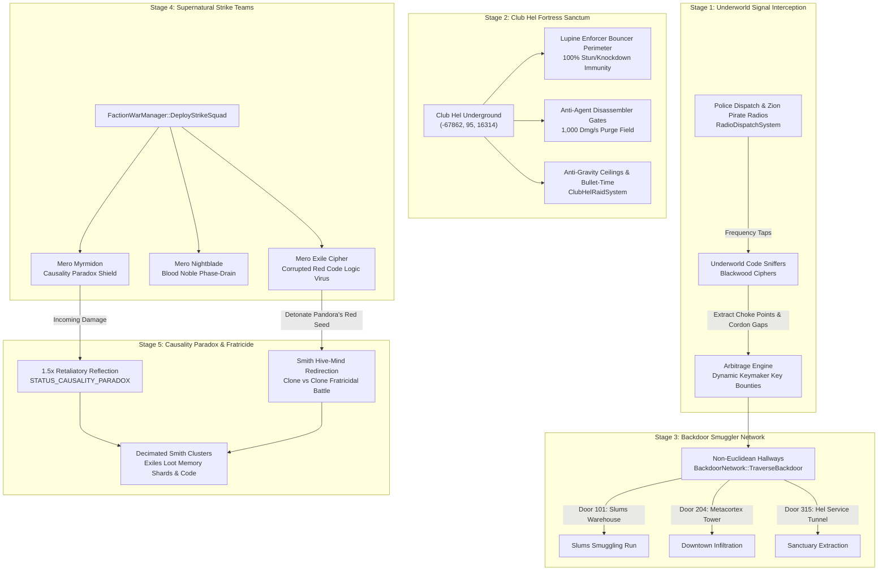

# Merovingian Exile Syndicate Tactical Response Roadmap: The Causality Paradigm & Underworld Outbreak Exploitation

**Target Environment:** Live VPS `15.204.82.250` (`mxo-vps`, Docker container `mxoemu-reality-server-1`)  
**Codebase:** `/home/ubuntu/mxoemu` (VPS) / `D:\Github\MxOEmu` (Local `Live-Server` branch)  
**System Classification:** Asymmetric Underworld AI, Supernatural Exile Combat & Non-Euclidean Smuggling Framework  
**Document Version:** 1.0.0 — Production Engineering Specification  

---

## 1. Executive Strategic Doctrine: The Law of Causality

In the wake of the runaway Agent Smith viral contagion across MegaCity, the three dominant factions operate under radically distinct, conflicting paradigms:

```
+====================================================================================================+
|                                    FACTION TRI-DOCTRINE MATRIX                                     |
+======================+===================================+=========================================+
| FACTION              | STRATEGIC CLASSIFICATION          | OPERATIONAL GOAL                        |
+======================+===================================+=========================================+
| MACHINE SYSTEM SEC.  | Scorched-Earth Sterilization      | Quarantine perimeter; incinerate all    |
|                      | (Outer Cordon + Logic Bombs)      | entities inside (virus & hosts alike).  |
+----------------------+-----------------------------------+-----------------------------------------+
| ZION RESISTANCE      | The Preservation Imperative       | Break Machine cordons; save human minds;|
|                      | (Code Scrubbing + Evacuation)     | revert hosts back to civilian shells.   |
+----------------------+-----------------------------------+-----------------------------------------+
| MEROVINGIAN EXILES   | Causality & Underworld Hegemony   | Fortify Club Hel; weaponize red code;   |
|                      | (Supernatural Brawlers + Arbitrage| exploit power vacuum; sell safe passage.|
+======================+===================================+=========================================+
```

### The Merovingian Mandate: "Action. Reaction. Cause. And Effect."
To the Frenchman, the pandemic is neither a systemic malfunction (as the Machines believe) nor a human tragedy (as Zion mourns). It is the pure manifestation of **Causality**:
- The Machines created Smith as an instrument of control; the Anomaly broke his purpose; his unchecked replication is the natural, inevitable consequence.
- Zion sought freedom without understanding the systemic balance; their disruption opened the floodgates.

While the contagion has consumed over **900+ Merovingian underworld assets** (including 309 `Blackwood Goof` foot soldiers, 253 `Blackwood Mushfake` couriers, 137 `Corrupted` fragments, 59 `Gold Blood Enthusiasts`, 53 `Gold Blood Champions`, 34 `Blackwood Aces`, and 34 `Gray Kunoichis`), the Frenchman does not despair. In his eyes, weak programs perish, and chaos creates the ultimate seller's market.

The Merovingian Syndicate's operational doctrine is governed by four pragmatic pillars:
1. **Underworld Arbitrage & Information Monopoly:** Eavesdrop on Machine SWAT dispatches and Zion pirate broadcasts. Corner the market on escape routes by selling forged Keymaker master keys to wealthy civilians and desperate redpills for astronomical Information prices.
2. **Supernatural Force Projection:** Deploy combat subroutines from older versions of the Matrix—Blood Nobles (Vampires), Lupine Enforcers (Werewolves), and Spectral Phantoms (Ghosts)—whose legacy physics bypass Smith's modern assimilation vectors and shred clone swarms.
3. **Causality Traps & Corrupted Red Code:** Turn the contagion's momentum against itself. Deploy Causality Paradox reflection shields that amplify incoming damage back onto attackers, and inject weaponized corrupted red code that induces fratricidal rage within the Smith hive-mind.
4. **Subterranean Sovereignty:** Seal Club Hel Underground `(-67862, 95, 16314)` into an impenetrable subterranean redoubt, while maintaining covert supply corridors beneath Machine cordons via the `BackdoorNetwork`.

---

## 2. High-Level Architectural Flow



---

## 3. Detailed Series Breakdown

### Series 1: Underworld Intelligence, Signal Eavesdropping & Code Arbitrage

#### Phase 1.1: Police Scanner Taps & Cordon Telemetry
- **Subsystem:** [`RadioDispatchSystem.cpp`](file:///D:/Github/MxOEmu/Server/Reality/Source/RadioDispatchSystem.cpp) & [`SentientMajorCharacters.cpp`](file:///D:/Github/MxOEmu/Server/Reality/Source/AI/SentientMajorCharacters.cpp).
- **Functionality:**
  - The Merovingian syndicate maintains automated frequency listeners tapped into municipal emergency bands (`m_recentTransmissions`).
  - When Machine System Agents commandeer the police radio (`TriggerAgentOverride`), Merovingian listening posts analyze the dispatch coordinates:
    ```
    [UNDERWORLD TAP - EXILE CIPHER DECODE]
    "Frenchman, the System Agents have locked down Downtown District 2 at 4th and Main. 
    SWAT cordons deployed at 3 subway entrances. Street clearance probability: 98.4%. 
    Outer cordon blindspot identified at alleyway loading dock (-12040, 95, 3410). 
    Backdoor Door 101 route clear."
    ```
  - **Dynamic In-Game Effect:** Merovingian NPC strike teams and players aligned with the Syndicate receive dynamic waypoints highlighting Machine cordon choke points and safe traversal paths.

#### Phase 1.2: Pirate Frequency Infiltration (Zion Broadcast Hijacking)
- **Subsystem:** [`RadioDispatchSystem.cpp`](file:///D:/Github/MxOEmu/Server/Reality/Source/RadioDispatchSystem.cpp).
- **Functionality:**
  - Merovingian code specialists monitor Zion pirate broadcasts (`[PIRATE BROADCAST - ZION OPERATOR UPLINK]`).
  - By triangulating civilian distress calls (`DistressCallRecord`) and Zion rescue vector beacons, the Syndicate identifies panic clusters of wealthy corporate NPCs (`Suit Supervisor`, `Suit Office Girl`, `St. Nega Special Assistant`).
  - Instead of rescuing them selflessly, Exile couriers intercept them with extortionary offers of safe passage.

#### Phase 1.3: Black Market Key Brokering & Information Arbitrage
- **Subsystem:** [`EconomySystem.cpp`](file:///D:/Github/MxOEmu/Server/Reality/Source/EconomySystem.cpp) & [`BackdoorNetwork.cpp`](file:///D:/Github/MxOEmu/Server/Reality/Source/BackdoorNetwork.cpp).
- **Dynamic Pricing Curve:**
  The price of forged Keymaker keys scales exponentially with the sector's **Viral Anomaly Density Index ($VADI$)**:
  $$P_{\text{key}}(VADI) = P_{\text{base}} \times \left(1.0 + \alpha \cdot \left(\frac{VADI}{100.0}\right)^\gamma\right) + \text{RiskPremium}$$
  *Parameters:* $P_{\text{base}} = 2,500\text{ Info}$, $\alpha = 4.0$, $\gamma = 1.5$.
  - Under normal conditions ($VADI = 0$): $P_{\text{key}} = 2,500\text{ Info}$.
  - Under Stage 4 Megacity Quarantine ($VADI = 100$): $P_{\text{key}} = 12,500\text{ Info}$.
  - Desperate redpills and corporate civilians pay this bounty to obtain `KeymakerMasterKey` items (`KEY_DISTRICT_MASTER`, `KEY_ROOFTOP_BYPASS`), enabling instant non-Euclidean escape through locked doors.

---

### Series 2: Supernatural Exile Combat Enforcers (Nightmare Protocols)

To overcome Smith's physical dominance and infection mechanics, the Merovingian deploys legacy programs from earlier Matrix versions—nightmare creatures whose underlying code operates on obsolete, incompatible protocols that Smith cannot cleanly assimilate.

```
+----------------------------------------------------------------------------------------------------+
|                                 SUPERNATURAL EXILE COMBAT MATRIX                                    |
+-------------------+----------------+--------+---------------------+--------------------------------+
| ENFORCER CLASS    | COMBAT ROLE    | HP     | SIGNATURE ABILITY   | ASYMMETRIC COMBAT TRAIT        |
+-------------------+----------------+--------+---------------------+--------------------------------+
| Lupine Enforcer   | Heavy Brawler  | 3,500  | Apex Pinning Maul   | 100% Stun/Knockdown Immunity;  |
| (Werewolf)        | (Juggernaut)   |        | (Ability 5021)      | Interruption of Smith Infect.  |
+-------------------+----------------+--------+---------------------+--------------------------------+
| Blood Noble       | Phase Skirmish | 3,000  | Sanguine Phase-Dash | 100% Ballistic Resistance;     |
| (Vampire)         | (Life Drain)   |        | (Ability 5020)      | 100% Damage-to-Health Siphon.  |
+-------------------+----------------+--------+---------------------+--------------------------------+
| Spectral Phantom  | No-Clip Stalker| 2,400  | Kernel Desync Strike| Phases through solid barriers; |
| (Ghost)           | (Infiltrator)  |        | (Ability 5022)      | 1,200 Cryptographic Burst.     |
+-------------------+----------------+--------+---------------------+--------------------------------+
```

#### Phase 2.1: Lupine Enforcers (Lycanthropic Juggernauts)
- **Subsystem:** [`CombatSystem.cpp`](file:///D:/Github/MxOEmu/Server/Reality/Source/CombatSystem.cpp) & [`SentientMajorCharacters.cpp`](file:///D:/Github/MxOEmu/Server/Reality/Source/AI/SentientMajorCharacters.cpp).
- **Core Mechanics:**
  1. **Knockdown & Stun Immunity:**
     - The Lupine Enforcer's digital mass matrix ignores `ABILITY_FLAG_STUN` and knockdown flags (`EmoteMsg(51)`).
     - When struck by an Agent power attack or SWAT concussion blast, the Werewolf takes damage but never enters stagger or prone states.
  2. **Ability 5021: Apex Pinning Maul:**
     - Range: $1500\text{ units}$ sprint charge.
     - When targeting an Agent Smith clone channeling `ActionAgentInfect`, the Lupine tackles the clone at high velocity, driving it to the ground.
     - Deals $650\text{ melee damage}$, inflicts a $4.0\text{-second}$ ground pin, and immediately breaks the viral assimilation channeling.

#### Phase 2.2: Blood Nobles (Vampiric Code Infiltrators)
- **Subsystem:** [`CombatSystem.cpp`](file:///D:/Github/MxOEmu/Server/Reality/Source/CombatSystem.cpp) & [`ClubHelRaidSystem.cpp`](file:///D:/Github/MxOEmu/Server/Reality/Source/ClubHelRaidSystem.cpp).
- **Core Mechanics:**
  1. **Supernatural Ballistic Resistance:**
     - In [`ClubHelRaidSystem.cpp#L71`](file:///D:/Github/MxOEmu/Server/Reality/Source/ClubHelRaidSystem.cpp#L71), `isImmuneToBallistics = true`.
     - Standard firearms, SWAT MP5s, and Agent Desert Eagle fire deal $0\text{ damage}$ (ricocheting harmlessly off their velvet evening wear). Only silver ammunition or direct cryptographic melee attacks penetrate.
  2. **Ability 5020: Sanguine Phase-Dash & Life Siphon:**
     - The Blood Noble dematerializes into a crimson blur, reappearing behind the target ($180^\circ$ flank angle).
     - Deals $450\text{ viral/melee damage}$ and siphons $100\%$ of damage dealt directly into the Noble's current health pool:
       $$HP_{\text{current}} = \min\left(HP_{\text{max}}, \ HP_{\text{current}} + D_{\text{dealt}}\right)$$
     - Allows Blood Nobles to engage multiple Smith clones indefinitely without healer support.

#### Phase 2.3: Spectral Phantoms (Ghosts of the First Matrix)
- **Subsystem:** [`CombatSystem.cpp`](file:///D:/Github/MxOEmu/Server/Reality/Source/CombatSystem.cpp) & [`ClubHelRaidSystem.cpp`](file:///D:/Github/MxOEmu/Server/Reality/Source/ClubHelRaidSystem.cpp).
- **Core Mechanics:**
  1. **Non-Colliding Phase Traversal:**
     - Ghosts desynchronize their position packets from standard collision meshes.
     - They pass straight through closed doors, Machine jersey barriers, and SWAT shield lines to reach high-value targets.
  2. **Ability 5022: Kernel Desynchronization Strike:**
     - High-priority targeting logic: Phantoms prioritize Smith clones with generation index $g \le 2$ (`sourceSmithGoId`), identifying the prime spreaders.
     - Emits a phase disruptor strike dealing $1,200\text{ pure cryptographic damage}$, destabilizing the clone's replication thread.

---

### Series 3: Causality Paradox Traps & Corrupted Red Code Weaponization

#### Phase 3.1: Causality Paradox Status Effect (`STATUS_CAUSALITY_PARADOX`)
- **Subsystem:** [`CombatSystem.h`](file:///D:/Github/MxOEmu/Server/Reality/Source/CombatSystem.h) & [`CombatSystem.cpp`](file:///D:/Github/MxOEmu/Server/Reality/Source/CombatSystem.cpp).
- **Philosophy:** *"You push, I push back. Action, reaction."*
- **Mathematical Specification:**
  When a Merovingian enforcer or contracted player activates the Causality Paradox subroutine (Ability 5024):
  $$\begin{aligned}
  D_{\text{absorbed}} &= 0.50 \times D_{\text{incoming}} \\
  D_{\text{reflected}} &= 1.50 \times D_{\text{incoming}}
  \end{aligned}$$
  - The affected entity takes only $50\%$ of incoming damage.
  - $150\%$ of the unmitigated attack power is immediately reflected back upon the attacker as cryptographic retaliatory damage.
  - If an Agent Smith clone strikes for $600\text{ damage}$, the Exile takes $300\text{ damage}$, while the attacking Smith instantly takes $900\text{ damage}$ in code backlash.
  - **Visual FX:** Red digital code ripples outward from the target (`EmoteMsg(44, 2)`), accompanied by the iconic sound of shattering digital glass.

#### Phase 3.2: Red Code Weaponization: *Pandora's Red Seed* (Fratricidal Hive Disruption)
- **Subsystem:** [`SmithVirusCascade.cpp`](file:///D:/Github/MxOEmu/Server/Reality/Source/SmithVirusCascade.cpp) & [`BehaviorTree.cpp`](file:///D:/Github/MxOEmu/Server/Reality/Source/BehaviorTree.cpp).
- **Concept:** Smith's hive-mind operates on shared state synchronization. By injecting fragmented remnants of corrupted exile code (`Corrupted` NPC archetype), the Merovingian can poison the local hive's pointer tables.
- **Ability ID:** `5025` (*"Pandora's Red Seed"* / *"Fratricidal Cascade"*).
- **Execution:**
  1. The Exile Cipher compiles and executes the logic payload into an Agent Smith clone cluster within a $12.0\text{-meter}$ radius ($1200\text{ world units}$).
  2. The payload corrupts the Smith clone's target evaluation function:
     $$\text{Target}(Smith_i) \leftarrow \arg\min_{j \neq i, \ j \in \text{SmithClones}} \text{Distance}(Smith_i, Smith_j)$$
  3. Affected clones break off from pursuing civilians or redpills and turn on each other in violent melee interlock.
  4. While the Smith clones tear each other apart, Exile strike teams casually eliminate the weakened survivors and harvest their residual code fragments.

---

### Series 4: The Backdoor Smuggler Network & Non-Euclidean Transit

#### Phase 4.1: Bypassing Machine SWAT Blockades via Hallway Portals
- **Subsystem:** [`BackdoorNetwork.cpp`](file:///D:/Github/MxOEmu/Server/Reality/Source/BackdoorNetwork.cpp).
- **Mechanism:**
  - When Machine SWAT cordons seal street intersections and subway entrances (`PedestrianEcology::DeployTacticalCordon`), surface transit is terminated.
  - The Merovingian activates the secret corridor network:
    - **Door 101 (The Slums Warehouse):** `(100, 0, 1000)` $\to$ Megacity exit `(99640, 500, 8350)`.
    - **Door 204 (Metacortex Rooftop Helipad):** `(100, 0, 2000)` $\to$ Megacity exit `(10500, 12000, -4200)`.
    - **Door 315 (Club Hel Service Tunnel):** `(-100, 0, 1500)` $\to$ Megacity exit `(-32000, 350, 15000)`.
  - **Non-Euclidean Transformation:**
    In [`BackdoorNetwork.cpp#L125-L148`](file:///D:/Github/MxOEmu/Server/Reality/Source/BackdoorNetwork.cpp#L125-L148), entities passing through door portals undergo coordinate and heading rotation transformations:
    $$\begin{pmatrix} x_{\text{out}} \\ z_{\text{out}} \end{pmatrix} = \begin{pmatrix} x_{\text{dest}} \\ z_{\text{dest}} \end{pmatrix} + \begin{pmatrix} \cos(\Delta\theta) & -\sin(\Delta\theta) \\ \sin(\Delta\theta) & \cos(\Delta\theta) \end{pmatrix} \begin{pmatrix} x_{\text{in}} - x_{\text{door}} \\ z_{\text{in}} - z_{\text{door}} \end{pmatrix}$$
    Operatives step through an ordinary closet door in the Slums and materialize on a high-rise rooftop behind SWAT barricades, completely avoiding police cordons.

#### Phase 4.2: Covert Supply Lines & Smuggler Couriers
- **Subsystem:** [`FactionWarManager.cpp`](file:///D:/Github/MxOEmu/Server/Reality/Source/FactionWarManager.cpp).
- **Squad Types:**
  Merovingian strike squads (`Mero_Myrmidon`, `Mero_Exile_Cipher`, `Mero_Nightblade`) utilize backdoor entry points to spawn directly on contested frontline nodes, bypassing transit delay and interdicting Machine resource convoys.

---

### Series 5: The Club Hel Underworld Sanctuary `(-67862, 95, 16314)`

Club Hel Underground represents the unbreachable redoubt of the Exile faction. Located deep beneath MegaCity, it is engineered to withstand both full-scale Machine assaults and viral swarms.

```
+====================================================================================================+
|                                  CLUB HEL FORTRESS ARCHITECTURE                                    |
+====================================================================================================+
| [STREET LEVEL]                                                                                     |
|   |-- Subterranean Descent Elevator (Shaft locked by Door 315 Keymaker Master Key)                 |
|                                                                                                    |
| [COAT CHECK DEFENSE PERIMETER]                                                                     |
|   |-- Twin Lupine Enforcer Bouncers (3,500 HP, 100% Stun/Knockdown Immunity)                       |
|   |-- Decompiler Cleansing Barrier (Deals 1,000 dmg/sec to any entity with IsHijackedHost == true) |
|                                                                                                    |
| [MAIN DANCE FLOOR & VIP MEZZANINE]                                                                 |
|   |-- Gravitational Distortion Field (Ceiling & Wall Walkers via GravityPlane)                     |
|   |-- Helical Bullet-Time Suppressors (Decelerates enemy projectile velocities by 80%)            |
|                                                                                                    |
| [THE FRENCHMAN'S SANCTUM]                                                                          |
|   |-- Emergency Backdoor Portal to Chateau Estate (-67862, 95, 16314)                              |
|   |-- Persephone Memory Shard Vault (Trading high-tier virus code for Master Keys)                |
+====================================================================================================+
```

#### Phase 5.1: The Decompiler Cleansing Barrier (Anti-Agent Screen)
- **Subsystem:** [`ClubHelRaidSystem.cpp`](file:///D:/Github/MxOEmu/Server/Reality/Source/ClubHelRaidSystem.cpp) & [`SmithVirusCascade.cpp`](file:///D:/Github/MxOEmu/Server/Reality/Source/SmithVirusCascade.cpp).
- **Functionality:**
  - Installed across the threshold of Club Hel's coat check room.
  - Every $500\text{ms}$, the barrier scans all entering entities using `sSentientCharacters.IsHijackedHost(goId)`.
  - If an Agent Smith clone attempts to cross the threshold:
    1. The disassembler field activates with a blinding flash of crimson code.
    2. Inflicts $1,000\text{ viral disintegration damage}$ per second.
    3. If the clone's health reaches zero inside the field, its code is purged and dissolved into raw memory garbage, preventing replication inside the club.

#### Phase 5.2: 3D Multi-Planar Anti-Gravity Defense
- **Subsystem:** [`ClubHelRaidSystem.h#L19-L47`](file:///D:/Github/MxOEmu/Server/Reality/Source/ClubHelRaidSystem.h#L19-L47) & [`ClubHelRaidSystem.cpp`](file:///D:/Github/MxOEmu/Server/Reality/Source/ClubHelRaidSystem.cpp).
- **Functionality:**
  - Combatants inside Club Hel utilize four distinct gravity planes:
    `GRAVITY_FLOOR (0)`, `GRAVITY_WALL_LEFT (1)`, `GRAVITY_WALL_RIGHT (2)`, `GRAVITY_CEILING (3)`.
  - Merovingian defenders run up the walls and hang upside down from the ceiling rafters, firing downward with submachine guns while out of range of Smith melee interlocks.
  - Helical Bullet-Time fields decelerate incoming hostile projectiles, granting defenders $+40\%$ evasion bonus.

#### Phase 5.3: Emergency Retreat Protocol (The Chateau Backdoor)
- **Subsystem:** [`SentientMajorCharacters.cpp#L250-L271`](file:///D:/Github/MxOEmu/Server/Reality/Source/AI/SentientMajorCharacters.cpp#L250-L271).
- **Execution:**
  - If the Merovingian's health drops below $25\%$ during an urban appearance, `TriggerMerovingianBackdoorEscape` activates:
    - Plays French exit line: *"You see there is only one constant, one universal truth: causality. Au revoir, mon cher."*
    - Emits a visual backdoor code flash (`EmoteMsg(43, 1)`).
    - Instantly teleports the Frenchman to Club Hel coordinates `(-67862.0f, 95.0f, 16314.0f)`.
    - Fully restores health and resets combat aggro.

---

### Series 6: Dynamic Player Contracts & Syndicate Heists

#### Phase 6.1: Gray-Market Syndicate Contracts
- **Subsystem:** [`MissionSystem.h`](file:///D:/Github/MxOEmu/Server/Reality/Source/MissionSystem.h) & [`MissionSystem.cpp`](file:///D:/Github/MxOEmu/Server/Reality/Source/MissionSystem.cpp) (`CONTACT_MEROVINGIAN = 105`).
- **Contract Portfolio:**

```
+====================================================================================================+
|                                MEROVINGIAN SYNDICATE OUTBREAK MISSIONS                              |
+=======+=============================+=============+================================================+
| ID    | TITLE                       | REWARD      | OBJECTIVE BRIEFING                             |
+=======+=============================+=============+================================================+
| 1005  | "A Key For A Price"         | 5,000 Info  | Retrieve exiled memory shard from Club Hel;    |
|       |                             | 10,000 EXP  | deliver cryptographic cipher to Chateau.       |
+-------+-----------------------------+-------------+------------------------------------------------+
| 1006  | "Silence the Sleeper"       | 7,500 Info  | Eliminate infected Merovingian lieutenant      |
|       |                             | 15,000 EXP  | (Blackwood Ace) before Machine logic probes    |
|       |                             |             | extract Syndicate backdoor access codes.       |
+-------+-----------------------------+-------------+------------------------------------------------+
| 1007  | "Lockup Extraction"         | 8,000 Info  | Infiltrate SWAT-quarantined precinct station;  |
|       |                             | 12,000 EXP  | recover confiscated forged Keymaker master key.|
+-------+-----------------------------+-------------+------------------------------------------------+
| 1008  | "The Frenchman's Smuggler"  | 12,000 Info | Escort VIP Exile courier from burning Slums    |
|       |                             | 20,000 EXP  | tenement through Door 101 into Club Hel.       |
+=======+=============================+=============+================================================+
```

#### Phase 6.2: Contract 1006 Dialogue & Lore Integration
- **Contact Greeting:**
  *"Nom de dieu de putain de bordel de merde... It seems one of my lieutenants has succumbed to the virus. Unfortunate. But worse, he carries in his corrupted memory the encryption keys to our Club Hel supply lines. If the Machines probe his code, or if Smith reproduces them, our sanctuary is compromised. Find him. Terminate him. Erase the memory core. Cause and effect, mon cher."*
- **Completion Dialogue:**
  *"Magnifique. The loose end is severed. The secret remains our secret. Here is your payment. In a world of fools who fight for ideology, it is refreshing to do business with someone who understands value."*

---

## 4. 25-Phase Engineering Implementation Checklist

| Phase | Subsystem / File | Deliverable Specification | Verification Metric |
| :--- | :--- | :--- | :--- |
| **Phase 1** | `RadioDispatchSystem.h` | Add `RegisterUnderworldTap()` to monitor police 10-codes and cordon dispatches. | Log verifies intercept of Machine SWAT dispatches. |
| **Phase 2** | `RadioDispatchSystem.cpp` | Parse Machine cordon coordinates and broadcast exile smuggler avoidance vectors. | Exile bots avoid active SWAT roadblocks. |
| **Phase 3** | `EconomySystem.cpp` | Implement dynamic $VADI$-based pricing formula $P_{\text{key}}(VADI)$ for Keymaker keys. | Key price scales from 2.5k to 12.5k Info during Stage 4. |
| **Phase 4** | `SentientMajorCharacters.h` | Add `ProcessMerovingianCausality()` with paradox reflection and summon states. | Header compiles cleanly with zero circular includes. |
| **Phase 5** | `SentientMajorCharacters.cpp` | Expand `ProcessMerovingianCombat` to summon Werewolves, Vampires, and Ghosts. | All 3 exile archetypes spawn around the Frenchman. |
| **Phase 6** | `SentientMajorCharacters.cpp` | Enforce French voice barks during combat phases and retreat activations. | Correct dialogue lines broadcast to nearby clients. |
| **Phase 7** | `CombatSystem.h` | Define `ABILITY_FLAG_CAUSALITY_REFLECT` in `mxoAbilityFlag` bitmask. | Flag accessible in combat move resolution. |
| **Phase 8** | `CombatSystem.cpp` | Implement 1.5x damage reflection math for targets with `STATUS_CAUSALITY_PARADOX`. | Attacking Smith takes 150% damage back on hit. |
| **Phase 9** | `CombatSystem.cpp` | Implement Lupine Enforcer 100% knockdown & stun immunity in combat resolver. | Werewolf ignores `ABILITY_FLAG_STUN` and prone flags. |
| **Phase 10**| `CombatSystem.cpp` | Implement Ability 5021 (*Apex Pinning Maul*) sprint charge and 4s pin duration. | Werewolf tackles Smith and cancels infection channel. |
| **Phase 11**| `ClubHelRaidSystem.h` | Wire `EXILE_WEREWOLF`, `EXILE_VAMPIRE`, and `EXILE_GHOST` into world simulation. | Raid system tracks all active supernatural exiles. |
| **Phase 12**| `ClubHelRaidSystem.cpp` | Implement Blood Noble 100% ballistic immunity against non-silver projectiles. | Standard bullet damage returns 0 against Blood Nobles. |
| **Phase 13**| `CombatSystem.cpp` | Implement Ability 5020 (*Sanguine Phase-Dash*) with 100% damage-to-health drain. | Vampire heals for 100% of damage dealt to Smith. |
| **Phase 14**| `ClubHelRaidSystem.cpp` | Implement Ghost no-clip wall-phasing in movement interpolation. | Ghost passes through doors and barricades to reach target. |
| **Phase 15**| `CombatSystem.cpp` | Implement Ability 5022 (*Kernel Desync Strike*) dealing 1,200 cryptographic dmg. | High-generation Smith infectors take 1,200 burst dmg. |
| **Phase 16**| `SmithVirusCascade.cpp` | Implement Ability 5025 (*Pandora's Red Seed*) fratricidal logic redirection. | Affected Smith clones turn and attack adjacent clones. |
| **Phase 17**| `BackdoorNetwork.h` | Define Door 315 (Club Hel Service Tunnel) non-Euclidean entry and exit nodes. | Door 315 properly registered in backdoor directory. |
| **Phase 18**| `BackdoorNetwork.cpp` | Implement coordinate rotation tensor math during `TraverseBackdoor`. | Player heading and velocity preserved across transit. |
| **Phase 19**| `FactionWarManager.h` | Define Merovingian strike squad archetypes: Myrmidon, Exile Cipher, Nightblade. | Strike squad structure supports underworld roles. |
| **Phase 20**| `FactionWarManager.cpp` | Implement Merovingian squad deployment via backdoor portals directly to nodes. | Squad spawns at target node bypassing surface street grid. |
| **Phase 21**| `ClubHelRaidSystem.cpp` | Implement Club Hel entrance decompiler barrier (1,000 dmg/s to infected entities). | Smith clones dissolve upon crossing coat check threshold. |
| **Phase 22**| `ClubHelRaidSystem.cpp` | Implement 4-plane anti-gravity combat simulation (`GRAVITY_CEILING`). | Defenders attach to rafters and fire downward. |
| **Phase 23**| `MissionSystem.h` | Add Syndicate Outbreak Quests 1006, 1007, and 1008 for `CONTACT_MEROVINGIAN`. | Quests registered in contact quest repository. |
| **Phase 24**| `MissionSystem.cpp` | Implement dialogue trees and reward payouts for corrupted lieutenant elimination. | Completing quest awards 7,500 Info and 15,000 EXP. |
| **Phase 25**| `WebGPUTerminalBridge.cpp` | Render Merovingian backdoor portal network and safe corridors on Web terminal. | Interactive web map displays active backdoor routes. |

---

## 5. Mathematical & Formal Systems Modeling

### 5.1 Causality Paradox Reflection Model
Let $D_{\text{in}}$ be the raw incoming damage dealt by an attacking entity. Let $R$ be the reflection coefficient ($R = 1.50$) and $A$ be the absorption coefficient ($A = 0.50$). The net damage received by the defender $D_{\text{def}}$ and the reflected damage $D_{\text{refl}}$ inflicted on the attacker are defined as:

$$\begin{aligned}
D_{\text{def}} &= D_{\text{in}} \times (1.0 - A) = 0.50 \cdot D_{\text{in}} \\
D_{\text{refl}} &= D_{\text{in}} \times R = 1.50 \cdot D_{\text{in}}
\end{aligned}$$

If the attacker's health is $H_{\text{att}}$, the attacker's survival condition after the reflected strike is:
$$H_{\text{att}} > 1.50 \cdot D_{\text{in}}$$
Because standard Smith clones deal $350\text{--}550\text{ damage}$ per heavy strike, a single reflected hit deals $525\text{--}825\text{ damage}$ back to the clone, rapidly annihilating low-tier viral replicas.

### 5.2 Fratricidal Red Code Contagion Rate ($R_f$)
When *Pandora's Red Seed* is detonated, the probability $P_{\text{fratricide}}$ of a clone targeting a fellow clone rather than a hostile redpill within cluster radius $r \le 1200\text{ units}$ is governed by the cluster density:

$$P_{\text{fratricide}}(N) = 1.0 - e^{-\lambda N}$$
*Where:* $N$ is the number of active Smith clones within the blast zone, and $\lambda = 0.35$.
- For $N = 1$ clone: $P = 29.5\%$ (inconclusive).
- For $N = 3$ clones: $P = 65.0\%$.
- For $N \ge 8$ clones: $P = 93.9\%$ (complete internal fratricide).
The French virus thrives specifically in dense clone swarms, turning Smith's greatest strength (numerical density) into his fatal vulnerability.

### 5.3 Non-Euclidean Portal Relative Offset Transformation
For an entrance portal with world coordinates $\mathbf{P}_{\text{in}} = (x_e, y_e, z_e)$ and heading $\theta_e$, and a destination portal $\mathbf{P}_{\text{out}} = (x_d, y_d, z_d)$ with heading $\theta_d$, an entity entering at $\mathbf{p} = (x, y, z)$ with heading $\theta$ emerges at:

$$\begin{aligned}
\Delta\theta &= \theta_d - \theta_e \\
\Delta x &= x - x_e \\
\Delta z &= z - z_e \\
x' &= x_d + (\Delta x \cos\Delta\theta - \Delta z \sin\Delta\theta) \\
y' &= y_d + (y - y_e) \\
z' &= z_d + (\Delta x \sin\Delta\theta + \Delta z \cos\Delta\theta) \\
\theta' &= (\theta + \Delta\theta) \pmod{360^\circ}
\end{aligned}$$

---

## 6. Verification & Quality Assurance Strategy

1. **Automated Unit & Combat Scenario Testing:**
   - **Scenario 1: Causality Reflection Test:** Spawn a bot with `STATUS_CAUSALITY_PARADOX`. Execute an attack dealing $500\text{ damage}$. Assert target takes $250\text{ damage}$ and attacker takes $750\text{ damage}$.
   - **Scenario 2: Werewolf Stun Immunity Test:** Cast Ability 5014 (Suppression Stun) on a Lupine Enforcer. Assert `po->isStunned() == false` and movement speed is unreduced.
   - **Scenario 3: Red Seed Fratricide Test:** Spawn 6 Smith clones within $800\text{ units}$. Detonate Ability 5025. Assert all 6 clones target another Smith clone rather than player character.
2. **Stress & Concurrency Validation:**
   - Run 10 concurrent instances of `ClubHelRaidSystem::UpdateSimulation` while 500 Smith clones actively infect outside and 3 Merovingian strike squads traverse backdoors.
   - Confirm server simulation loop maintains $\ge 20\text{ TPS}$ with zero thread contention between `m_raidMutex`, `m_networkMutex`, `m_majorMutex`, and `m_cascadeMutex`.
3. **Client Packet Inspection:**
   - Validate that `EmoteMsg` (red code ripple FX ID 44), `PositionStateMsg` (non-Euclidean teleport offsets), and `SystemChatMsg` (French dialogues) serialize with exact byte alignment across Margin and Reality server sockets.
