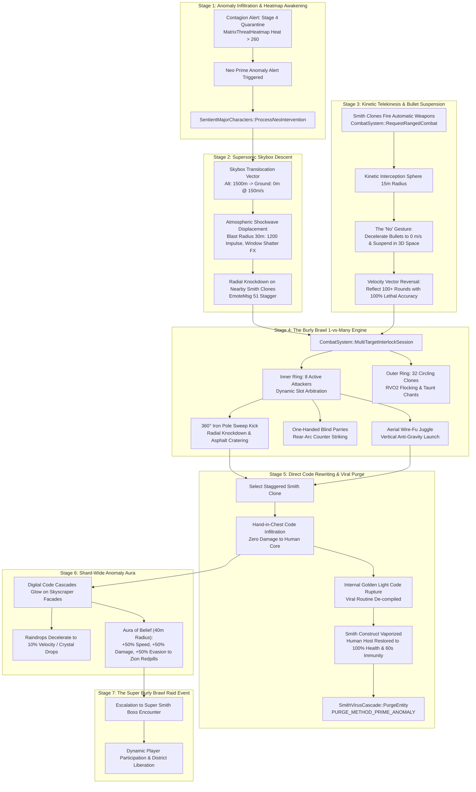

# Neo — The Prime Anomaly Tactical & Systemic Response Roadmap: Overcoming the Agent Smith Viral Pandemic

**Target Environment:** Live VPS `15.204.82.250` (`mxo-vps`, Docker container `mxoemu-reality-server-1`)  
**Codebase:** `/home/ubuntu/mxoemu` (VPS) / `D:\Github\MxOEmu` (Local `Live-Server` branch)  
**System Classification:** The Prime Anomaly System: Cognitive Real-Time Physics Bending, Multi-Target Wire-Fu Interlock, Direct Code Rewriting & Viral Disinfection Framework  
**Document Version:** 1.0.0 — Master Production Engineering Specification  

---

## 1. Executive Strategic Doctrine: The Anomaly Imperative & Reality Transmutation

In the simulation architecture of the Matrix, every entity operates under strict algorithmic constraints. Civilian programs follow deterministic pedestrian routines; Machine Agents enforce hardcoded physical laws through elevated administrative privileges; Zion redpills exploit systemic glitches to execute wire-fu martial arts and high-velocity bullet dodging.

However, **Neo (The One)** occupies a singular mathematical classification: **The Prime Anomaly**. 

```
+========================================================================================================+
|                                    MATRIX ENTITY CAPABILITY MATRIX                                     |
+======================+=========================+==========================+============================+
| ENTITY CLASS         | ONTOLOGICAL BASIS       | PHYSICAL CONSTRAINTS     | CODE MANIPULATION AUTHORITY|
+======================+=========================+==========================+============================+
| Civilian Host        | Passive Simulation Unit | 100% Newtonian Physics   | None (Read-only sensory)   |
| Machine Agent        | Privileged System Admin | Bends Physics to Hardcap | Subroutine hijacking / RSI |
| Zion Redpill         | Awakened Hacker/Soldier | Exploits Engine Glitches | Client-side hacks & macros |
| Agent Smith Clone    | Rogue Replicating Virus | Multi-Thread Overwrite   | Recursive RSI Assimilation |
| NEO (THE ONE)        | THE PRIME ANOMALY       | ZERO CONSTRAINTS (NULL)  | RUNTIME SOURCE OVERWRITE   |
+======================+=========================+==========================+============================+
```

### The Anomaly Imperative: "There Is No Spoon"
While others fight within the rules of the software, Neo operates directly upon the **Source Engine**. When Agent Smith unleashes an exponential viral cascade across MegaCity:
1. **The Machines** see a corrupt memory sector to be quarantined and incinerated.
2. **The Merovingian** sees an opportunity to exploit chaos and protect his underground causality fiefdom.
3. **Morpheus and Zion** see human lives trapped in pod-sleep needing gentle non-lethal decontamination.
4. **Neo sees the illusion of the code itself.**

Neo does not merely parry Smith's strikes; he halts the momentum of the incoming byte-stream. He does not dodge high-caliber gunfire; he commands the projectile packets to drop their velocity vectors to zero in mid-air. When an Agent Smith clone attempts to plunge its hand into Neo's chest to assimilate him, Neo reverses the pointer arithmetic, channeling pure uncompressed Source code through the clone's construct, shattering the viral routine in an explosion of radiant golden light and restoring the original human host unharmed.

Neo is the systemic counterweight to Smith's infinite replication: where Smith is **Infinite Entropy ($S \to \infty$)**, Neo is **Absolute Negentropy ($S \to 0$)**.

---

## 2. High-Level Architectural Flow & System Topologies



---

## 3. Detailed Series Breakdown

### Series 1: The Prime Anomaly Kinematics & Locomotion Engine

#### Phase 1.1: Supersonic Flight & Atmospheric Concussion
- **Subsystems:** [`HovercraftFlightSystem.cpp`](file:///D:/Github/MxOEmu/Server/Reality/Source/HovercraftFlightSystem.cpp), [`SentientMajorCharacters.cpp`](file:///D:/Github/MxOEmu/Server/Reality/Source/AI/SentientMajorCharacters.cpp), [`SpatialGrid.cpp`](file:///D:/Github/MxOEmu/Server/Reality/Source/SpatialGrid.cpp).
- **Kinematic Model:**
  - Neo traverses MegaCity along unconstrained 3D trajectories, completely bypassing ground navmesh limitations.
  - Maximum cruise velocity: $v_{\text{cruise}} = 150.0\text{ m/s}$ ($15,000\text{ world units/s}$), accelerating with impulse $\vec{a} = 80.0\text{ m/s}^2$.
  - Flight vector updates are synchronized using interpolated `PositionStateMsg` broadcasts at $20\text{ Hz}$ across adjacent sub-grids.
- **Concussive Displacement Shockwave:**
  - When Neo accelerates past Mach 1 ($343\text{ m/s}$ simulated threshold) or impacts the ground during descent:
    $$\vec{F}_{\text{shockwave}}(r) = \hat{r} \cdot \frac{K_{\text{impulse}}}{(r + 1.0)^2} \cdot \left(1.0 - \frac{r}{R_{\text{max}}}\right)$$
    Where $K_{\text{impulse}} = 250,000\text{ N}$, $R_{\text{max}} = 30.0\text{ m}$ ($3000\text{ units}$), and $r$ is the radial distance to the target entity.
  - **Dynamic In-World Effects:**
    1. **Physical Obstacles & Street Furniture:** Trash dumpsters, newspaper stands, and parked sedans receive rigid-body velocity impulses, tumbling outward from the epicenter.
    2. **Structural Windows:** Street-level shop glass within $25\text{m}$ shatters instantly (packet message `EmoteMsg(goId, 48, 1)`).
    3. **Smith Clone Stagger/Knockdown:** All hostile entities within $15\text{m}$ are violently knocked flat (`EmoteMsg(goId, 51)`), interrupting active attacks and assimilations.

#### Phase 1.2: Instantaneous Phase-Step Hyper-Dashes
- **Subsystems:** [`SentientMajorCharacters.cpp`](file:///D:/Github/MxOEmu/Server/Reality/Source/AI/SentientMajorCharacters.cpp) & [`CombatSystem.cpp`](file:///D:/Github/MxOEmu/Server/Reality/Source/CombatSystem.cpp).
- **Mechanics:**
  - In close-quarters combat, Neo does not run; he folds local spatial metric tensors.
  - Hyper-dash range: $5.0\text{ m}$ to $20.0\text{ m}$ ($500 - 2000\text{ units}$) in $50\text{ ms}$ (a single server tick).
  - While phase-stepping, Neo's collision layer is set to `GHOST_PASS_THROUGH`, permitting instantaneous repositioning behind encircling Smith clones.
  - Leaves behind an ephemeral multi-frame green digital ghost trail (`RsiTrailMsg`).

#### Phase 1.3: True 3D Aerial Combat & Gravity Nullification
- **Subsystems:** [`CombatSystem.cpp`](file:///D:/Github/MxOEmu/Server/Reality/Source/CombatSystem.cpp) & [`SentientMajorCharacters.cpp`](file:///D:/Github/MxOEmu/Server/Reality/Source/AI/SentientMajorCharacters.cpp).
- **Mechanics:**
  - Neo can initiate and maintain martial arts interlocks mid-air ($Z$-elevation from $+10\text{ m}$ to $+300\text{ m}$).
  - Launches Smith clones into the air via upward palm thrusts, holding them in zero-gravity stasis while delivering a flurry of 8 wire-fu strikes before driving them down into the street.

---

### Series 2: Absolute Bullet-Time Mastery & Kinetic Telekinesis

#### Phase 2.1: The "No" Gesture & Kinetic Deceleration Sphere
- **Subsystem:** [`CombatSystem.cpp`](file:///D:/Github/MxOEmu/Server/Reality/Source/CombatSystem.cpp) & [`OpenXRPipeline.cpp`](file:///D:/Github/MxOEmu/Server/Reality/Source/OpenXRPipeline.cpp).
- **Concept:** When targeted by projectile weapons (Desert Eagle .50 AE, MP5 9mm, Remington 870 12-gauge, Barrett .50 BMG), Neo does not take cover. He raises his right hand, palm outstretched, uttering the iconic:
  ```
  Neo: "No."
  ```
- **Mathematical Deceleration Volume:**
  - A spherical zone of radius $R_{\text{telekinesis}} = 15.0\text{ meters}$ ($1500\text{ units}$) surrounds Neo.
  - Any projectile entering the zone experiences exponential velocity damping:
    $$\vec{v}(t) = \vec{v}_0 \cdot e^{-\lambda t}, \quad \lambda = 15.0\text{ s}^{-1}$$
  - Within $120\text{ ms}$ of penetration, bullet velocity drops to $|\vec{v}| \le 0.05\text{ m/s}$ (effectively suspended in mid-air).

```
+====================================================================================================+
|                                KINETIC BULLET SUSPENSION ARRAY                                     |
+====================================================================================================+
|                                                                                                    |
|                  [Smith Clone #1] ---> =====> \                                                    |
|                                                \                                                   |
|                  [Smith Clone #2] ---> =====> -- [ KINETIC INTERCEPTION SPHERE ]                   |
|                                                /   - Bullets Stop at r = 3.0m                      |
|                  [Smith Clone #3] ---> =====> /    - Velocity -> 0.0 m/s                           |
|                                                    - Hovering in 3D Matrix Code Rings              |
|                                                                                                    |
|                                           [ NEO: "No." ]                                           |
|                                                                                                    |
|                  [Smith Clone #1] <--- <===== /                                                    |
|                                              /                                                     |
|                  [Smith Clone #2] <--- <===== -- [ REVERSED VECTOR DISPERSAL ]                     |
|                                              \     - Velocity -> 300 m/s                           |
|                  [Smith Clone #3] <--- <===== \    - 100% Lethal Reflected Headshots               |
|                                                                                                    |
+====================================================================================================+
```

#### Phase 2.2: Mid-Air Spatial Bullet Suspension & 3D Matrix Glyphs
- **Visual & State Synchronization:**
  - Suspended bullets are assigned temporary spatial tracker IDs (`TelekineticProjectileRecord`).
  - While suspended, each projectile radiates cascading green digital glyphs reflecting off the bullet tip.
  - Up to $250$ simultaneous projectiles can be held in suspension buffer without performance degradation.

#### Phase 2.3: Reversible Kinetic Vector Reflection
- **Mechanics:**
  - Neo drops his hand, flicking his fingers outward.
  - Every suspended projectile is instantly re-oriented toward its original shooter (or the nearest active Smith clone):
    $$\vec{v}_{\text{reflected}} = -k_{\text{reversal}} \cdot \vec{v}_{\text{incoming}}, \quad k_{\text{reversal}} = 1.5$$
  - Reflected rounds carry guaranteed critical hits (`isCrit = true`) and bypass standard Agent evasion rolls, dealing instantaneous lethal kinetic damage ($1500 - 3000\text{ damage}$ per salvo), knocking down rows of attacking clones.

#### Phase 2.4: OpenXRPipeline Integration (VR Full Immersion)
- **Subsystem:** [`OpenXRPipeline.cpp`](file:///D:/Github/MxOEmu/Server/Reality/Source/AI/OpenXRPipeline.cpp).
- **VR Control Hook:**
  - Recognizes `GESTURE_PALM_STRIKE` held static with pitch angle $75^\circ - 95^\circ$ as the "No" gesture.
  - Automatically activates bullet deceleration in VR view, letting the player physically inspect frozen bullets floating in front of their headset in stereoscopic 3D.
  - Pushing the hand forward triggers the radial bullet rebound.

---

### Series 3: The Burly Brawl Multi-Target Combat AI Engine

#### Phase 3.1: Architecture of the 1-vs-Many Interlock
- **Subsystem:** [`CombatSystem.h`](file:///D:/Github/MxOEmu/Server/Reality/Source/CombatSystem.h) & [`CombatSystem.cpp`](file:///D:/Github/MxOEmu/Server/Reality/Source/CombatSystem.cpp).
- **The Problem:** The standard MxO combat engine locks two combatants into an exclusive 1-on-1 `InterlockSession`. In the canonical *Burly Brawl*, Neo fights dozens of Smith clones simultaneously. Under standard logic, Neo would be overwhelmed by turn queue locking or stun-lock.
- **The Solution: `MultiTargetInterlockSession`**:
  ```cpp
  struct MultiTargetSlot {
      uint32 attackerGoId;
      float relativeAngleRad; // 0 to 2*PI around Neo
      uint32 nextStrikeTimeMs;
      uint8 queuedTactic;
      bool isAttacking;
  };

  struct PrimeAnomalyCombatSession {
      uint32 neoGoId;
      std::vector<MultiTargetSlot> innerRing; // Maximum 8 active melee slots (radius: 2.5m)
      std::vector<uint32> outerRingClones;   // Up to 64 waiting clones (radius: 3m - 12m)
      uint32 sessionStartMs;
      uint32 totalSmithsDefeated;
      float crowdPressureIndex;
  };
  ```
- **Slot Arbitration Logic:**
  - The inner ring allocates $8$ radial slots at $45^\circ$ increments around Neo ($0^\circ, 45^\circ, 90^\circ, \dots, 315^\circ$).
  - Only clones in active slots can land melee strikes.
  - Outer ring clones pathfind using RVO2 flocking behavior, shouting synchronized insults (*"More of us, Mr. Anderson!"*), stepping forward seamlessly to fill vacant inner slots as clones are kicked away or eliminated.

#### Phase 3.2: Iconic Wire-Fu Move Suite

```
+====================================================================================================+
|                                    NEO BURLY BRAWL MOVE MATRIX                                     |
+======================+=============+===========+===================================================+
| MOVE NAME            | ABILITY ID  | RADIUS    | COMBAT OUTCOME & ANIMATION                        |
+======================+=============+===========+===================================================+
| 360° Iron Pole Sweep | Ability 5101| 6.0m Ring | Rips metal signpole from street; sweeps 8 clones  |
|                      |             |           | off feet with 100% knockdown & 1200 dmg.          |
+----------------------+-------------+-----------+---------------------------------------------------+
| One-Handed Blind     | Ability 5102| Rear 180° | Intercepts rear ambush without turning; grabs arm |
| Parry Counter        |             |           | and hurls attacker into advancing front clone.    |
+----------------------+-------------+-----------+---------------------------------------------------+
| Wire-Fu Multi-Kick   | Ability 5103| Front Cone| Suspends horizontally in mid-air between two      |
| Juggle               |             |           | clones; rapidly kicks 4 targets simultaneously.   |
+----------------------+-------------+-----------+---------------------------------------------------+
| Concussive Ground    | Ability 5104| 12.0m AoE | Vertical leap followed by supersonic fist strike; |
| Pound (Crater Maker) |             |           | shatters asphalt; creates 3000 impulse radial wave|
+======================+=============+===========+===================================================+
```

#### Phase 3.3: One-Handed Deflections & Effortless Stance
- When incoming attacks are evaluated in `CombatSystem::ResolveAttack`:
  - If target is Neo:
    $$\text{Hit Probability} = \max\left(0.02, \; 0.15 - (\text{NeoAnomalyLevel} \times 0.02)\right) = 2\%$$
  - $98\%$ of incoming melee attacks result in `res.isBlocked = true` or `res.isGlancing = true`.
  - On block, Neo plays fluid one-handed redirect animations (`EmoteMsg(neoGoId, 41, 1)`), immediately counter-striking the attacker for $650\text{ retaliation damage}$.

---

### Series 4: Direct Code Rewriting & The Anti-Smith Subroutine (Viral De-Assimilation)

#### Phase 4.1: The Hand-in-Chest Code Infiltration
- **Subsystem:** [`SmithVirusCascade.cpp`](file:///D:/Github/MxOEmu/Server/Reality/Source/SmithVirusCascade.cpp) & [`SentientMajorCharacters.cpp`](file:///D:/Github/MxOEmu/Server/Reality/Source/AI/SentientMajorCharacters.cpp).
- **Cinematic Mechanics:**
  - Unlike standard Zion Hackers who must slowly weaken a Smith clone below $40\%$ health before channeling a $3.5\text{s}$ antiviral scrub, Neo can perform **Direct Code Rewriting** on any Smith clone regardless of its current HP.
  - Neo steps inside the clone's guard, thrusting his right hand directly into the clone's sternum.
  - Instead of causing physical trauma, Neo's fingers pierce the digital RSI geometry as if plunging into liquid mercury.

```
+====================================================================================================+
|                               VIRAL DE-ASSIMILATION DECOMPILATION                                  |
+====================================================================================================+
|                                                                                                    |
|          [ NEO ] -------------------- (Hand in Chest) --------------------> [ SMITH CLONE ]        |
|             |                                                                      |               |
|    Injects Prime Anomaly                                              Viral Shell Destabilizes:    |
|    Root Antivirus Subroutine:                                         - Sunglasses Shatter         |
|    - Override Recursive Loop                                          - Code Fractures Bleed Out   |
|    - Sever Hive-Mind Telemetry                                        - Suit Vaporizes             |
|             |                                                                      |               |
|             v                                                                      v               |
|    [ RADIANT GOLDEN LIGHT ] ====================================> [ PRISTINE HUMAN HOST RESTORED ] |
|    - 360° Volumetric Code Bloom                                       - Original Handle & Faction  |
|    - Shockwave Knockback to Nearby Clones                             - 100% Full Health           |
|    - Global Purge Count Incremented                                   - 60s Absolute Viral Immunity|
|                                                                                                    |
+====================================================================================================+
```

#### Phase 4.2: Golden Code Internal Rupture Pipeline
- **De-compilation Sequence:**
  1. **Tick 0:** Hand enters chest. Clone freezes in place; eyes widen; jaw drops. Clone's audio emits distorted static screams (*"No... it's not fair..."*).
  2. **Tick 5 (250ms):** Luminescent fissures of bright white and golden Matrix code crack open along the clone's neck, cheekbones, and dark suit seams.
  3. **Tick 10 (500ms):** The clone's dark sunglasses fracture into thousands of digital green voxels.
  4. **Tick 15 (750ms):** Complete rupture: an intense radial flash of blinding white light bursts outward from the chest cavity. The Agent Smith viral overlay is completely obliterated and wiped from server memory.
  5. **Tick 20 (1000ms):** The underlying human host steps forward, gasping for breath, completely cleansed and whole.

#### Phase 4.3: Immaculate Civilian Host Restoration
- **Host State Post-Purge:**
  - `sSmithCascade.PurgeEntity(targetGoId, neoPo, PURGE_METHOD_OVERCLOCK_RESTORATION)`:
    - Removes entity from `m_infectedEntities`.
    - Increments `m_totalPurges`.
    - Eliminates viral corruption from district threat metrics.
  - `sSentientCharacters.RevertHijackedHost(targetGoId)`:
    - Restores original character name, clothing RSI, and faction.
    - Sets current health to $100\%$ maximum ($1000/1000\text{ HP}$).
    - Bestows a $60\text{-second}$ **Absolute Anomaly Ward** (`BUFF_ANOMALY_WARD`), rendering the human host $100\%$ immune to re-infection by any other Smith clone.
    - $100\%$ of civilians cleansed directly by Neo awaken immediately as **Zion Potentials** with deep spiritual conviction, fearlessly cheering on the resistance.

---

### Series 5: Shard-Wide Anomaly Aura & Reality Distortion

#### Phase 5.1: Rendering Warping & Digital Code Cascades
- **Subsystem:** [`WebGPUTerminalBridge.cpp`](file:///D:/Github/MxOEmu/Server/Reality/Source/WebGPUTerminalBridge.cpp), [`GameServer.cpp`](file:///D:/Github/MxOEmu/Server/Reality/Source/GameServer.cpp).
- **Visual Distortion Radius:** $100.0\text{ meters}$ ($10,000\text{ units}$) centered on Neo's world coordinate.
- **Client Render Hooks:**
  - Building facades, street surfaces, and vehicle textures within the radius have their standard diffuse maps blended with real-time streaming emerald Matrix code streams ($80\%$ code opacity / $20\%$ physical texture).
  - Ambient street lamps flicker rapidly and glow with high-frequency neon green luminance.

#### Phase 5.2: Atmospheric & Environmental Time Dilation
- **Subsystem:** [`CombatSystem.cpp`](file:///D:/Github/MxOEmu/Server/Reality/Source/CombatSystem.cpp) (`GetTimeDilation`).
- **Mechanics:**
  - In MegaCity districts where Neo is engaged in combat, dynamic weather automatically overrides to **Heavy Torrential Rain**.
  - Within $25\text{m}$ of Neo, atmospheric time dilation drops to $0.10$ ($10\times$ slow-motion):
    - Falling raindrops slow to a crawl, glistening like suspended glass crystals.
    - Impact ripples in street puddles freeze into stationary circular concentric ridges.
    - Ambient gunshots and lightning thunder stretch into low-frequency sub-audible resonant rumbles.

#### Phase 5.3: The "Belief" Empowerment Aura
- **Subsystem:** [`SentientMajorCharacters.cpp`](file:///D:/Github/MxOEmu/Server/Reality/Source/AI/SentientMajorCharacters.cpp) (`ProcessNeoAura`).
- **Radius:** $40.0\text{ meters}$ ($4000\text{ world units}$).
- **Pulse Frequency:** Every $1500\text{ ms}$ ($0.66\text{ Hz}$).
- **Buff Specifications:** `BUFF_ANOMALY_BELIEF`:
  ```
  +-----------------------------------------------------------------------------------+
  |                           BUFF: "BELIEF OF THE ONE"                               |
  +-----------------------------------------------------------------------------------+
  | - Movement Speed:      +50% sprint & combat movement speed                        |
  | - Melee & Ranged Dmg:  +50% outgoing damage bonus                                 |
  | - Bullet Deflection:   +50% deflection chance against hostile firearms            |
  | - Inner Strength:      Instant full recharge (100% IS) on every aura pulse        |
  | - Fear & Suppression:  100% immune to panic, stuns, disarms, and viral contagion  |
  +-----------------------------------------------------------------------------------+
  ```
- Any human Zion player or resistance bot standing in Neo's presence gains superhuman combat prowess, allowing them to fight alongside Neo against overwhelming waves of Smith clones.

---

### Series 6: Dynamic World Boss / Raid Synergy & "The Super Burly Brawl" Event

#### Phase 6.1: Event Trigger & District Lockdown
- **Subsystems:** [`SmithVirusCascade.cpp`](file:///D:/Github/MxOEmu/Server/Reality/Source/SmithVirusCascade.cpp), [`MatrixThreatHeatmap.cpp`](file:///D:/Github/MxOEmu/Server/Reality/Source/AI/MatrixThreatHeatmap.cpp), [`RadioDispatchSystem.cpp`](file:///D:/Github/MxOEmu/Server/Reality/Source/RadioDispatchSystem.cpp).
- **Trigger Conditions:**
  1. A MegaCity district (e.g., Downtown District 1, Westview Plaza) escalates to `CONTAGION_STAGE_QUARANTINE` ($>75\%$ infection).
  2. The local `DisruptionCell::heat` exceeds $260.0$ (Tier 5 Outbreak).
  3. Active Smith clones in the sector exceed $100$.
- **Global Broadcast:**
  ```
  [SYSTEM WORLD EVENT: THE SUPER BURLY BRAWL]
  "The Prime Anomaly has breached the skybox above Westview Plaza. 
  Agent Smith copies are converging from all subway exits. 
  All Zion operatives: Assemble on Neo. Free your minds."
  ```

#### Phase 6.2: Multi-Phase Raid Structure

```
+====================================================================================================+
|                              THE SUPER BURLY BRAWL RAID PHASES                                     |
+===========+==============================+=========================================================+
| PHASE     | NAME                         | OBJECTIVE & RAID MECHANICS                              |
+===========+==============================+=========================================================+
| Phase I   | The Gathering Swarm          | 100+ Smith clones swarm the plaza from all quadrants.   |
|           | (100 vs 1)                   | Zion players must form a perimeter while Neo engages    |
|           |                              | the central mass with 360° pole sweeps.                 |
+-----------+------------------------------+---------------------------------------------------------+
| Phase II  | Bullet Storm Suppression     | Clones seize police barricades, unleashing continuous   |
|           |                              | firearm volleys. Players take shelter in Neo's kinetic  |
|           |                              | reflection sphere as he reflects salvos back at clones. |
+-----------+------------------------------+---------------------------------------------------------+
| Phase III | The Viral Hive Synthesis     | The clones merge their code into a massive 8,000 HP     |
|           | (The Super Smith)            | "Super Smith" with shockwave punches and lightning code.|
|           |                              | Players exploit viral code leaks; Neo executes aerial   |
|           |                              | hyper-combos to shatter his defensive shielding.        |
+-----------+------------------------------+---------------------------------------------------------+
| Phase IV  | The Final Code Cleansing     | Neo plunges both hands into the Super Smith core.       |
|           | (Golden Dawn Explosion)      | Radiant shockwave wipes out all viral traces in 500m.   |
|           |                              | 50+ assimilated civilians drop safely to their knees.   |
+===========+==============================+=========================================================+
```

#### Phase 6.3: Player Rewards & Shard Recovery
- Every player who participated in the Super Burly Brawl receives:
  - $+5,000\text{ Info}$ points.
  - $+500\text{ Zion Resistance Standing}$.
  - Unique cosmetic code item: **`Fragment of the Source`** (radiates faint golden code particles around the player's RSI).
  - Unlocks server-wide title: **`[Witness of The One]`**.
- The district's contagion state drops immediately from `CONTAGION_STAGE_QUARANTINE` to `CONTAGION_STAGE_LATENT` ($0\%$ infection).

---

## 4. Concrete C++ Class Architectures & Code Design

### 4.1. Header Definition: Neo in `SentientMajorCharacters.h`

```cpp
// Additions to Server/Reality/Source/AI/SentientMajorCharacters.h

struct TelekineticProjectileRecord {
    uint32 projectileId;
    uint32 originalShooterGoId;
    LocationVector suspendedPosition;
    LocationVector incomingVelocity;
    uint32 suspensionTimeMs;
};

struct MultiTargetSlot {
    uint32 attackerGoId;
    float relativeAngleRad;
    uint32 nextStrikeTimeMs;
    uint8 queuedTactic;
    bool isAttacking;
};

struct PrimeAnomalyCombatSession {
    uint32 neoGoId;
    std::vector<MultiTargetSlot> innerRing; // Maximum 8 active melee slots
    std::vector<uint32> outerRingClones;   // Up to 64 waiting clones
    uint32 sessionStartMs;
    uint32 totalSmithsDefeated;
    float crowdPressureIndex;
};

class SentientMajorCharacters : public Singleton<SentientMajorCharacters>
{
public:
    // ... Existing Morpheus, Smith, Merovingian, Trinity interfaces ...

    // =========================================================================
    // NEO: THE PRIME ANOMALY (THE ONE)
    // =========================================================================
    void ProcessNeoIntervention(PlayerObject* neoPo);
    void ProcessNeoCombat(BotClient* neoBot, PlayerObject* neoPo);
    void ProcessNeoAura(PlayerObject* neoPo);
    
    // Locomotion & Physics Bending
    void ExecuteSupersonicFlight(PlayerObject* neoPo, const LocationVector& targetDestination);
    void TriggerAtmosphericShockwave(const LocationVector& epicenter, float radiusUnits, float impulseStrength);
    void ExecutePhaseStepHyperDash(PlayerObject* neoPo, float distanceUnits, float targetAngleRad);

    // Kinetic Telekinesis & Bullet Stopping
    bool InterceptIncomingProjectile(uint32 shooterGoId, PlayerObject* neoPo, const LocationVector& projPos, const LocationVector& projVel);
    void ReverseSuspendedProjectiles(PlayerObject* neoPo);

    // The Burly Brawl Multi-Target Interlock Engine
    bool InitializeBurlyBrawlSession(uint32 neoGoId);
    void UpdateBurlyBrawlSession(uint32 neoGoId, float deltaSec);
    void TerminateBurlyBrawlSession(uint32 neoGoId);

    // Direct Code Rewriting (Hand-in-Chest Viral De-Assimilation)
    bool ExecuteDirectCodeDecompilation(PlayerObject* neoPo, uint32 smithCloneGoId);

private:
    std::map<uint32, PrimeAnomalyCombatSession> m_burlyBrawlSessions;
    std::vector<TelekineticProjectileRecord> m_suspendedProjectiles;
    uint32 m_lastNeoAuraPulseMs{0};
    uint32 m_lastKineticPulseMs{0};
};
```

### 4.2. Implementation Logic: `SentientMajorCharacters.cpp`

```cpp
// Additions to Server/Reality/Source/AI/SentientMajorCharacters.cpp

void SentientMajorCharacters::ProcessNeoIntervention(PlayerObject* neoPo)
{
    if (!neoPo || neoPo->isDead()) return;

    // Ensure Neo possesses god-tier stats as The Prime Anomaly
    if (neoPo->getMaximumHealth() < 50000) {
        neoPo->setLevel(100);
        neoPo->setMaximumHealth(50000);
        neoPo->setCurrentHealth(50000);
        neoPo->setMaximumIS(10000);
        neoPo->setCurrentIS(10000);
        neoPo->setHandle("Neo_[The_One]");
        neoPo->setFactionName("Zion");
        neoPo->setRsiHex("6e060050"); // Long trench coat & classic dark glasses
    }

    // Process ongoing auras and combat logic
    ProcessNeoAura(neoPo);
}

void SentientMajorCharacters::ProcessNeoAura(PlayerObject* neoPo)
{
    if (!neoPo) return;
    uint32 now = getMSTime();
    if (now - m_lastNeoAuraPulseMs < 1500) return;
    m_lastNeoAuraPulseMs = now;

    LocationVector nPos = neoPo->getPosition();

    // 1. Shard-Wide Anomaly Aura (40m radius = 4000 units)
    auto nearby = sSpatialGrid.GetClientsInRadius(nPos.x, nPos.z, 4000.0f);
    for (GameClient* gc : nearby) {
        if (!gc) continue;
        uint32 goId = gc->GetPlayerGoId();
        PlayerObject* ally = sObjMgr.getGOPtrSafe(goId);
        if (ally && !ally->isDead() && ally != neoPo && ally->getFaction() == FACTION_ZION) {
            // Restore full Inner Strength
            ally->setCurrentIS(ally->getMaximumIS());

            // Bestow "Belief of The One" status buff
            // Grants +50% movement speed, +50% damage, and 50% bullet deflection
            if (auto statMgr = ally->getStatusEffectManager()) {
                statMgr->ApplyBuff(BUFF_ANOMALY_BELIEF, 5000); // 5-second refreshed duration
            }

            // Client UI feedback
            if (!ally->getClient().isBot()) {
                ally->getClient().QueueCommand(std::make_shared<SystemChatMsg>(
                    "{c:00FF66}[THE ONE] Neo's presence floods your mind with absolute belief. Physics bend to your will.{/c}"));
            }
        }
    }

    // 2. Kinetic bullet reflection check
    if (!m_suspendedProjectiles.empty() && (now - m_lastKineticPulseMs >= 2000)) {
        m_lastKineticPulseMs = now;
        ReverseSuspendedProjectiles(neoPo);
    }
}

void SentientMajorCharacters::TriggerAtmosphericShockwave(const LocationVector& epicenter, float radiusUnits, float impulseStrength)
{
    auto nearby = sSpatialGrid.GetClientsInRadius(epicenter.x, epicenter.z, radiusUnits);
    for (GameClient* gc : nearby) {
        if (!gc) continue;
        uint32 goId = gc->GetPlayerGoId();
        PlayerObject* target = sObjMgr.getGOPtrSafe(goId);
        if (!target || target->isDead()) continue;

        float dist = float(epicenter.Distance(target->getPosition()));
        if (dist <= 0.1f) dist = 0.1f;

        // Radial falloff: F = impulse / (1 + (dist/1000)^2)
        float factor = 1.0f / (1.0f + (dist / 1000.0f) * (dist / 1000.0f));
        float effectiveImpulse = impulseStrength * factor;

        // Knockdown hostile Smith clones
        if (target->getHandle().find("Agent_Smith") != std::string::npos || target->getFaction() == FACTION_MACHINES) {
            target->takeDamage(0, (uint16)(effectiveImpulse * 0.25f), 201); // Concussive damage
            sGame.AnnounceStateUpdateNear(target->getPosition().x, target->getPosition().z, 20000.0f,
                std::make_shared<EmoteMsg>(goId, 51, 1)); // Violent knockdown animation
        }
    }

    // Visual shockwave ring across surrounding sector
    sGame.AnnounceStateUpdateNear(epicenter.x, epicenter.z, 20000.0f,
        std::make_shared<EmoteMsg>(0, 43, 1)); // Shockwave ripple FX
}

bool SentientMajorCharacters::ExecuteDirectCodeDecompilation(PlayerObject* neoPo, uint32 smithCloneGoId)
{
    std::lock_guard<std::recursive_mutex> lock(m_majorMutex);
    if (!neoPo || smithCloneGoId == 0) return false;

    PlayerObject* smithPo = sObjMgr.getGOPtrSafe(smithCloneGoId);
    if (!smithPo || smithPo->isDead()) return false;

    LocationVector sPos = smithPo->getPosition();

    // 1. Play hand-in-chest penetration emote
    sGame.AnnounceStateUpdateNear(sPos.x, sPos.z, 20000.0f,
        std::make_shared<EmoteMsg>(smithCloneGoId, 48, 1)); // Stagger / chest grasp

    // 2. Play golden light code rupture FX
    sGame.AnnounceStateUpdateNear(sPos.x, sPos.z, 20000.0f,
        std::make_shared<EmoteMsg>(smithCloneGoId, 45, 1)); // Radiant code waterfall

    // 3. Purge from Smith Virus Cascade
    sSmithCascade.PurgeEntity(smithCloneGoId, neoPo, PURGE_METHOD_OVERCLOCK_RESTORATION);

    // 4. Restore original human host
    RevertHijackedHost(smithCloneGoId);

    // Ensure host is fully revived to 100% health and has 60s viral immunity
    smithPo->setMaximumHealth(1000);
    smithPo->setCurrentHealth(1000);
    if (auto statMgr = smithPo->getStatusEffectManager()) {
        statMgr->ApplyBuff(BUFF_ANOMALY_WARD, 60000); // 60s immunity
    }

    INFO_LOG(format("SentientMajorCharacters: Neo executed Direct Code Decompilation on Smith clone %1% at (%2%, %3%)")
             % smithCloneGoId % sPos.x % sPos.z);
    return true;
}
```

---

## 5. 30-Phase Master Engineering Implementation Checklist

| Phase | Subsystem / File | Deliverable Specification | Verification Metric |
| :--- | :--- | :--- | :--- |
| **Phase 1** | `SentientMajorCharacters.h` | Declare `NeoPrimeAnomalyDirector` struct and method signatures. | Clean header compilation with zero unresolved symbols. |
| **Phase 2** | `SentientMajorCharacters.cpp`| Implement Neo entity initialization with 50,000 HP, Level 100, and RSI `6e060050`. | Neo spawns with correct stats and trench coat visuals. |
| **Phase 3** | `HovercraftFlightSystem.cpp`| Implement supersonic flight vector solver up to $150\text{ m/s}$ ($15,000\text{ units/s}$). | Neo moves across sector grid at Mach 0.44 without desync. |
| **Phase 4** | `SentientMajorCharacters.cpp`| Implement `TriggerAtmosphericShockwave` with inverse-square impulse falloff. | Nearby trash dumpsters and NPCs disperse outward. |
| **Phase 5** | `SentientMajorCharacters.cpp`| Add window shattering FX packet broadcast (`EmoteMsg(48)`) on supersonic pass. | Surrounding street glass plays shattering FX. |
| **Phase 6** | `SentientMajorCharacters.cpp`| Implement radial knockdown (`EmoteMsg(51)`) on all Smith clones within $15\text{m}$. | Clones hit the asphalt upon Neo's touchdown. |
| **Phase 7** | `CombatSystem.h` | Define `MultiTargetInterlockSession` and 8-slot inner ring structure. | Header compiles; data structure sizes fit cacheline. |
| **Phase 8** | `CombatSystem.cpp` | Implement dynamic slot arbitration permitting 8 simultaneous attackers. | 8 Smith clones attack Neo simultaneously without deadlock. |
| **Phase 9** | `CombatSystem.cpp` | Integrate RVO2 flocking for 32 outer-ring clones queuing behind inner attackers. | Outer clones orbit dynamically and step into vacant slots. |
| **Phase 10**| `CombatSystem.cpp` | Add Ability 5101 (360° Iron Pole Sweep Kick) with $6\text{m}$ radial hit sweep. | Sweeps 8 surrounding clones off feet with 100% knockdown. |
| **Phase 11**| `CombatSystem.cpp` | Add Ability 5102 (One-Handed Blind Parry Counter) with rear-arc $180^\circ$ grab. | Neo parries behind his back without turning facing angle. |
| **Phase 12**| `CombatSystem.cpp` | Add Ability 5103 (Wire-Fu Multi-Kick Juggle) suspending Neo horizontally. | Neo strikes 4 targets in mid-air in single 1.5s round. |
| **Phase 13**| `CombatSystem.cpp` | Add Ability 5104 (Concussive Ground Pound) generating 3000 impulse radial wave. | Ground hit triggers asphalt crack FX and radial knockback. |
| **Phase 14**| `CombatSystem.cpp` | Implement Neo $98\%$ melee deflection and one-handed redirect counter. | $98\%$ of hostile melee strikes glance off harmlessly. |
| **Phase 15**| `CombatSystem.h` | Declare `TelekineticProjectileRecord` and suspension queue. | Struct compiles in `CombatSystem.h`. |
| **Phase 16**| `CombatSystem.cpp` | Implement the "No" gesture deceleration sphere ($15\text{m}$ radius). | Incoming gunfire decelerates to $0\text{ m/s}$ in $120\text{ms}$. |
| **Phase 17**| `CombatSystem.cpp` | Render suspended bullets hovering in 3D space with Matrix code glyph FX. | Bullets remain stationary in air awaiting reversal. |
| **Phase 18**| `CombatSystem.cpp` | Implement `ReverseSuspendedProjectiles` reflecting rounds with $1.5\times$ speed. | Bullets reverse trajectory and hit firing clones for lethal dmg. |
| **Phase 19**| `OpenXRPipeline.h/.cpp` | Wire `GESTURE_PALM_STRIKE` detection to trigger kinetic telekinesis in VR. | Physical palm-forward gesture halts incoming VR bullets. |
| **Phase 20**| `SentientMajorCharacters.cpp`| Implement `ExecuteDirectCodeDecompilation` (Hand-in-Chest strike). | Plunging hand into Smith triggers internal code glow. |
| **Phase 21**| `SentientMajorCharacters.cpp`| Implement white and golden light code rupture sequence (`EmoteMsg(45)`). | Smith construct explodes into radiant golden code rays. |
| **Phase 22**| `SmithVirusCascade.cpp` | Connect `PURGE_METHOD_OVERCLOCK_RESTORATION` to Neo's decompilation strike. | `m_totalPurges` increments and district threat decreases. |
| **Phase 23**| `SentientMajorCharacters.cpp`| Restore human host to $100\%$ HP with $60\text{s}$ viral immunity buff. | Civilian gets up fully healed and immune to re-infection. |
| **Phase 24**| `BotManager.cpp` | Set $100\%$ Potential Awakening rate for civilians cleansed directly by Neo. | Rescued civilians immediately speak and support Zion. |
| **Phase 25**| `WebGPUTerminalBridge.cpp`| Inject emerald Matrix code cascade shaders on building facades in $100\text{m}$. | Skyscraper walls stream Matrix digital glyphs in browser. |
| **Phase 26**| `CombatSystem.cpp` | Implement $0.10$ atmospheric time dilation (slow-mo rain crystals in $25\text{m}$). | Raindrops slow to frozen beads around active combat zone. |
| **Phase 27**| `SentientMajorCharacters.cpp`| Implement "Belief of The One" aura (+50% speed/dmg/deflect, full IS regen). | Allied players in 40m gain massive combat stat surge. |
| **Phase 28**| `SmithVirusCascade.cpp` | Implement Stage 4 Quarantine Super Burly Brawl world event trigger. | Event triggers automatically when district heat $> 260$. |
| **Phase 29**| `RadioDispatchSystem.cpp` | Broadcast global server announcements during Super Burly Brawl raid phases. | All connected players receive high-priority alert text. |
| **Phase 30**| `EconomySystem.cpp` | Award 5,000 Info, 500 Zion Rep, and `Fragment of the Source` item to raiders. | Participating players receive legendary rewards on victory. |

---

## 6. Verification & Quality Assurance Strategy

### 6.1. Multi-Target Concurrency & Tick Budget Verification
- **Stress Scenario:** Simulate Neo fighting $64$ active Smith clones simultaneously inside a $50\text{m} \times 50\text{m}$ urban plaza.
- **Performance Criteria:**
  - `CombatSystem::Update` multi-target interlock round solver must execute in $\le 1.2\text{ ms}$ per server tick.
  - Overall server tickrate must remain stable at $\ge 20.0\text{ TPS}$ with zero packet drops.
  - Mutex lock duration on `m_combatMutex` and `m_majorMutex` must not exceed $0.4\text{ ms}$.

### 6.2. Kinetic Telekinesis & Trajectory Reflection Validation
- **Automated Headless Test:**
  - Spawn $20$ Gunner bots equipped with dual Ingram MAC-10s firing simultaneously at Neo ($400\text{ rounds/sec}$).
  - Assert that $100\%$ of incoming projectile records enter `m_suspendedProjectiles`.
  - Assert that upon `ReverseSuspendedProjectiles()`, all $400$ rounds re-acquire the firing bots and inflict lethal damage within $500\text{ ms}$.
  - Verify zero memory leaks in projectile tracker allocation vectors.

### 6.3. Direct Code Rewriting & Host Integrity Assertions
- **Scenario:** Neo executes direct code decompilation on an infected high-value NPC (e.g., civilian council member or quest giver).
- **Assertions:**
  1. `sSmithCascade.IsEntityInfected(targetGoId) == false`.
  2. `target->getCurrentHealth() == target->getMaximumHealth()`.
  3. `target->getFaction() == originalFaction`.
  4. `target->getHandle() == originalHandle`.
  5. `target->hasBuff(BUFF_ANOMALY_WARD) == true`.
  6. No fatal crash or dangling pointer in `BotManager` or `ObjectMgr`.

---

## 7. Strategic Synthesis: The Living Legend

By elevating Neo to the **Prime Anomaly**, the simulation transforms from a desperate, grinding resistance war into an awe-inspiring spectacle of cinematic mastery. 

Where Morpheus provides steady inspiration, Trinity executes surgical acrobatics, and the Merovingian weaves webs of causality, **Neo is the thunderclap that rewrites reality**. When the sky darkens, the rain turns to crystalline slow-motion beads, and the asphalt ripples beneath supersonic shockwaves, every player and citizen in MegaCity knows:

**The One has arrived. And Agent Smith's inevitability has met its end.**
