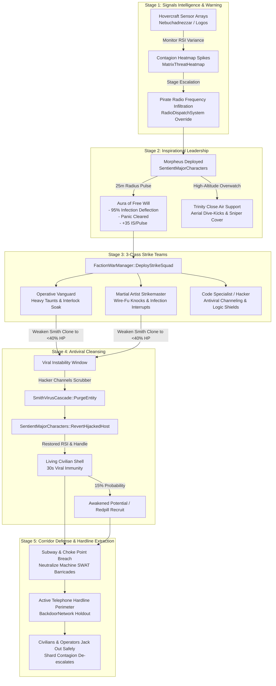

# Zion Resistance Tactical Response Roadmap: Countering the Agent Smith Viral Contagion

**Target Environment:** Live VPS `15.204.82.250` (`mxo-vps`, Docker container `mxoemu-reality-server-1`)  
**Codebase:** `/home/ubuntu/mxoemu` (VPS) / `D:\Github\MxOEmu` (Local `Live-Server` branch)  
**System Classification:** Asymmetric Multi-Tier Resistance AI & Tactical Decontamination Framework  
**Document Version:** 1.0.0 — Production Engineering Specification  

---

## 1. Executive Strategic Doctrine: The Preservation Imperative

In the face of an exponential Agent Smith contagion event in MegaCity, the three major Matrix factions operate under irreconcilable, diametrically opposed operational doctrines:

```
+====================================================================================================+
|                                    FACTION TRI-DOCTRINE MATRIX                                     |
+======================+===================================+=========================================+
| FACTION              | STRATEGIC CLASSIFICATION          | OPERATIONAL GOAL                        |
+======================+===================================+=========================================+
| MACHINE SYSTEM SEC.  | Scorched-Earth Sterilization      | Quarantine perimeter; incinerate all    |
|                      | (Outer Cordon + Logic Bombs)      | entities inside (virus & hosts alike).  |
+----------------------+-----------------------------------+-----------------------------------------+
| MEROVINGIAN EXILES   | Opportunistic Chaos & Sanctuary   | Defend Club Hel; exploit viral breach;  |
|                      | (Supernatural Brawlers + Red Code)| deploy causality traps for leverage.    |
+----------------------+-----------------------------------+-----------------------------------------+
| ZION RESISTANCE      | The Preservation Imperative       | Break Machine cordons; save human minds;|
|                      | (Code Scrubbing + Evacuation)     | revert hosts back to civilian shells.   |
+======================+===================================+=========================================+
```

### The Zion Mandate: Human Souls Over Digital Code
The Machines treat an infected sector as a corrupted storage sector to be wiped clean by police cordons and logic bombs. The Merovingian treats the crisis as an underworld turf war.

For Zion, **every infected civilian or redpill is an actual living human body plugged into a power plant pod or hovering aboard a resistance ship**. Incinerating the host kills the human in the real world. Therefore, Zion's response doctrine rejects total eradication. Zion's mission is defined by three unbending directives:
1. **Preserve the Host Shell:** Weaken Smith clones through tactical combat without applying lethal terminal damage, exposing the viral exploit window.
2. **Execute Antiviral Decontamination:** Deploy Hacker code scrubbers to purge Smith's signature, restore the host's original identity, faction, and appearance, and awaken dormant potentials.
3. **Establish Evacuation Corridors:** Breach Machine SWAT blockades and subway choke points to shepherd terrified civilians toward active telephone hardlines and subterranean hovercraft extraction portals.

---

## 2. High-Level Architectural Flow



---

## 3. Detailed Series Breakdown

### Series 1: Threat Detection & Pirate Broadcast Intelligence

#### Phase 1.1: Hovercraft Sensor Array Telemetry (Subterranean Signals Intelligence)
- **Subsystem:** [`HovercraftFlightSystem.cpp`](file:///D:/Github/MxOEmu/Server/Reality/Source/HovercraftFlightSystem.cpp) & [`MatrixThreatHeatmap.cpp`](file:///D:/Github/MxOEmu/Server/Reality/Source/AI/MatrixThreatHeatmap.cpp).
- **Functionality:**
  - Subterranean hovercrafts (the *Nebuchadnezzar*, *Logos*, *Mjolnir*, and *Vigilant*) cruise the real-world utility tunnels beneath MegaCity, projecting deep-frequency electromagnetic sniffers into the Matrix broadcast carrier waves.
  - The system computes the **Viral Anomaly Density Index ($VADI$)** for each city sector:
    $$VADI = \frac{\sum_{i \in \text{Entities}} \mathbb{I}(\text{isSmithClone}_i) \times \text{ThreatHeat}_i}{\text{Total Sector Volume}} \times \Delta t$$
  - When $VADI$ crosses threshold values, the Zion defense matrix transitions through tactical alertness states (`ZION_ALERT_MONITOR` $\to$ `ZION_ALERT_MOBILIZE` $\to$ `ZION_ALERT_FULL_DEPLOYMENT`).
- **Telemetry Hooks:** Automated alerts dispatch to Zion command consoles when `SmithVirusCascade::GetStage() >= CONTAGION_STAGE_ELEVATED`.

#### Phase 1.2: Pirate Frequency Infiltration & Counter-Dispatches
- **Subsystem:** [`RadioDispatchSystem.cpp`](file:///D:/Github/MxOEmu/Server/Reality/Source/RadioDispatchSystem.cpp).
- **Functionality:**
  - When Machine System Agents (Gray, Pace, Skinner) seize municipal radio dispatch channels and declare martial law (`[CODE-BLACK MARTIAL LAW]`), Zion Operators (e.g., Tank, Link, Sparky) deploy **Frequency Hijack Daemons**.
  - Hijack transmissions override the police scanner and civilian cellular receivers within a $3000\text{m}$ radius of the contagion epicenter:
    ```
    [PIRATE BROADCAST - ZION OPERATOR UPLINK]
    "Attention all citizens and free operatives in Downtown District 2: 
    Do not trust municipal police directives. SWAT teams have sealed the subway exits. 
    The men in black suits are replicating. Avoid corporate plazas. 
    Move immediately towards Hardline 84 on 4th Street. Zion Strike Teams are inbound to clear a corridor. 
    Hold on to your minds."
    ```
  - **Dynamic In-Game Effect:** Panicking civilians within audible earshot of radios or payphones receive an acoustic pathfinding redirection, steering their retreat vectors away from police roadblocks and toward active Zion rescue beacons.

#### Phase 1.3: Real-Time Contagion Mapping & Operator HUD Overlay
- **Subsystem:** [`WebGPUTerminalBridge.cpp`](file:///D:/Github/MxOEmu/Server/Reality/Source/WebGPUTerminalBridge.cpp) & [`MatrixThreatHeatmap.cpp`](file:///D:/Github/MxOEmu/Server/Reality/Source/AI/MatrixThreatHeatmap.cpp).
- **Functionality:**
  - Renders dynamic SVG/WebGPU tactical heatmaps displaying real-time contagion vectors, quarantine cordon boundaries, and hardline operational status.
  - Generates optimal pathfinding escape corridors ($A^*$ path with threat heatmap weights) displayed to connected human players.

---

### Series 2: Morpheus Leadership & Anti-Panic Psychological Auras

#### Phase 2.1: Morpheus's "Aura of Free Will" (Architectural Expansion)
- **Subsystem:** [`SentientMajorCharacters.cpp`](file:///D:/Github/MxOEmu/Server/Reality/Source/AI/SentientMajorCharacters.cpp) (`ProcessMorpheusAura`).
- **Operational Specifications:**
  - **Radius:** $25.0\text{ meters}$ ($2500\text{ world units}$), centered on Morpheus's world position.
  - **Pulse Frequency:** Every $2000\text{ms}$ ($0.5\text{ Hz}$) via the Reality simulation loop.
  - **Mechanics:**
    1. **Viral Infection Deflection ($95\%$ Resist):**
       - When an Agent Smith clone executes `ActionAgentInfect::Tick` against any target inside Morpheus's aura, the target rolls a $95\%$ deflection check.
       - On success, the assimilation fails instantly. The infection channeling is severed, and the Smith clone receives a kinetic shockwave knockback ($500\text{ units}$ backward) with visual blue code ripple FX (`EmoteMsg(43, 1)`).
    2. **Inner Strength / Focus Surge:**
       - Restores $+35\text{ IS points}$ per pulse to all allied Zion redpills, allowing continuous execution of high-tier martial arts techniques and code defense scripts.
       - Increases allied melee parry and ranged deflection chance by $+25\%$.
    3. **Psychological Trauma & Panic Cleansing:**
       - Any civilian NPC within the aura has their `m_isPanicking` flag immediately cleared.
       - Fetal cowering emotes (`EmoteMsg(50)`) are terminated. The civilian's fear level is reset to $0.15$ (calm alertness), and their AI state switches to `STATE_EVACUATING_ZION_ESCORT`.

#### Phase 2.2: Dual-Stance Switching & Iconic Dialogues
- **Subsystem:** [`SentientMajorCharacters.cpp`](file:///D:/Github/MxOEmu/Server/Reality/Source/AI/SentientMajorCharacters.cpp) (`ProcessMorpheusStance`).
- **Tactical Logic:**
  - **Melee Interlock Range ($\le 300\text{ units}$):** Morpheus activates `TACTIC_POWER`, executing Crane Stance counters and roundhouse kicks that knock Smith clones to the ground.
    - *Voice Bark:* `"Morpheus: Free your mind."` / `"Morpheus: He is beginning to believe."`
  - **Ranged Stance Range ($> 300\text{ units}$):** Morpheus unholsters his high-caliber combat shotgun, firing point-blank suppression blasts (Ability 5014) to stagger advancing clones.
    - *Voice Bark:* `"Morpheus: Fate, it seems, is not without a sense of irony."`

#### Phase 2.3: Trinity High-Acrobatic Close Air Support
- **Subsystem:** [`SentientMajorCharacters.cpp`](file:///D:/Github/MxOEmu/Server/Reality/Source/AI/SentientMajorCharacters.cpp) (`ProcessTrinityCombat`).
- **Tactical Logic:**
  - **Aerial Dive-Kicks (Ability 5005 - Eagle Strike):** Trinity targets Smith clones currently channeling `ActionAgentInfect` on civilians, performing high-velocity leaping wire-fu kicks that break the infection lock.
    - *Voice Bark:* `"Trinity: Dodge this."`
  - **Dual Beretta Bullet-Time Suppression (Ability 5011 - Trick Shot):** Trinity provides perimeter fire, staggering secondary clones attempting to swarm the primary decontamination zone.

#### Phase 2.4: The Anomaly Surge Protocol (Neo Intervention)
- **Subsystem:** [`SentientMajorCharacters.cpp`](file:///D:/Github/MxOEmu/Server/Reality/Source/AI/SentientMajorCharacters.cpp).
- **Trigger Condition:** Shard reaches `CONTAGION_STAGE_QUARANTINE` (>75% infection) and active Smith clones exceed 100 within a single district.
- **Mechanics:**
  - Neo enters the sector, emitting an Anomaly Distortion Field within a $50\text{m}$ radius.
  - Incoming high-velocity projectile rounds decelerate to zero velocity in mid-air and drop harmlessly to the asphalt.
  - Emits a radial **Matrix Code Wave** that strips viral camouflage, instantly revealing all assimilated hosts on player mini-maps and rendering Smith clones vulnerable to immediate decontamination.

---

### Series 3: Tactical Strike Squad Deployments & Interlock Disruption

#### Phase 3.1: 3-Class Strike Team Synergies
- **Subsystem:** [`FactionWarManager.cpp`](file:///D:/Github/MxOEmu/Server/Reality/Source/FactionWarManager.cpp) (`DeployStrikeSquad`, `updateStrikeSquads`).
- **Operational Composition:**
  ```
  +--------------------------------------------------------------------------------------------------+
  |                                ZION 3-CLASS STRIKE TEAM MATRIX                                   |
  +----------------------+--------------------+--------+---------------------------------------------+
  | ROLE                 | ARCHETYPE          | HP     | PRIMARY TACTICAL RESPONSIBILITY             |
  +----------------------+--------------------+--------+---------------------------------------------+
  | Operative Vanguard   | Heavy Tank         | 3,500  | Aggro magnet, crowd control, body-blocking, |
  |                      |                    |        | shotgun suppression fire.                   |
  +----------------------+--------------------+--------+---------------------------------------------+
  | Martial Artist       | Agile Strikemaster | 2,600  | Wire-fu knockdowns, 85% infection interrupt,|
  |                      |                    |        | rear-arc backstabs, parry defense.          |
  +----------------------+--------------------+--------+---------------------------------------------+
  | Code Specialist      | Support Hacker     | 2,200  | Antiviral decontamination, logic barriers,  |
  |                      |                    |        | IS replenishment, hardline decryption.      |
  +----------------------+--------------------+--------+---------------------------------------------+
  ```

#### Phase 3.2: Behavior Tree Infection Disruption Routine
- **Subsystem:** [`BehaviorTree.cpp`](file:///D:/Github/MxOEmu/Server/Reality/Source/BehaviorTree.cpp).
- **New Action Node: `ActionDisruptInfection`:**
  - **Preconditions:** An enemy entity within $1500\text{ units}$ is currently executing `ActionAgentInfect`.
  - **Execution:**
    1. The Martial Artist immediately drops current target and pathfinds via Detour NavMesh to the infector at maximum sprint speed.
    2. Executes a high-priority interrupt move (Sweep Kick / Flying Knee).
    3. Triggers an interlock disruption check:
       $$\text{Interrupt Chance} = 0.70 + (\text{MartialArtistAgility} \times 0.003) = 85\%$$
    4. Upon success, the Smith clone is knocked down (`EmoteMsg(51)`), terminating the infection channel and saving the civilian victim.

#### Phase 3.3: Adaptive Squad Formations & Flocking Dynamics
- **Subsystem:** [`RVO2Steering.h`](file:///D:/Github/MxOEmu/Server/Reality/Source/AI/RVO2Steering.h) & [`FactionWarManager.cpp`](file:///D:/Github/MxOEmu/Server/Reality/Source/FactionWarManager.cpp).
- **Formations:**
  - **Vanguard Wedge (Advancing):** Operative at $(0, 0)$, Hacker at $(-800, -600)$, Martial Artist at $(+800, -600)$.
  - **Protective Ring (Cleansing / Holding):** Operative and Martial Artist form an outer defensive perimeter $180^\circ$ apart, while the Hacker occupies the center radius ($300\text{ units}$ from target) channeling the decontamination pulse.

---

### Series 4: Antiviral Code Scrubbing & Host Decontamination Pipeline

#### Phase 4.1: The Sub-40% HP Viral Instability Window
- **Subsystem:** [`CombatSystem.cpp`](file:///D:/Github/MxOEmu/Server/Reality/Source/CombatSystem.cpp) & [`SmithVirusCascade.cpp`](file:///D:/Github/MxOEmu/Server/Reality/Source/SmithVirusCascade.cpp).
- **Concept:** Smith's viral code bonds tightly to the host's digital RSI. Attempting to scrub the virus at full health causes catastrophic code rejection (killing the host). Only when the clone is physically weakened in combat does the viral link destabilize.
- **Formula:**
  $$\text{Instability State} = \begin{cases} 
  \text{ACTIVE}, & \text{if } \text{currentHealth} \le (0.40 \times \text{maximumHealth}) \\
  \text{LOCKED}, & \text{otherwise}
  \end{cases}$$
- **Visual Tell:** When instability is reached, green Matrix digital glyphs flicker through the clone's business suit, and the clone plays a staggered recovery animation (`EmoteMsg(48)`).

#### Phase 4.2: Antiviral Purge Execution
- **Subsystem:** [`SmithVirusCascade.cpp`](file:///D:/Github/MxOEmu/Server/Reality/Source/SmithVirusCascade.cpp) (`PurgeEntity`) & [`SentientMajorCharacters.cpp`](file:///D:/Github/MxOEmu/Server/Reality/Source/AI/SentientMajorCharacters.cpp) (`RevertHijackedHost`).
- **Channeling Protocol:**
  1. The Hacker AI (or human player using Ability 401: *Antiviral Scrubber*) channels for $3.5\text{ seconds}$ within an $8\text{-meter}$ standoff distance.
  2. If channeling is not interrupted by damage:
     - `sSmithCascade.PurgeEntity(targetGoId, purifierPo, PURGE_METHOD_ANTIVIRAL_PULSE)` is invoked:
       - Removes target from `m_infectedEntities`.
       - Increments `m_totalPurges`.
       - Awards $+750\text{ Info}$ and $+50\text{ Zion Standing}$ to the purifier.
     - `sSentientCharacters.RevertHijackedHost(targetGoId)` is invoked:
       - Retrieves the original pre-infection `HostHijackRecord` (handle, faction, and RSI appearance).
       - Restores the original model, clearing the Agent Smith suit and sunglasses.
       - Restores health to $1000\text{ max HP}$ / $150\text{ current HP}$ (conscious civilian state).
       - Applies a $30\text{-second}$ **Viral Immunity Buff**, preventing immediate re-infection.
       - Plays the iconic green Matrix waterfall cleansing FX (`EmoteMsg(45, 1)`).

#### Phase 4.3: Memory Awakening & The Redpill Emergence
- **Subsystem:** [`BotManager.cpp`](file:///D:/Github/MxOEmu/Server/Reality/Source/BotManager.cpp).
- **Mechanics:**
  - Overwritten civilians experience residual digital awareness of the Matrix code after being cleansed.
  - Roll an **Awakening Probability Check ($15\%$)**:
    - **$85\%$ Standard Civilian:** Plays relief dialogue (*"What happened to me? Who was that man?"*), then pathfinds along the evacuation corridor to the nearest subway or building interior.
    - **$15\%$ Awakened Potential:** The civilian stands up as an awakened **Redpill Novice** with Zion faction affiliation. The NPC speaks to the rescuers (*"I saw it... the green code behind the walls. Get me out of here."*) and follows the strike team toward the nearest Hardline to jack out to Zion.

---

### Series 5: Evacuation Corridors & Hardline Defense Operations

#### Phase 5.1: Breaching Machine SWAT Barricades
- **Subsystem:** [`PedestrianEcology.cpp`](file:///D:/Github/MxOEmu/Server/Reality/Source/AI/PedestrianEcology.cpp) & [`RadioDispatchSystem.cpp`](file:///D:/Github/MxOEmu/Server/Reality/Source/RadioDispatchSystem.cpp).
- **Tactical Clash:**
  - Machine System Agents deploy municipal SWAT squads to seal subway stairs (`POI_SUBWAY_TRANSIT`) and bridge crossings, forming an outer quarantine ring to trap everyone inside.
  - When Zion strike teams arrive at a barricaded transit node:
    1. Operatives deploy EMP disruption canisters that disable SWAT spotlight dazzlers and riot shield electronics.
    2. Martial Artists engage SWAT breachers with disabling non-lethal strikes (Aikido throws and disarms).
    3. Hackers crack the transit security turnstiles and security gates (`DOOR_UNLOCKED`), restoring the subway portal as a viable egress route for fleeing civilians.

#### Phase 5.2: Hardline Bastion Holdouts
- **Subsystem:** [`BackdoorNetwork.cpp`](file:///D:/Github/MxOEmu/Server/Reality/Source/BackdoorNetwork.cpp) & [`BotManager.cpp`](file:///D:/Github/MxOEmu/Server/Reality/Source/BotManager.cpp).
- **Defensive Mechanics:**
  - System Agents attempt to execute remote hardline lockouts (`DOOR_SEALED_BY_AGENTS`).
  - Zion Hackers deploy a **Hardline Firewall Anchor**, holding the telephone line open for $180\text{ seconds}$.
  - A dynamic defense event triggers:
    - Strike squads establish a $15\text{-meter}$ defensive perimeter around the phone booth.
    - Up to 3 waves of Smith clones attempt to swarm the hardline to sever the link.
    - Civilians and awakened redpills arriving at the hardline step into the booth and execute emergency jack-out animations, successfully escaping MegaCity.

#### Phase 5.3: Shard De-escalation & Quarantine Lifting
- **Subsystem:** [`SmithVirusCascade.cpp`](file:///D:/Github/MxOEmu/Server/Reality/Source/SmithVirusCascade.cpp).
- **Transition Logic:**
  - When the active infection percentage drops below critical thresholds via sustained purges:
    - Pct $< 75\%$: Quarantine is lifted; shard downgrades to `CONTAGION_STAGE_CASCADE`.
    - Pct $< 50\%$: Downgrades to `CONTAGION_STAGE_OUTBREAK`.
    - Pct $< 25\%$: Downgrades to `CONTAGION_STAGE_ELEVATED`.
    - Pct $< 10\%$: Shard returns to `CONTAGION_STAGE_LATENT`.
  - Upon returning to `LATENT`, `RadioDispatchSystem::Reset()` terminates martial law, SWAT barricades stand down, and civil traffic returns to normal ambient commuting schedules.

---

### Series 6: Human Player Integration & World Missions

#### Phase 6.1: Active Decontamination Ability for Players
- **Ability ID:** `401` (*"Antiviral Code Scrubber"* / *"Logic Purge"*).
- **Targeting:** Requires targeting an Agent Smith clone below $40\%$ health within $8\text{ meters}$.
- **Cost:** $50\text{ IS points}$, $3.0\text{ second}$ channeled cast time.
- **Reward:** $+750\text{ Info}$, $+50\text{ Zion Reputation}$, and contribution to the Shard Decontamination Leaderboard.

#### Phase 6.2: Dynamic Zion Resistance World Events
1. **Event: "Operation Mindbreak"**
   - Escort Morpheus through Downtown District 2 to rescue an enclave of 8 cornered civilians and 2 high-value Potentials.
2. **Event: "Hardline Bastion 42"**
   - Defend Hardline 42 against escalating waves of Smith clones while 15 rescued civilians jack out one by one.
3. **Event: "The Subway Breakthrough"**
   - Destroy Machine SWAT barricades at Central Metro, neutralizing the cordon and establishing an escape corridor before Machine logic bombs detonate.

---

## 4. 25-Phase Engineering Implementation Checklist

| Phase | Subsystem / File | Deliverable Specification | Verification Metric |
| :--- | :--- | :--- | :--- |
| **Phase 1** | `HovercraftFlightSystem.cpp` | Compute real-time $VADI$ contagion density from subterranean hovercrafts. | Log output verifying $VADI$ updates every tick. |
| **Phase 2** | `RadioDispatchSystem.h/.cpp` | Implement `BroadcastPirateOverride` to hijack municipal scanner bands. | Verified pirate broadcast audio/text in player chat. |
| **Phase 3** | `RadioDispatchSystem.cpp` | Route panicking civilians toward Zion hardlines on pirate broadcast. | Civilian pathfinding vectors redirect to phone booths. |
| **Phase 4** | `SentientMajorCharacters.h` | Add `ProcessMorpheusAura` parameters: 25m radius, 95% infection resist. | Target deflects infection 95% of time inside aura. |
| **Phase 5** | `SentientMajorCharacters.cpp` | Implement kinetic shockwave knockback on failed Smith infection attempt. | Attacking Smith knocked back 500 units with FX. |
| **Phase 6** | `SentientMajorCharacters.cpp` | Implement civilian trauma clearance (reset `m_isPanicking` and cower emote). | Zero cowering civilians within 25m of Morpheus. |
| **Phase 7** | `SentientMajorCharacters.cpp` | Add Morpheus shotgun suppression blasts (Ability 5014) at range $>300$. | Morpheus alternates fluidly between shotgun and melee. |
| **Phase 8** | `SentientMajorCharacters.cpp` | Expand Trinity aerial dive-kicks (Ability 5005) targeting active infectors. | Trinity breaks Smith infection channels from elevation. |
| **Phase 9** | `SentientMajorCharacters.cpp` | Add Neo Anomaly Surge protocol at `CONTAGION_STAGE_QUARANTINE`. | Bullets stop mid-air within 50m radius of Neo. |
| **Phase 10**| `FactionWarManager.h` | Define Zion strike squad archetypes (Operative, Martial Artist, Hacker). | Squads initialize with dedicated roles and RSI skins. |
| **Phase 11**| `FactionWarManager.cpp` | Implement Operative high-threat taunts and body-blocking aggro routing. | Smith clones target Operative over civilians. |
| **Phase 12**| `FactionWarManager.cpp` | Implement Martial Artist 85% interlock interrupt on channeling infectors. | Flying kick breaks Smith assimilation channeling. |
| **Phase 13**| `FactionWarManager.cpp` | Implement Hacker protective positioning (10m standoff behind tank). | Hacker maintains distance and line-of-sight. |
| **Phase 14**| `CombatSystem.cpp` | Implement Sub-40% HP `VIRAL_INSTABILITY` threshold for Smith clones. | Clones below 40% play instability tell animation. |
| **Phase 15**| `SmithVirusCascade.cpp` | Implement `PurgeEntity` caller in Hacker AI behavior tree. | `m_totalPurges` increments upon successful scrub. |
| **Phase 16**| `SentientMajorCharacters.cpp` | Enhance `RevertHijackedHost` with 30s viral immunity status effect. | Cleansed NPC cannot be re-infected for 30s. |
| **Phase 17**| `SentientMajorCharacters.cpp` | Restore original handle, faction, and clothing RSI upon reversion. | NPC model reverts from Smith suit to civilian clothes. |
| **Phase 18**| `BotManager.cpp` | Add 15% probability check for cleansed civilians to awaken as Potentials. | 15% of rescued NPCs follow squad to Hardline. |
| **Phase 19**| `PedestrianEcology.cpp` | Add Zion tactical cordon breach action against Machine SWAT blockades. | Zion strike teams engage SWAT and unlock turnstiles. |
| **Phase 20**| `BackdoorNetwork.cpp` | Implement Hardline Firewall Anchor to prevent `DOOR_SEALED_BY_AGENTS`. | Telephone hardline remains active during siege. |
| **Phase 21**| `BackdoorNetwork.cpp` | Add civilian emergency jack-out sequence at active hardline booths. | Rescued civilians despawn safely at phone booth. |
| **Phase 22**| `SmithVirusCascade.cpp` | Implement dynamic de-escalation logic transitioning stage back to `LATENT`. | Shard alert downgrades as infections are purged. |
| **Phase 23**| `CombatSystem.cpp` | Wire Ability 401 (*Antiviral Scrubber*) for human player execution. | Human players can target <40% Smith and channel purge. |
| **Phase 24**| `EconomySystem.cpp` | Implement +750 Info bounty and Zion faction rep rewards for purges. | Player Info and standing increment correctly. |
| **Phase 25**| `WebGPUTerminalBridge.cpp` | Render real-time Zion evacuation routes on AR web terminal map. | Live browser UI shows escape paths and safe hardlines. |

---

## 5. Verification & Quality Assurance Strategy

1. **Automated Unit & Scenario Testing:**
   - Script headless combat scenarios where 10 Smith clones encounter Morpheus and a 3-person Zion strike squad.
   - Verify that all 10 clones are weakened below $40\%$ and successfully reverted without fatal host destruction.
   - Assert `m_totalPurges == 10` and `m_infectedEntities.empty() == true`.
2. **Stress & Concurrency Validation:**
   - Simulate a 500-entity outbreak in Downtown District 2 while 5 Zion strike squads and Morpheus operate concurrently.
   - Confirm server tickrate maintains $\ge 20\text{ TPS}$ with zero mutex deadlocks between `m_cascadeMutex` and `m_majorMutex`.
3. **Client Packet Inspection:**
   - Verify `EmoteMsg` (shockwave, cowering, and digital waterfall) and `PositionStateMsg` packets serialize with exact byte alignment across Margin and Reality sockets.
