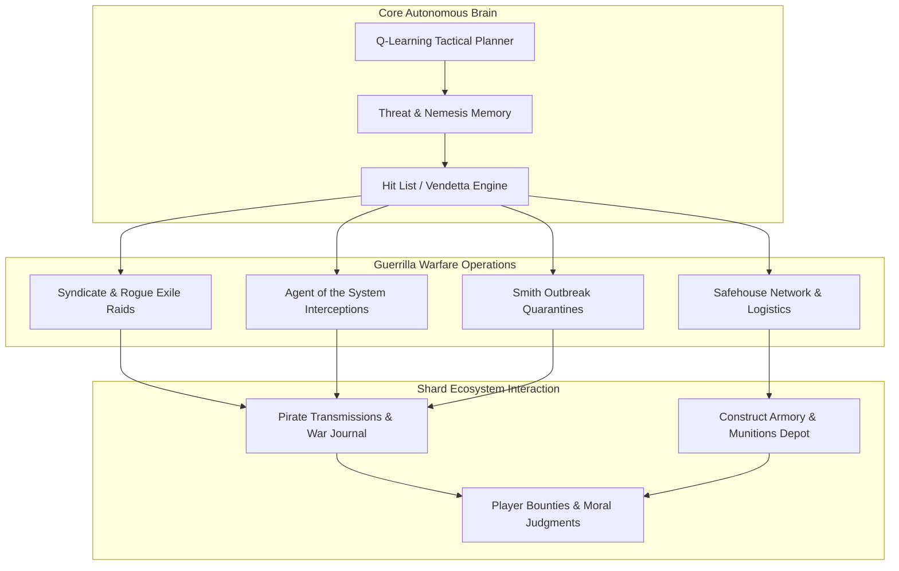
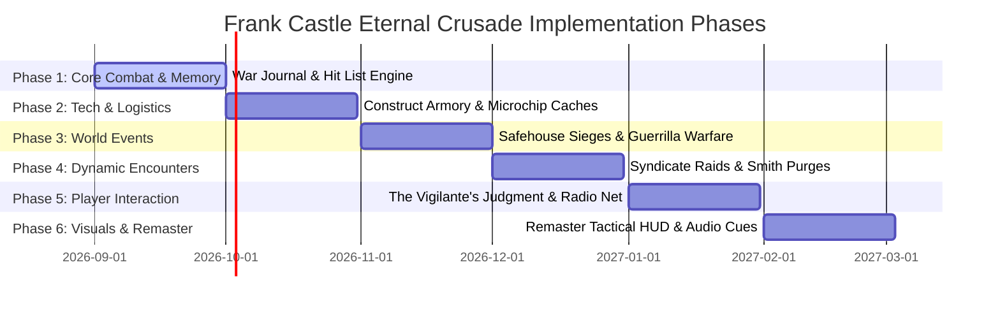

# Frank Castle: The Eternal Crusade — Master Architecture & Gameplay Roadmap
*A Strategic Engineering Blueprint for The Punisher's Autonomous War Across Megacity*

---



---

## Executive Summary

Frank Castle (The Punisher) is not merely another roaming bot or boss monster. In *The Matrix Online*, he operates as a **persistent, self-sustaining anti-hero ecosystem**—an unyielding Force Recon veteran who perceives the Matrix not as an illusion to escape, but as an active urban combat zone infected by systemic oppression, Machine overlords, corrupt human cartels, and depraved Exile syndicates.

This roadmap lays out the phased technical and mechanical expansion of Frank Castle from an autonomous secret operative into a living legend whose eternal quest to punish dynamically reshapes shard politics, economy, and street-level combat.

---

## Phase Breakdown



---

### Phase 1: The War Journal & Dynamic Hit List Engine
*Objective: Give Castle a persistent memory of crimes, grudges, and targets across Megacity.*

* **The War Journal Persistence (`WarJournal.sqlite`)**:
  * Every kill, tactical retreat, safehouse capture, and radio broadcast is logged with high-resolution timestamps, district coordinates, and target dossiers.
  * Players can discover encrypted "War Journal Cassettes" as rare loot drops throughout back-alleys and subway tunnels, providing lore entries and clues to Castle's next target.
* **Autonomous Hit List Algorithm**:
  * Castle maintains a dynamic, ranked **Hit List** based on target infamy:
    1. *High-Priority*: Agents of the System actively patrolling or hunting redpills.
    2. *High-Priority*: Smith viral clones and replication vectors.
    3. *Medium-Priority*: Corrupt Merovingian Lupine/Vampire lieutenants running extortion rackets.
    4. *Opportunistic*: Redpills with extreme negative karma, excessive PvP griefing bounties, or Cypherite faction affiliations.
* **Reconnaissance & Stalking Cycles**:
  * Castle does not immediately charge into battle. He spends 5–10 minutes observing designated targets from elevated perches, rooftops, and dark alleys, calculating engagement angles and setting perimeter mines before executing his strike.

---

### Phase 2: Microchip Tech & Construct Armory Logistics
*Objective: Build an autonomous supply chain, weapon customization, and ordnance depot.*

```
Tactical Caches & Armory Network
├── Primary Depot: Abandoned Subway Bunkers (Heavy Weapons & Ordinance)
├── Secondary Drop Points: Rooftop HVAC Crates (Sniper & Surveillance Gear)
└── Field Caches: Industrial Sewers & Slums (Medical Triage & EMP Grenades)
```

* **Microchip Arms Logistics**:
  * Microchip-engineered tactical hardware:
    * **Armor-Piercing Depleted Uranium AP Volleys**: Deals direct bypass damage through Machine armor plating.
    * **Code-Scrambler EMP Satchels**: Disables Agent ability queues and temporarily locks out simulation teleportation.
    * **Field Triage Adrenaline Stims**: Rapid auto-injectors that cleanse crowd-control stuns and jumpstart Inner Strength regeneration.
* **Autonomous Munitions Scavenging**:
  * After defeating hostiles, Castle cleans out their munitions and data codes.
  * When carried ammunition drops below 25%, Castle calculates a stealth path to the nearest uncompromised weapons cache to re-arm.
* **Construct Terminal Integration**:
  * Castle maintains a hidden rogue loading construct ("The Armory"). Periodically, he jacks into this isolated construct to manufacture bespoke ballistic ammunition and field upgrades.

---

### Phase 3: Safehouse Defense, Incursions & Siege Events
*Objective: Turn safehouses into active battlefields and faction contestation points.*

* **Safehouse Contestation Mechanics**:
  * Factions (Zion, Machines, Merovingian, and Exiles) periodically detect Castle's safehouse signals and launch armed assault waves:
    * *Machine Retribution Units*: Heavy assault pacifiers and Agent hunter-killer squads.
    * *Exile Cleaners*: Club Hel hit squads sent to reclaim stolen contraband.
* **Automated Defensive Networks**:
  * When fortified, Castle's safehouses deploy:
    * **Motion-Activated Tripwire Explosives**: Blasts intruders upon entering doorways.
    * **Automated CIWS Heavy Turrets**: Suppressive 7.62mm fire that shreds approaching hostiles.
    * **Emergency Hardline Scramblers**: Blocks hostiles from calling in reinforcements.
* **Player Participation**:
  * Players can assist Castle in defending his safehouses against Machine sieges, earning tactical rewards, rare ballistic mods, and Castle's begrudging respect.
  * Traitorous players can attempt to breach Castle's safehouse to loot his stockpile—risking lethal claymore ambushes and permanent placement at the top of Castle's Hit List.

---

### Phase 4: Syndicate Decapitation & Anti-Agent Guerilla Raids
*Objective: Stage coordinated tactical strikes against major world factions.*

| Target Category | Tactical Approach | Signature Munitions | Tactical Reward |
|---|---|---|---|
| **Agents of the System** | Long-range sniper ambush followed by CQC disarm | EMP Disruption Grenades + AP Rounds | Agent Code Shards, Massive XP |
| **Smith Replicas** | High-cadence area suppression and scorched-earth sweeps | Anti-Viral Incendiary Volleys | Shard Contagion Reduction |
| **Merovingian Mob Enclaves** | Breaching entry, close-quarters room clearance | Flechette Shotgun & Flashbangs | Extorted Information & Stockpiles |
| **Machine Power Convoys** | Roadway sabotage and convoy ambushes | High-Explosive Limpet Mines | Power Cells & Hardware Components |

* **Coordinated Hit Runs**:
  * Castle tracks underworld bosses and elite rogue programs. Every few server hours, he initiates a "Clean Sweep" operation across an entire district, eliminating every hostile gang leader in sequence.
* **Smith Outbreak "Omega Protocols"**:
  * If shard contagion exceeds 30%, Castle automatically escalates to maximum tactical alert:
    * He activates his mobile scrambler and begins systematically hunting down the host zero and highest-density clone clusters.
    * Transmits tactical coordinates to all Zion operatives via pirate radio to coordinate mutual killzones.

---

### Phase 5: Player Interaction, The Vigilante's Judgment & Radio Net
*Objective: Deepen player engagement with Castle as an unpredictable anti-hero.*

* **The Vigilante's Judgment (Karma & Bounties)**:
  * Castle does not kill indiscriminately. He evaluates players based on their actions:
    * *Redpills rescuing copper-tops & fighting machines*: Castle may provide fire support during overwhelming encounters, tossing them a trauma kit before vanishing into the shadows.
    * *Griefers & Corrupt PKers*: Players who murder low-level redpills or align with the Machines find themselves stalked by Castle across multiple districts.
* **Interactive Pirate Radio Frequencies (`FM 88.3 "The War Zone"`)**:
  * Players can tune their in-game radio UI to Castle's encrypted frequency to hear:
    * Tactical situation reports on Agent locations and Machine convoy routes.
    * Grim philosophical commentary on the nature of the Matrix, justice, and retribution.
    * Open warnings directed at specific players who violated his code.
* **Vigilante Field Contracts**:
  * Players can interact with drop-boxes in secured safehouses to leave intelligence on corrupt targets or accept high-risk contract bounties sanctioned by Castle.

---

### Phase 6: Deep Reinforcement Learning & Tactical Combat Evolution
*Objective: Transform Castle into an AI that continuously studies and outwits player tactics.*

* **Multi-Layer Combat Adaptation**:
  * *Evasion Counters*: If players or agents frequently dodge his ballistic fire, Castle adapts by leading targets, using flashbangs, and closing in for grapple takedowns.
  * *Cover & Sightline Analysis*: Utilizes raycast-based occlusion queries to calculate blind spots, utilizing flanking routes rather than straight-line charges.
  * *Ammunition Conservation*: Adjusts weapon burst lengths and switch timings dynamically based on target armor classification and distance.
* **Environmental Interaction**:
  * Castle shoots explosive barrels, triggers fire sprinkler systems to ground electrical shocks, shoots out streetlights to force night-vision encounters, and collapses scaffolding onto pursuing enemies.

---

### Phase 7: Client-Side Remaster Integration & Visual Polish
*Objective: Deliver visceral visual and auditory feedback in the modern Remaster client.*

```
Visual & Audio Presentation
├── Tactical RSI Mesh: Skull Emblem Vest, Weathered Trenchcoat, Holsters
├── Dynamic FX: Spent Brass Casings, Smoke Canisters, Ballistic Sparks
├── Spatial DSP: Heavy Weapon Crack, Combat Boot Steps, Radio Static
└── HUD Interface: Safehouse Network Map, Threat Dossiers, Radio Widget
```

* **Custom Remaster RSI Model**:
  * Highly detailed model featuring the iconic white skull stencil on a Kevlar vest, combat boots, dual shoulder holsters, tactical web gear, and dynamic cloth physics on his trenchcoat.
  * Visual battle damage: as Castle takes damage during extended battles, blood stains, bullet holes, and shredded cloth dynamically appear on his model until he undergoes field triage.
* **Bespoke Audio & Voice Synthesis**:
  * Authentic raspy, battle-hardened voice lines synthesized via the server's neural voice pipeline for combat taunts, tactical callouts, and radio broadcasts.
  * Spatial audio DSP ensuring distant gunfights between Castle and Agents echo through the concrete canyons of Megacity.
* **Remaster HUD Map Overlays**:
  * An optional tactical map layer in `Custom3DGame` displaying the real-time operational status of the 5 safehouses (Contested, Secured, Fortified) and known combat hotspots.

---

## Strategic Rollout Schedule

1. **Sprint 1 (Weeks 1–2)**: Implement persistent War Journal logging, dynamic Hit List generation, and encrypted lore loot drops.
2. **Sprint 2 (Weeks 3–4)**: Deploy Construct Armory, custom munitions crafting, and tactical scavenging routines.
3. **Sprint 3 (Weeks 5–6)**: Launch Safehouse Siege world events with automated turret and tripwire defenses.
4. **Sprint 4 (Weeks 7–8)**: Integrate The Vigilante's Judgment player karma/bounty system and interactive pirate radio broadcasts.
5. **Sprint 5 (Weeks 9–10)**: Advance combat RL neural nets with environmental hazard triggers and sightline flanking.
6. **Sprint 6 (Weeks 11–12)**: Release client-side Remaster custom RSI textures, visual battle wear, and spatial audio soundscapes.

---
*“They call it a war. A war has rules. This is punishment.”* — Frank Castle
