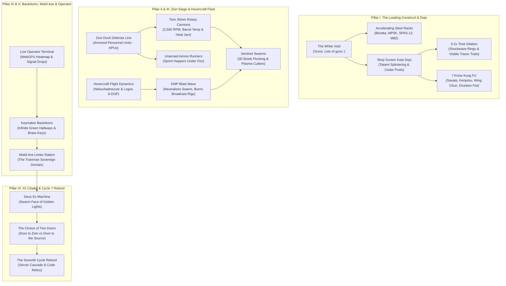

# The Matrix Awakened: Epoch III — Real-World War, The Loading Construct & The Seventh Cycle Reboot Master Roadmap

## Executive Overview & Progression Baseline

With **Phases 1 through 4 completed and deployed live** on the production cluster (`15.204.82.250`):
- **Phase 1 (Agent Possession Engine)**: Green code rain, civilian host overwrites, 10,000 HP, 45-60% martial mitigation, and tragic host demorphing.
- **Phase 2 (Redpill Awakening & Hardline Extraction)**: Matrix glitches (deja vu cat, bent spoon), cognitive disbelief escalation, player escorts, and ringing phone booth jack-outs.
- **Phase 3 (101 Freeway Interceptor Engine)**: 50km continuous highway loop, 80mph commuter traffic, relative momentum vehicle ramming, blown tires, and Twin ethereal ghost phasing.
- **Phase 4 (Semi-Trailer Rooftop Wire-Fu Duels)**: Dynamic balance meters on moving 18-wheelers, airborne evasions, falloff trauma, and Agent hood latch suicide accelerations.
- **Verified Foundation**: 14 native C++ test suites (761 assertions passed, 0 failures), 456 .NET E2E tests across 7 tiers (100% pass rate), and 15,114+ active bots operating simultaneously in 3D space.

**Epoch III** expands beyond Megacity pavement into the **full tripartite continuum of The Matrix canon**: the zero-latency **Loading Construct**, the desperate **Zion Dock Siege Defense**, the derelict **Subterranean Sewer Pipe Flight Network**, the non-Euclidean **Keymaker Backdoor Corridors**, the remote **WebGPU Operator Bridge**, and the apocalyptic **Seventh Cycle Matrix Reboot**.

---

## Epoch III Systems Architecture

---

## The 6 Core Pillars of Epoch III

### Pillar I: The Loading Construct & Bullet-Time Kata Dojo (`LoadingConstruct`)
*Inspired by the virtual training environments of the Nebuchadnezzar.*
- **The White Void**: Spawns an infinite, featureless white room with absolute zero ambient friction. Players command weapon racks to accelerate inward from the vanishing point (*"Guns. Lots of guns."*), instantly equipping akimbo handguns, assault rifles, or precision ordnance.
- **Shoji Screen Splinter Physics**: Generates an authentic Japanese tatami dojo with cedar beams and fragile paper shoji partitions. Heavy kicks and throws destroy partitions, generating dynamic wood splinters and paper tears.
- **0.2x Bullet-Time Dilation Engine**: On critical counter-attacks, dive-rolls, or hyper-dodges, the local simulation delta scales to `0.2x` for 3.5 seconds. Bullet trajectories render visible refractive shockwaves and supersonic contrails.
- **"I Know Kung Fu" Diskette Loader**: Instantaneous memory uploads allowing redpills to master distinct martial kata programs (Wing Chun, Boxe Française, Drunken Fist, Kenjutsu) that modify interlock animation sets and combo branches.

### Pillar II: Zion Dock Siege Defense & Sentinel Swarms (`APUCombatSystem`)
*Inspired by the climactic defense of Zion against the Machine drill.*
- **Armored Personnel Units (APUs)**: Dual-hydraulic bipedal combat mechs equipped with twin 30mm rotary cannons (2,500 RPM fire rate, 850°C barrel overheat limits, hydraulic recoil dampeners). Sustained fire risks barrel thermal jamming.
- **Ammo Runner Logistics Loop**: Dedicated recruit bots sprint between subterranean loading hoppers and front-line APUs, hauling 30mm ammunition crates under heavy Sentinel bombardment.
- **3D Boids Sentinel Swarm AI**: Thousands of autonomous Sentinels operating via flocking algorithms (separation, alignment, cohesion, obstacle avoidance). Sentinels dive-bomb in vortex formations, latch onto APU chassis, and engage plasma cutting torches against pilots.

### Pillar III: Subterranean Hovercraft Fleet & EMP Warfare (`HovercraftFlightSystem`)
*Inspired by the Nebuchadnezzar navigating derelict subterranean sewer mains.*
- **6-DOF Pipe Flight Mechanics**: Full pitch, roll, yaw, and electromagnetic boost vectors through winding industrial pipes and subterranean drainage ducts.
- **Hull Collision & Electrical Arcing**: Scraping pipe bulkheads at speed damages hull integrity, vents cooling gas, and triggers cockpit electrical fires.
- **EMP Pulse Weapon**: Activating the electromagnetic pulse charges the ship's capacitors and releases an 800m expanding microwave wave that instantly de-rezzes all airborne Sentinels—at the cost of disabling the ship's engines, radar, and Matrix broadcast rigs for 45 seconds.

### Pillar IV: Keymaker Backdoor Corridors & Mobil Ave Rail (`BackdoorNetwork` & `MobilAveRailSystem`)
*Inspired by the non-Euclidean corridors and the border train station.*
- **The Infinite Green Hallway**: Non-Euclidean corridors with identical brown wooden doors. Inserting brass skeleton keys forged by the Keymaker into specific keyholes creates spatial wormholes connecting directly to any coordinate in Megacity.
- **Key Charge Degradation**: Handcrafted keys possess limited charges (e.g. 1 to 5 uses before melting into slag).
- **Mobil Ave Purgatory Station**: The dimensional limbo between the Matrix and the Machine World. The Trainman is completely invulnerable inside the station, controlling the ghost train that ferries illicit contraband and exiled programs across the border.

### Pillar V: Real-Time Operator Bridge & WebGPU Signal Warfare (`CyberdeckHackingSystem` & `OperatorBridge`)
*Inspired by Tank and Link monitoring green code rain on the hovercraft deck.*
- **Browser & WebGPU Tactical Dashboard**: A real-time operator interface communicating via WebSocket and Protocol Buffers. Remote operators observe a top-down code-rain view of Megacity with player coordinates, police scanner chatter, and Agent pursuit vectors.
- **Hardline Phone Trace Scanner**: Operators scan the city grid to identify the nearest ringing phone booths, clear roadblocks remotely, and calculate optimal escape vectors for field redpills.
- **Tactical Code Injections**: Operators expend cyberdeck memory to inject weapon drops, jam local police dispatch channels, or trigger emergency phone rings.

### Pillar VI: 01 Machine City Citadel & Seventh Cycle Reboot (`MatrixRebootEngine`)
*Inspired by Neo's journey to the Machine Source and the Architect's revelation.*
- **Machine City (01)**: The surface citadel dominated by colossal spires, energy towers, and the towering face of the Deus Ex Machina.
- **The Architect's Equation Dialogue**: Multi-branch philosophical confrontation with the Architect evaluating the player population's cumulative anomaly quotient.
- **The Choice of Two Doors**: Server-wide community climax. Selecting the Door to the Source triggers the **Seventh Cycle Matrix Reboot**—a server-wide cascading reset that de-rezzes the world in white code rain, refreshes territory maps, and awards permanent Source Code relics to participating veterans.

---

## 12-Phase Concrete Execution Schedule

| Phase | System / Component | Core Technical Deliverable | Test Suite Target |
|:---:|:---|:---|:---|
| **Phase 5** | `LoadingConstruct` | White Void & Accelerating Weapon Racks | `RunConstructTestSuite()` |
| **Phase 6** | `KataDojoSimulator` | Shoji Screen Splintering & 0.2x Bullet-Time Dilation | Suite 15 in `Main.cpp` |
| **Phase 7** | `APUCombatSystem` | Dual 30mm Rotary Cannons & Barrel Overheat Jamming | `RunAPUCombatTestSuite()` |
| **Phase 8** | `SentinelSwarmEngine` | 3D Boids Flocking Swarms & Plasma Cutting Torches | Suite 16 in `Main.cpp` |
| **Phase 9** | `AmmoRunnerLogistics` | Recruit Supply Sprint AI & Crane Hopper Refills | Suite 17 in `Main.cpp` |
| **Phase 10** | `HovercraftFlightSystem`| 6-DOF Pipe Flight Aerodynamics & EMP Pulse Waves | `RunHovercraftTestSuite()` |
| **Phase 11** | `BackdoorNetwork` | Infinite Green Hallway & Brass Key Spatial Wormholes | `RunBackdoorTestSuite()` |
| **Phase 12** | `MobilAveRailSystem` | Limbo Station, Invulnerable Trainman & Ghost Train | Suite 19 in `Main.cpp` |
| **Phase 13** | `OperatorBridge` | WebGPU / WebSocket Real-Time Tactical Dashboard | Suite 20 in `Main.cpp` |
| **Phase 14** | `CyberdeckHacking` | Phone Line Tracing & Memory Code Drops | Suite 21 in `Main.cpp` |
| **Phase 15** | `MegacityDestruction` | Lobby Marble Column Chipping & Glass Curtain Cascades | Suite 22 in `Main.cpp` |
| **Phase 16** | `MatrixRebootEngine` | 01 Machine City, Deux Ex Machina & 7th Cycle Reboot | Suite 23 in `Main.cpp` |

---

## Verification & Production Standards

1. **Dual-Mode World Bridge Requirement**:
   All new subsystems must implement `Has3DWorldSupport()` checking `GameServer::getSingletonPtr() != nullptr && BotManager::getSingletonPtr() != nullptr`. Headless execution (`Reality.exe --test-all`) must run 100% deterministic in-memory tests with zero pointer escapes.
2. **Deterministic Physics on Pre-Allocated Pools**:
   APU rotary ballistics, Sentinel Boids flocking vectors, and hovercraft pipe collisions must use contiguous memory arrays with zero heap allocations per tick.
3. **Automated Verification Protocol**:
   - 100% pass rate across all native C++ test suites (expanding from 14 to 23 suites).
   - 100% pass rate across all 456+ .NET E2E test suites.
   - Continuous deployment via `deploy_vps.py` maintaining 24+ TPS across 15,000+ active bots on the live cluster.
