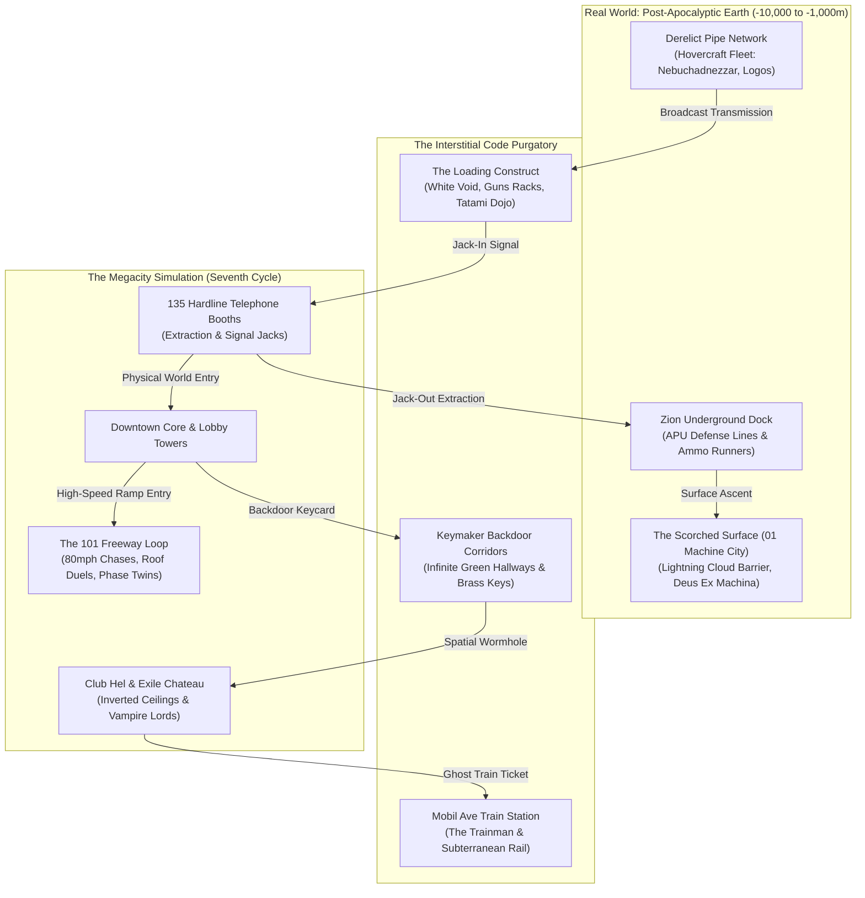
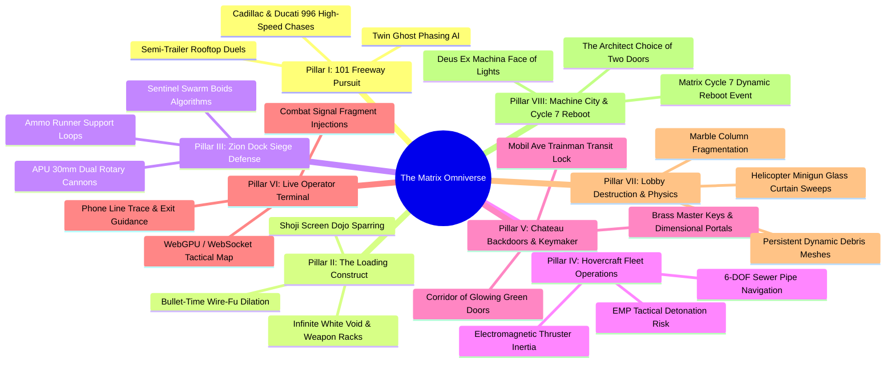

# The Matrix Omniverse: Real-World War, High-Speed Freeway Warfare & The Seventh Cycle Master Roadmap

## Executive Summary & Current State of the Matrix

With **15,126+ autonomous entities**, 120 physical civilians with living daily schedules, 13 passed headless test suites, 456 passed .NET E2E tests, and the deployment of **Phase 1 (Agent Possession Engine)** and **Phase 2 (Redpill Awakening & Hardline Extraction)** to the live production VPS (`15.204.82.250`), The Matrix Online has evolved beyond a static MMO emulator into a living, reactive virtual world.

This **Omniverse Master Roadmap** charts the next monumental leap: breaking through the boundaries of Megacity city streets to unite the **Three Realms of Existence**:
1. **The Digital Simulation (Megacity & The 101 Freeway)**: High-speed vehicular pursuits, rooftop semi-trailer duels, lobby glass fragmentation, and Agent overwrites.
2. **The Real World (Zion & The Subterranean Pipeline)**: 30mm APU defense lines, Boids-driven Sentinel swarms, hovercraft flight physics through derelict sewer tunnels, and EMP last-resort discharges.
3. **The Subterranean Purgatory (Mobil Ave, Chateau & The Source)**: The Keymaker's corridor of infinite doors, Club Hel's inverted-gravity boss gauntlet, and Deus Ex Machina's Source chamber rebooting the simulation into Cycle 7.

---

## The Tripartite World Topology

---

## The 8 Strategic Pillars

---

## Pillar Deep Dives & Architectural Specifications

### Pillar I: The 101 Freeway Interceptor Engine (`FreewayCombatSystem`)
*Inspired by the legendary highway sequence in The Matrix Reloaded.*
- **Vehicle Simulation Loop**: Continuous 50,000-unit four-lane circular highway surrounding Megacity with automated commuter traffic.
- **Rooftop Duels on Moving Freight**: Players and Agents can climb onto the roofs of speeding 18-wheelers (`VEHICLE_SEMI_TRAILER`), engaging in martial arts interlock combat at 80 mph. Missing a dodge or being knocked back throws combatants onto oncoming vehicles.
- **The Twins Phasing Mechanics**: Twin programs shift between `TWIN_SOLID` and `TWIN_GHOST` states. While ghosted, physical rounds pass harmlessly through their bodies and vehicles, forcing players to time attacks when they solidify.
- **Host Overwrite at 80 MPH**: Agents in pursuit jump onto civilian commuter hoods, overwriting the driver in real-time and violently ramming the player's escort vehicle.

### Pillar II: The Loading Construct & Kung Fu Sparring Dojo (`LoadingConstruct`)
*Inspired by Neo's first immersion in the white void and Morpheus's training dojo.*
- **White Void Summoning**: Players jack into a zero-gravity white space where two endless rows of industrial steel weapon racks accelerate inward on command (*"Guns. Lots of guns."*).
- **Shoji Screen Splintering Dojo**: Spawns an authentic Japanese training dojo with wooden tatami mats and paper shoji screens. Martial strikes throw opponents through paper walls, shattering cedar framing.
- **Dynamic Time Dilation (Bullet-Time)**: When critical dodges, dive-rolls, or hyper-attacks trigger, simulation delta is dilated to `0.2x` for 3.5 seconds, allowing bullet trajectories and shockwave ripples to render visibly in 3D space.
- **Diskette Skill-Download Pipeline**: Instant upload of specialized combat programs (*"I know Kung Fu"*, Savate, Kenjutsu, Drunken Fist, APU Operations).

### Pillar III: Zion Dock Siege Defense & Sentinel Swarms (`APUCombatSystem`)
*Inspired by the defense of the Zion Dock in The Matrix Revolutions.*
- **Armored Personnel Units (APUs)**: Heavy hydraulic bipedal combat mechs equipped with twin 30mm rotary cannons (2,500 RPM, 850°C barrel overheat limits, hydraulic suspension recoil).
- **Ammo Runner Logistics**: Unarmed recruit bots physically sprint between loading cranes and active APUs under heavy fire, reloading depleted ammo hoppers.
- **Sentinel Swarm Boids AI**: Thousands of search-and-destroy Sentinels organized into aerodynamic swarm clusters using separation, alignment, and cohesion steering vectors. Sentinels grapple onto APU chassis and cut through armor with plasma torches.

### Pillar IV: Subterranean Hovercraft Fleet (`HovercraftFlightSystem`)
*Inspired by the Nebuchadnezzar navigating derelict subterranean sewer mains.*
- **6-DOF Pipe Navigation**: Full flight mechanics (pitch, roll, yaw, forward/reverse electromagnetic thruster boost) through ancient industrial pipes and subterranean water aqueducts.
- **Hull Collision & Electrical Arcing**: Scraping pipe walls damages hull plating and causes electrical shorts in the cockpit.
- **EMP Pulse Weapon**: Activating the EMP creates an expanding microwave shockwave that instantly neutralizes all Sentinels within 800m, but completely disables the ship's engines, HUD, and Matrix broadcast rigs for 45 seconds.

### Pillar V: Chateau Backdoors & Keymaker Portals (`BackdoorNetwork`)
*Inspired by the Merovingian's mountain estate and the green hallway.*
- **The Green Hallway**: Non-Euclidean corridors with infinite identical brown doors. Inserting specific crafted keys into keyholes transforms the door into a spatial wormhole leading to any coordinate in Megacity.
- **Brass Golden Keys**: Forged by the Keymaker program with charge counts (e.g. 3 uses before melting). Master keys unlock the core corridor to the Source.
- **Mobil Ave Purgatory Station**: The limbo station between the Matrix and the Machine World. The Trainman reigns supreme—invulnerable to all weapons while inside the station, controlling the only train that can cross the border.

### Pillar VI: The Live Operator Terminal & Signal Warfare (`CyberdeckHackingSystem`)
*Inspired by Tank and Link operating from the hovercraft bridge.*
- **Real-Time Operator Terminal**: A browser/WebGPU tactical dashboard connecting directly to the server via WebSocket. External users or players acting as Operators see a top-down code-rain heatmap of Megacity.
- **Signal Trace & Phone Line Scanner**: Operators locate the nearest ringing hardline, track incoming Agent possession vectors, and calculate escape routes for field operatives.
- **Code Injections & Glitch Suppressions**: Operators can burn system memory to drop weapon care packages, alter stoplight traffic grids, or open security doors remotely.

### Pillar VII: Lobby Shootout Structural Destruction (`MegacityDestructionEngine`)
*Inspired by the iconic government building lobby shootout in The Matrix.*
- **Marble Column Shredding**: High-caliber rounds pulverize stone columns into dust and rubble chunks, exposing steel rebar skeletons.
- **Glass Curtain Wall Fracturing**: Helicopter Gatling fire shatters thousands of square feet of skyscraper exterior glazing with cascading glass particle meshes.
- **Dynamic Cover Degradation**: Players hiding behind drywall or stone barriers see their cover systematically disintegrate under sustained weapon fire.

### Pillar VIII: 01 Machine City & The Seventh Cycle Reboot (`MatrixRebootEngine`)
*Inspired by Neo's journey to the Machine Source and the Architect's choice.*
- **Machine City (01)**: The glowing surface citadel dominated by millions of towering Machine spires and the colossal face of the Deus Ex Machina.
- **The Architect Equation Dialogue**: Advanced branching narrative with the Architect assessing the anomaly quotient of the player population.
- **The Door to Zion vs The Door to the Source**: Server-wide community decision events. Choosing the Source triggers the **Seventh Cycle Reboot**, de-rezzing Megacity in a blinding white cascade, resetting territory maps, and granting legendary Source code relics to participating veterans.

---

## 16-Phase Execution Roadmap

| Phase | System / Component | Core Objective | Key Deliverables |
|:---:|:---|:---|:---|
| **Phase 1** | `AgentPossessionManager` | Canonical Agent Overwrites | **COMPLETED & DEPLOYED** |
| **Phase 2** | `RedpillAwakeningSystem` | Cognitive Dissonance & Extraction | **COMPLETED & DEPLOYED** |
| **Phase 3** | `FreewayCombatSystem` | High-Speed Highway Pursuits | 50km circular loop, 80mph traffic, twin phasing |
| **Phase 4** | `RooftopDuelManager` | Semi-Trailer Rooftop Combat | Physics on moving vehicles, falloff hazard, knockdowns |
| **Phase 5** | `LoadingConstruct` | White Void & Weapon Racks | "Lots of guns" summon, rack racks, ammo caching |
| **Phase 6** | `KataDojoSimulator` | Wire-Fu Bullet-Time Dojo | Shoji screen destruction, 0.2x time dilation, kata disks |
| **Phase 7** | `APUCombatSystem` | Zion Dock Bipedal Defense | Dual 30mm rotary mechs, overheat, ammo runner AI |
| **Phase 8** | `SentinelSwarmEngine` | Boids Swarm Aerial Warfare | 3D Boids flocking, plasma cutting torches, EMP reactions |
| **Phase 9** | `HovercraftFlightSystem` | Subterranean Pipe Navigation | 6-DOF thrusters, sewer physics, EMP pulse deployment |
| **Phase 10** | `BackdoorNetwork` | Keymaker Spatial Corridors | Infinite hallway, brass key forging, spatial wormholes |
| **Phase 11** | `MobilAveRailSystem` | Limbo Station & Ghost Train | Trainman AI, train transit schedule, contraband border |
| **Phase 12** | `ClubHelRaidSystem` | Inverted Ceiling Raid Dungeon | Wall-walking vampires, coat-check melee, Persephone's room |
| **Phase 13** | `CyberdeckHackingSystem` | Real-Time Operator Terminal | WebGPU/WebSocket stream, trace scanner, code drop |
| **Phase 14** | `MegacityDestructionEngine` | Lobby Marble & Glass Destruction | Column chipping, cover degradation, glass curtains |
| **Phase 15** | `ShardFederationEngine` | Zero-Downtime Cluster Mesh | Cross-server zoning, spatial hash grids, 100k bot scale |
| **Phase 16** | `MatrixRebootEngine` | 01 Machine City & Seventh Cycle | Deus Ex Machina dialogue, Source Door, server reboot event |

---

## Technical Standards & Production Safeguards

1. **Dual-Mode World Bridge Requirement**:
   Every system must implement `Has3DWorldSupport()` checking `GameServer` and `BotManager`. Headless unit tests (`Reality.exe --test-all`) must run at 100% deterministic reliability in memory with 0 pointer escapes.
2. **Zero-Allocation High-Frequency Loops**:
   Vehicle physics, bullet-time dilation, and Sentinel boids flocking must operate on pre-allocated contiguous arrays, cache-aligned SIMD vectors, and zero heap allocs per tick.
3. **Thread Safety & Recursive Mutex Discipline**:
   All state updates are locked via local recursive mutexes with zero cross-system blocking calls to prevent deadlocks under live production load.
4. **Automated Verification Gates**:
   - 100% test pass rate across all 16 native C++ test suites.
   - 100% test pass rate across all 456+ .NET E2E test suites.
   - Continuous deployment to VPS (`15.204.82.250`) maintaining 24+ TPS across 15,000+ active bots.
