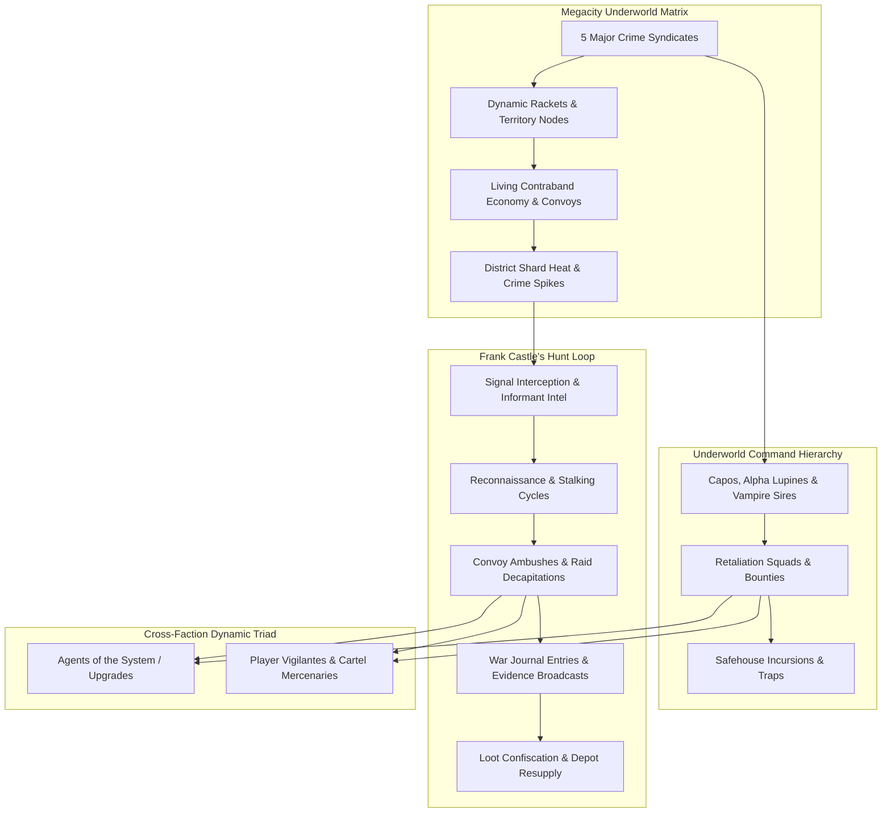
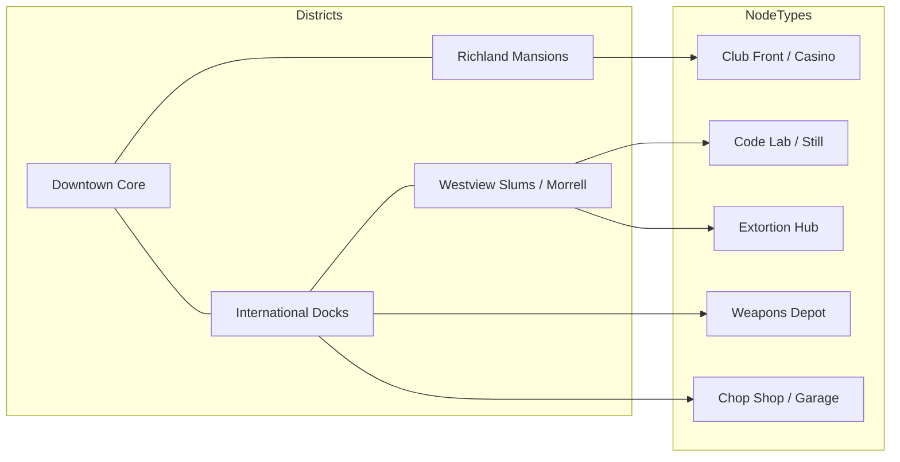
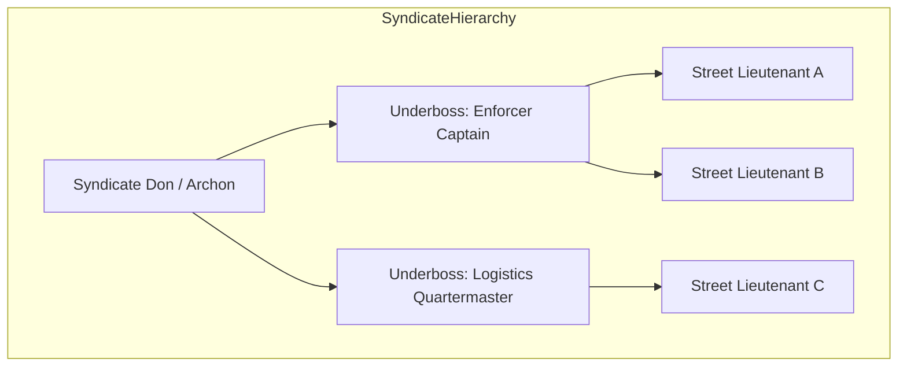
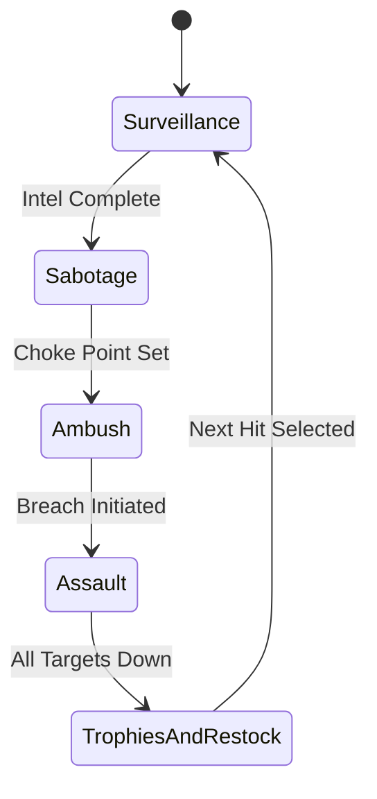
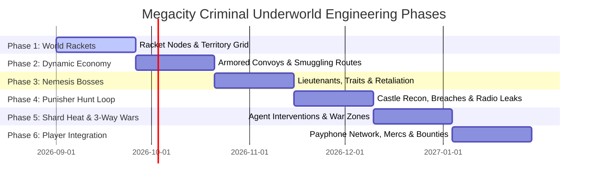

# The Megacity Criminal Underworld: Syndicate Ecosystem & Living Crime Matrix Roadmap
*A Master Systems Architecture & Gameplay Blueprint for an Autonomous Underworld for Frank Castle (The Punisher) to Stalk, Infiltrate, and Decapitate*

---



---

## Executive Summary

While Agents enforce simulation obedience and Zion redpills fight for human liberation, the underbelly of Megacity festers with corruption. An autonomous, multi-layered criminal syndicate operates in the shadows—trafficking forbidden source code, laundering bluepill identities, brewing synthetic sensory narcotics, and violently extracting protection tribute from redpill businesses.

This roadmap designs a **living, breathing, self-simulating Criminal Underworld** for *The Matrix Online*. It provides Frank Castle (The Punisher) with an ever-evolving web of targets, supply lines, safehouses, and crime lords to hunt, interrogate, and eliminate, turning Megacity's back-alleys, subways, and rooftop penthouses into a dynamic warzone.

---

## The 5 Criminal Syndicates & Faction Profiles

```
Megacity Crime Cartels
├── 1. The Wolfpack (Merovingian Lupine Outcasts) — Slums & Industrial Waterfront
├── 2. Château Sanguine (Vampire Aristocracy & Le Vrai Syndicate) — Richland & Downtown Penthouses
├── 3. The Judas Cabal (Cypherite Turncoat Front) — Financial Towers & Data Switching Hubs
├── 4. The Marcone & Dragon Families (Corrupt Human Mobs) — Docks, Warehouses & Chop Shops
└── 5. The Byte Cartel (Rogue Exile Glitch Brokers) — Abandoned Subways & Deep Under-City
```

### 1. The Wolfpack (Merovingian Lupine Outcasts)
* **Origins & Lore**: Exiled Lupine programs who broke away from the Merovingian's direct service, forming feral predatory street gangs across the Westview Slums and Morrell industrial zones.
* **Specialties**: Violent extortion, street muscle, illegal code-pit fight rings, and body harvesting.
* **Combat Doctrine**: Pack hunting, high-speed melee lunges, ferocious regeneration, and coordinated pincer ambushes.
* **Castle's Perspective**: *"Rabid animals. You don't negotiate with rabid dogs. You put them down."*

### 2. Château Sanguine (Vampire Aristocracy / Le Vrai Syndicate)
* **Origins & Lore**: High-tier Exile vampires operating through front nightclubs (Club Hel, Le Vrai, The Velvet Siphon) and luxury penthouses in Richland and Downtown.
* **Specialties**: Blackmail of city officials, VIP memory-draining parlors, counterfeit RSI credentials, and high-end assassin contracts.
* **Combat Doctrine**: Phase-shifting evasions, ultrasonic disorient shrieks, silenced high-caliber handguns, and human shield tactics.
* **Castle's Perspective**: *"Monsters in tailored tuxedos feeding on the innocent. Their blood burns just like anyone else's."*

### 3. The Judas Cabal (Cypherite Turncoat Front)
* **Origins & Lore**: Radical human redpills who have made secret pacts with Machines and rogue Exiles. They betray Zion operatives in exchange for luxurious bluepill memories and illicit Matrix privileges.
* **Specialties**: Bluepill identity forgery, redpill bounty hunting, high-tech sniper ambushes, and sabotage of Zion broadcast nodes.
* **Combat Doctrine**: Long-range Barrett .50 Cal sniper overwatch, optical camouflage cloaks, flashbang volleys, and automated decoy clones.
* **Castle's Perspective**: *"Traitors. The worst scum of all. They chose slavery with a price tag."*

### 4. The Marcone & Red Dragon Families (Corrupt Human Mobs)
* **Origins & Lore**: Old-school traditional human syndicates that predate the Machine War, now backed by corrupt machine-code dealers. They control the dockyards, construction sites, and chop shops of International.
* **Specialties**: Illicit munitions smuggling, vehicle theft/chop shops, construction racketeering, and harbor cargo theft.
* **Combat Doctrine**: Heavy ballistic weapons (Tommy guns, sawed-off shotguns, RPGs), armored sedans, and sheer overwhelming squad numbers.
* **Castle's Perspective**: *"Greed never changes. They think concrete and bribes protect them. Concrete shatters."*

### 5. The Byte Cartel (Rogue Exile Glitch Brokers)
* **Origins & Lore**: Discarded utility programs, rogue subroutines, and renegade compilers residing in the subterranean utility ducts and decommissioned subway stations.
* **Specialties**: Synthetic sensory narcotics ("Static Dust", "Blue Bliss"), uncompiled memory exploits, military-grade EMP traps, and rogue hyper-stims.
* **Combat Doctrine**: Proximity minefields, hacking simulation collision boxes, deployable turret emplacements, and suicide overload drones.
* **Castle's Perspective**: *"Poisoning the city with corrupted code. Cut off the supply, burn the lab."*

---

## System 1: Dynamic Rackets & Territory Node Infrastructure

Megacity is partitioned into living operational sectors where rackets spawn, generate illicit revenue, expand their influence, or get crippled when Castle strikes.



### Racket Typology & Operational States

| Racket Type | Syndicate Owner | Primary Locations | Illicit Yield | Defense Tier | Castle Strike Method |
| :--- | :--- | :--- | :--- | :--- | :--- |
| **Code Stills & Narcotic Labs** | Byte Cartel | Slums Basements, Sewers | Synthetic "Static Dust" | Turrets, EMP mines, gas traps | Thermite breaches, exploding vat chain reactions |
| **Weapons Munitions Depot** | Marcone Family | International Cargo Docks | Military-grade AP ammo, RPGs | Heavy guards, snipers, guard dogs | Barrett .50 Cal exterior clearance, C4 cache detonation |
| **Bloodline Penthouses & Clubs** | Château Sanguine | Richland High-Rises, Club Hel | Blackmail files, forged RSIs | Phase-vampires, VIP bodyguards | Skylight rappel breach, flashbang dual-wield sweep |
| **Vehicle Chop Shops** | Red Dragon Triad | Morrell Industrial Garages | Armored convoys, black boxes | Armed mechanics, hydraulic crushers | Car-bomb booby traps, heavy machine gun strafe |
| **Extortion & Shakedown Hubs** | The Wolfpack | Westview Tenements, Back-alleys | Protection cash, captive redpills | Feral Lupines, barbed perimeter | Shotgun door breacher, smoke grenade close-quarters takedowns |

### Dynamic Racket Lifecycle:
1. **Undercover / Seed**: Syndicate establishes a low-profile hideout in an alley or basement.
2. **Operational**: Racket begins pumping contraband onto the black market, increasing local district **Shard Heat**.
3. **Fortified**: Boss invests profits into reinforced steel blast doors, surveillance cameras, and armed enforcers.
4. **Targeted**: Castle gathers sufficient intel; safehouse marked on Castle's dynamic Hit List.
5. **Decapitated / Smoldering**: Castle attacks, kills the capo, detonates the contraband, and leaves his skull signature. Node enters cooldown for 48–72 hours before another gang moves in.

---

## System 2: Living Contraband Economy & Armored Convoys

Crime syndicates do not just spawn statically—they move merchandise, illicit code, and weapons across Megacity's live streets and tunnels.

```
Supply Chain Topology
[Docks Munitions Cache] ──(Armored Van Convoy)──> [Downtown Penthouse Club]
            │                                             │
      (Subway Courier)                              (Rooftop Dead-Drop)
            ▼                                             ▼
  [Slums Narcotic Still] ───────────────────────> [Black Market Broker]
```

### Armored Smuggling Convoys:
* **The Convoy Route**: 2–3 armored black SUVs escorted by motorcycle outriders moving between International Docks and Downtown clubs.
* **Dynamic Interception Points**: Convoys slow down at bridge checkpoints, traffic intersections, and underpasses.
* **Castle's Ambush Tactics**:
  * Castle sets remote-detonated claymore charges on roadway overpasses.
  * Drops spike strips across avenue choke points.
  * Takes up a high-angle rooftop sniper position with a Barrett .50 Cal, targeting the lead vehicle's engine block and driver.
  * Descends with an M60 or shotgun to finish surviving enforcers and loot the cargo.
* **Player Participation**:
  * Players can discover convoy schedules via intercepted radio chatter on FM 88.3 or syndicate payphones.
  * Players can choose to hijack the convoy themselves, defend it against Castle for syndicate pay, or assist Castle in eliminating the guards.

---

## System 3: Street-Level Nemesis AI & Boss Lieutenant Hierarchy

Each syndicate features a dynamic command hierarchy featuring procedurally generated and named Boss Lieutenants with unique personality traits, combat behaviors, and tactical memories.



### Lieutenant Attributes & Tactical Traits:
* **Unique Trait Pool**:
  * `Ironclad`: Wears reinforced Kevlar with blast plates; immune to headshot one-shots.
  * `Hostage Taker`: Grabs civilian NPCs or captive redpills as meat shields when Castle engages.
  * `Cowardly Tactician`: Immediately sprints for an armored escape vehicle or secret escape tunnel while ordering bodyguards to cover him.
  * `Pyromaniac`: Deploys incendiary grenade launchers and sets fire to rooms to deny Castle cover.
  * `Phase Glitcher`: Teleports 10 meters when struck, leaving behind a flashbang after-image.
  * `Blood Frenzy`: At under 30% HP, damage output doubles and speed increases by 50%.

### Memory & Retaliation Engine:
* If Castle eliminates a Capo's top enforcer, the Capo places an **Underworld Bounty** on Castle.
* Cartels dispatch **Hit Squads** (4–6 elite hunters) to track Castle down at known safehouses.
* If Castle is spotted in a district, syndicate lookouts call in reinforcements via cellular networks (players can hear lookouts on radio scanners).

---

## System 4: Shard Heat, Megacity Tension & 3-Way Wars

Crime is not isolated from the rest of the simulation. As syndicates operate and Castle executes his war, district **Shard Heat** rises and falls.

```
Shard Heat Metric (0.0 to 100.0) per District:
├── 0 - 25: Low Tension (Syndicates operate covertly; regular police patrols)
├── 26 - 60: Elevated Crime (Open gang muggings, convoy deliveries, active shakedowns)
├── 61 - 85: War Zone (Frank Castle actively strikes nodes; syndicate death squads mobilized)
└── 86 - 100: Machine Critical (Simulation integrity alarms triggered; System Agents deploy)
```

### The Three-Way War Dynamic:
When Shard Heat hits the Critical Threshold (>85):
1. **The System Awakens**: System Agents (Agent Gray, Agent Pace, Agent Skinner) spawn into the district to purge anomalous violence.
2. **Three-Way Conflict**:
   * **Syndicate Goons**: Shoot at both Agents (to defend their contraband) and Frank Castle.
   * **System Agents**: Attack both Castle (unauthorized anomalous vigilante) and Exiles (unregistered code deviations).
   * **Frank Castle**: Uses the chaos to maneuver between both factions, using Agents as distractions to assassinate syndicate bosses, and deploying EMP satchels against Agents.
3. **Player Battlefield**: Players caught in this sector experience epic, high-stakes urban warfare with massive loot potential.

---

## System 5: Frank Castle's Dynamic Hunting Cycle

Castle does not wander randomly; his AI operates on a relentless 5-stage **Hunting Cycle**:



1. **Phase A: Surveillance & Reconnaissance**:
   * Castle perches on rooftops overlooking target racket nodes.
   * Scans guard rotation patterns, camera blind spots, and vehicle arrival times.
   * Records target identities into his local `WarJournal.json` dossier.
2. **Phase B: Perimeter Sabotage**:
   * Shoots out power junction boxes to plunge the facility into darkness.
   * Sabotages getaway vehicles by slicing fuel lines or shooting engine manifolds.
   * Plants remote claymores on emergency exit routes to catch fleeing lieutenants.
3. **Phase C: Surgical Breach & Execution**:
   * Castle detonates breaching charges on doors/windows with flashbang entries.
   * Executes high-threat priority targets first (heavy gunners, phase-shifters).
   * Utilizes dynamic cover, combat rolls, shotgun knockbacks, and point-blank takedowns.
4. **Phase D: Interrogation & Evidence Gathering**:
   * If a boss survives in a wounded state, Castle forces him to reveal the location of the next cartel armory or crooked official before executing him.
   * Collects encrypted ledgers, code keys, and cassette recordings.
5. **Phase E: Evidence Broadcast & Loot Redistribution**:
   * Broadcasts the criminal syndicate's exposed ledgers over pirate radio FM 88.3.
   * Restocks his safehouse caches with captured ammunition and medical supplies.
   * Spray paints his iconic white skull on the crime den's main wall as an ominous warning.

---

## System 6: Player Interaction & Dual-Underworld Alignments

Players are not passive spectators in this underworld war; they can choose how they interact with Castle and the syndicates.

```
Player Underworld Pathways
├── The Vigilante / Informant Path (Allied with Castle)
│   ├── Drop anonymous tips on FM 88.3 / payphones about cartel convoys
│   ├── Provide sniper cover or assault support during safehouse breaches
│   └── Rewards: Microchip AP Ammo, High-end ballistic armor, Castle's War Commendations
│
└── The Syndicate Mercenary Path (Hostile to Castle)
    ├── Accept syndicate protection contracts for smuggling convoys & club penthouses
    ├── Collect cartel bounties by tracking and assaulting Frank Castle
    └── Rewards: Illicit Exile combat codes, Vampire phase abilities, Cartel illicit bank rolls
```

### The Underworld Payphone Tip Network:
* Payphones across Megacity ring periodically.
* If a player answers, an encrypted voice or informant gives clues regarding upcoming syndicate drops or Castle sightings.
* Players can feed coordinates to Castle or warn the syndicate for corresponding karma shifts and material rewards.

---

## System 7: Technical Implementation Blueprint in Reality C++

### File Architecture:
```
Reality/Source/
├── UnderworldManager.h            // Core Underworld simulation, factions & rackets
├── UnderworldManager.cpp          // Dynamic racket lifecycle, convoys & boss AI
├── UnderworldRacketNode.h         // Physical world node, defenses, and states
├── CartelLieutenantAI.h          // Nemesis AI traits, memory, and retaliation
└── UnderworldPersistence.h        // JSON/SQLite serialization of rackets and heat
```

### Core Data Models:

```cpp
enum class SyndicateFaction : uint8_t {
    WolfpackLupines     = 0,
    ChateauSanguine     = 1,
    JudasCabal          = 2,
    MarconeFamily       = 3,
    ByteCartel          = 4
};

enum class RacketType : uint8_t {
    CodeStill           = 0,
    WeaponsDepot        = 1,
    NightclubFront      = 2,
    ChopShop            = 3,
    ExtortionHub        = 4,
    BlackClinic         = 5
};

enum class RacketState : uint8_t {
    Incubating          = 0,
    Active              = 1,
    Fortified           = 2,
    UnderSiegeByCastle  = 3,
    DecapitatedCooldown = 4
};

struct UnderworldRacketNode {
    uint32_t            id;
    std::string         name;
    SyndicateFaction    faction;
    RacketType          type;
    RacketState         state;
    std::string         district;
    Vector3             coordinates;
    uint32_t            bossLieutenantId;
    std::string         bossName;
    float               defenseHealth;
    float               illicitRevenueRate;
    std::vector<Vector3> patrolWaypoints;
    std::vector<Vector3> tripwireTrapPoints;
    uint32_t            activeGoonsCount;
    int64_t             lastAttackedTimestamp;
    int64_t             cooldownExpiryTimestamp;
};

struct SmugglingConvoy {
    uint32_t            convoyId;
    SyndicateFaction    faction;
    Vector3             startLocation;
    Vector3             destinationLocation;
    Vector3             currentLocation;
    float               routeProgress; // 0.0 to 1.0
    uint32_t            escortVehicleCount;
    uint32_t            cargoValuation;
    bool                isInterceptedByCastle;
    bool                isDestroyed;
};

struct CartelLieutenant {
    uint32_t            id;
    std::string         name;
    SyndicateFaction    faction;
    std::string         rankTitle; // e.g. "Capo", "Alpha Enforcer", "Blood Sire"
    std::vector<std::string> personalityTraits;
    uint32_t            bountyOnCastle;
    int32_t             grudgeScoreAgainstCastle;
    bool                isAlive;
    Vector3             lastKnownLocation;
};
```

### Operator Console Commands Suite:
* `underworldStatus`: Prints district-by-district breakdown of active syndicates, racket nodes, and Shard Heat.
* `underworldRaid <racketId>`: Forces Frank Castle to immediately initiate an assault on the designated racket.
* `underworldSpawnConvoy <faction>`: Launches an armed smuggling convoy across city streets.
* `underworldBossList`: Displays all active Cartel Lieutenants, their traits, and grudge scores against Castle.
* `underworldSetHeat <district> <amount>`: Adjusts Shard Heat to trigger 3-way wars or police/Agent lockdowns.
* `underworldClearCooldowns`: Resets all decapitated racket cooldowns for immediate action.

---

## 6-Phase Engineering Roadmap & Implementation Timeline



### Phase 1: Underworld Racket Infrastructure (Weeks 1–3)
* Implement `UnderworldManager.h/.cpp` with 15 initial racket nodes across Downtown, Richland, Slums, and Docks.
* Node state machine (Incubating -> Active -> Fortified -> Decapitated).
* Persistent serialization via `UnderworldEcosystem.json`.

### Phase 2: Smuggling Convoys & Dynamic Transit (Weeks 4–6)
* Autonomous vehicle and courier movement system along street navmeshes.
* Convoy ambush points with choke point calculation.
* Cargo drop tables (rare weapons, ammunition, encrypted ledgers).

### Phase 3: Nemesis Boss AI & Retaliation Hierarchy (Weeks 7–9)
* Boss generation engine with dynamic names and trait combinations (`Ironclad`, `Hostage Taker`, `Phase Glitcher`).
* Retaliation hit squads dispatched to siege Castle's safehouses when a boss is killed.
* Dynamic voice and combat callout strings.

### Phase 4: Frank Castle's Infiltration & Decapitation Loop (Weeks 10–12)
* Direct interface with `FrankCastleManager`: Castle pulls active rackets into his Hit List based on heat and faction priority.
* Breaching sequence: exterior sniper clearance, door explosive charge, smoke entry, interior sweep.
* Spray-painted skull decal entity spawned at decapitated racket sites.

### Phase 5: Shard Heat & 3-Way Wars with System Agents (Weeks 13–15)
* District Shard Heat calculation based on crime and combat frequency.
* Agent spawning when heat reaches >85.
* Complex 3-way faction aggro rules (Agents vs Castle vs Syndicates).

### Phase 6: Player Interaction, Payphone Tips & Underworld Economy (Weeks 16–18)
* Dynamic ringing payphones with text/voice informant tips.
* Underworld bounty board in Club Hel and Slums dive bars.
* Remaster client tactical map layer showing contested underworld rackets and convoy routes.

---
*“They think they own the streets because the police look away and the Machines don't care. They forgot about me.”* — Frank Castle
