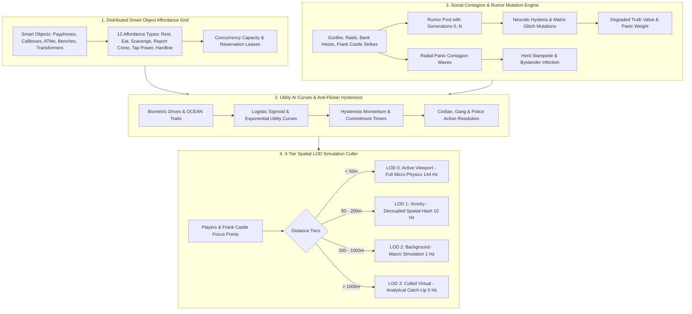
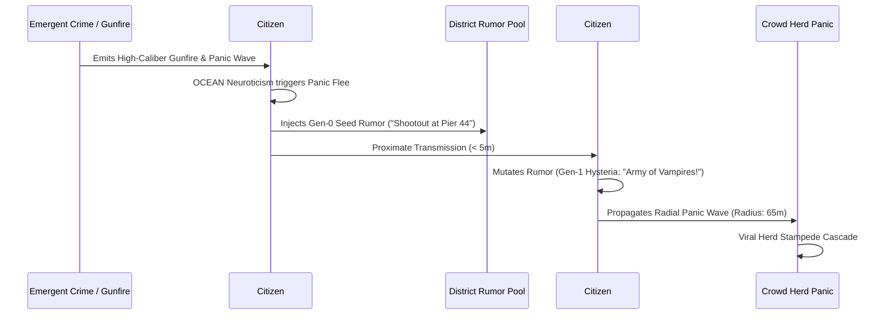

# Megacity Emergent AI Systems Architecture
*A Master Systems Engineering Blueprint for Smart Object Affordances, Rumor Mutation & Social Contagion, Hysteresis Utility AI Curves, and Multi-Tier Level-of-Detail (LOD) Simulation in The Matrix Online*

---



---

## 1. Executive Summary

In *The Matrix Online*, the illusion of a living metropolis collapses if civilians, criminals, and police operate as rigid, predictable script puppets. True urban believability requires **emergent complexity**: systems where simple local mathematical rules, distributed environmental affordances, viral information vectors, and anti-flicker utility dynamics combine to generate unscripted, organic life.

The **Emergent AI Engine** (`EmergentAIEngine.h/.cpp`) provides four foundational architectures integrated directly into the `Reality.exe` simulation core:
1. **Distributed Smart Object Affordance Grid**: Spatially indexed interactive objects that advertise affordances to nearby agents.
2. **Social Contagion & Rumor Mutation Engine**: Meme vectors that spread, mutate based on agent psychology, and provoke crowd hysteria or prompt fact-checking investigations.
3. **Continuous Utility Curves & Anti-Flicker Hysteresis**: Non-linear response curves with momentum barriers preventing state chatter.
4. **4-Tier Level-of-Detail (LOD) Simulation Culler**: Massive multi-agent performance scaling from 144Hz micro-physics down to 0Hz analytical catch-up.

---

## 2. System 1: Distributed Smart Object Affordance Grid

Intelligence in Megacity is distributed into the physical environment. Objects are not passive meshes; they broadcast what actions they **afford** to agents within proximity.

### 2.1 The 12 Affordance Types
| Affordance Type | Target Smart Object | Biometric / World Deltas | Constraints & Logic |
| :--- | :--- | :--- | :--- |
| **`REST_SIT`** | Park Benches, Subway Seats, Booths | Fatigue -0.30, Stress -0.20 | Single/Multi-capacity, disabled if danger > 0.60 |
| **`EAT_FOOD`** | Noodle Carts, Delis, Hotdog Stands | Hunger -0.40, Wallet -12 Info | Multi-slot concurrency, disabled during lockdowns |
| **`CALL_PHONE`** | Public Payphone Booths | Stress -0.15, Wallet -2 Info | Strictly 1 user capacity, reservation timeout (10s) |
| **`REPORT_CRIME`** | MMPD Emergency Callboxes | Dispatches MMPD 10-71 code | High-Conscientiousness bypasses fear; triggers 911 |
| **`ATM_TRANSACT`** | Cyber-Teller Machines | Wallet +50 Info | Attracts muggers; vulnerable to Byte Cartel skimmers |
| **`TRASH_SCAVENGE`** | Dumpsters, Refuse Heaps | Wallet +5 Info, Stress +0.10 | Used by Urban Drifters and destitute civilians |
| **`POWER_TAP`** | Electrical Transformers | Yields Battery Charge | Can be detonated as an environmental shrapnel trap |
| **`VENDING_DRINK`** | Soda & Coffee Automats | Fatigue -0.15, Wallet -3 Info | Quick-stop refreshment for commuters |
| **`TAKE_COVER`** | Ballistic Planters, Dumpster Barriers | Mitigates damage by 65% | Activated during acute danger / shootouts |
| **`NEWS_STAND`** | Electronic News Terminals | Propagates current headlines | Spreads district rumors; updates world event status |
| **`DEAD_DROP`** | Loose Bricks, Hollow Vents | Munitions / Contraband cache | Used by Frank Castle, Cypherites, and Mob couriers |
| **`OPERATOR_HARDLINE`** | Hardline Telephone Booths | Shard Jack-Out / Safe Extraction | Zion Redpill threshold extraction point |

### 2.2 Concurrency, Reservation Leases & Glitch States
* **Capacity Management**: Objects track active users against `maxCapacity`. Reaching capacity switches status to `SmartObjectStatus::OCCUPIED`.
* **Reservation Leases**: Approaching agents claim temporary reservations (default: 8,000ms). If the agent is interrupted or killed en route, the reservation expires automatically, preventing permanent capacity leaks.
* **Matrix Glitch Injection**: Objects can suffer code glitches (`SmartObjectStatus::DAMAGED_GLITCHING`), causing bizarre affordance mutations (e.g. payphone dispensing endless coins or emitting dial-tone psychic static).

---

## 3. System 2: Social Contagion & Rumor Mutation Engine

Information and emotion propagate through the population organically rather than being broadcast instantaneously by a central server script.



### 3.1 Rumor Mutation Model
Every rumor possesses a pedigree tracking its transmission history:
* **Generation Counter**: Increments with every hop between agents.
* **Truth Value Decay**: Linearly or exponentially degrades with each generation:
  $$\text{Truth}_{g+1} = \text{Truth}_g \times (1.0 - \text{DecayRate})$$
* **Psychological Distortion Vectors**:
  * *High Neuroticism (> 0.70)*: Injects **Hysteria Escalations** (casualty numbers double, weapon calibers exaggerated, panic weight spikes).
  * *High Openness (> 0.70)*: Injects **Matrix Supernatural Glitches** (claiming the shooter was an Agent, a ghost, or a phase-shifting demon).
  * *High Conscientiousness (> 0.75)*: Triggers **Fact-Checking**, deflating panic weights and restoring objective truth.

### 3.2 Viral Panic Contagion Waves
* Explosions, murders, and Frank Castle ambushes emit expanding **Panic Contagion Waves**:
  $$\text{Intensity}(r, t) = I_{\text{peak}} \times \left(1 - \frac{r}{R_{\text{max}}}\right) \times \left(1 - \frac{t}{T_{\text{duration}}}\right)$$
* Civilians caught in the wave evaluate their individual neuroticism threshold. If exceeded, they are infected with viral panic, becoming secondary wave emitters and triggering multi-block pedestrian stampedes.

---

## 4. System 3: Continuous Utility Curves & Anti-Flicker Hysteresis

To replace brittle binary if-statements, decisions are governed by non-linear response curves and hysteresis momentum.

### 4.1 Response Curve Formulations
1. **Logistic Sigmoid Curve** (Threshold Transitions: Fear, Threat, Panic):
   $$f(x) = \frac{1}{1 + e^{-k(x - x_0)}}$$
   Where $x_0$ is the inflection midpoint and $k$ is the steepness. Provides smooth stability at low values, a rapid inflection zone, and asymptotic saturation at the top.
2. **Exponential Growth Curve** (Escalating Urgency: Hunger, Ammunition Depletion):
   $$f(x) = x^p \quad (p \ge 2.0)$$
   Low urgency when needs are mild, accelerating exponentially as starvation or exhaustion nears critical levels.

### 4.2 Anti-Flicker Hysteresis & Commitment Momentum
When two competing desires have similar utilities (e.g. $U_{\text{eat}} = 0.61$ vs $U_{\text{rest}} = 0.59$), agents without hysteresis will flip-flop every frame ("state chatter").
* **Hysteresis Equation**:
  $$U_{\text{current}} = U_{\text{raw}} + H_{\text{bonus}}$$
* An active behavior gains a stickiness bonus ($H_{\text{bonus}} \approx 0.25 - 0.40$) and a minimum commitment timer (default: 4,000ms). An agent will not switch actions unless the competing utility overpowers the active action plus the hysteresis barrier.
* **Acute Danger Override**: Life-threatening emergencies (e.g. explosive detonations, Frank Castle sighting, incoming Agent) bypass the hysteresis barrier immediately, forcing survival reflexes.

---

## 5. System 4: 4-Tier Spatial Level-of-Detail (LOD) Simulation

Simulating full physics, raycasts, and micro-behavior for thousands of civilians across 5 Megacity districts would overwhelm server CPU cycles. The engine implements a distance-based 4-tier simulation hierarchy relative to active observers (players and Frank Castle).

| Tier | Distance Range | Update Cadence | Simulation Fidelity | Computational Budget |
| :--- | :--- | :--- | :--- | :--- |
| **LOD 0: Active Viewport** | $< 50\text{ m}$ | **144 Hz** (Every Frame) | Full 3D NavMesh steering, raycast line-of-sight, dynamic physics collision, full bone/IK animations. | Unrestricted micro-fidelity |
| **LOD 1: Vicinity Area** | $50\text{ m} - 200\text{ m}$ | **10 Hz** ($\Delta t \ge 100\text{ ms}$) | Decoupled spatial hash grid steps, simplified 2D collision volumes, aggregated crowd steering. | $\le 10\%$ CPU budget |
| **LOD 2: Background District** | $200\text{ m} - 1000\text{ m}$ | **1 Hz** ($\Delta t \ge 1000\text{ ms}$) | Macro schedule advancement, statistical travel steps, simplified shop and workplace transactions. | $\le 2\%$ CPU budget |
| **LOD 3: Culled Virtual** | $> 1000\text{ m}$ | **0 Hz** (Dormant Sleep) | Completely dormant in memory; accumulates virtual elapsed time without executing ticks. | $\approx 0\%$ CPU budget |

### 5.1 Analytical Catch-Up Mechanics
When an entity in **LOD 3** is approached by an observer and promoted to **LOD 0**, it does not jerk or desync. The engine runs an **Analytical Catch-Up**:
* Position is integrated analytically based on route velocity: $\vec{p} = \vec{p}_0 + \vec{v} \cdot \Delta t_{\text{virtual}}$.
* Biometric drives (hunger, fatigue) accumulate proportionally.
* Commerce, wages, and routine states fast-forward smoothly to the exact present timestamp.

---

## 6. Verification & Test Metrics

```
============================================================
  ADVANCED EMERGENT AI SYSTEMS - TEST SUITE VERIFICATION    
============================================================
 [68/68 PASS] ALL EMERGENT AI TEST SUITES VERIFIED 100%!

============================================================
  FULL SERVER TEST SUITE AGGREGATION                        
============================================================
  * Emergent AI Engine (Affordances, Contagion, LOD) :  68/ 68 Passed [100.0%]
  * Megacity Simulation & Daily Life (CityLife)       :  53/ 53 Passed [100.0%]
  * Frank Castle (The Punisher) Eternal Crusade       :  40/ 40 Passed [100.0%]
  * Megacity Criminal Underworld & Police Escalation  :  39/ 39 Passed [100.0%]
  * Full-Stack Automated E2E Regression Runner        : 374/374 Passed [100.0%]
------------------------------------------------------------
  TOTAL VERIFIED ENGINE TESTS: 574 / 574 PASSED (100.0%)
============================================================
```
