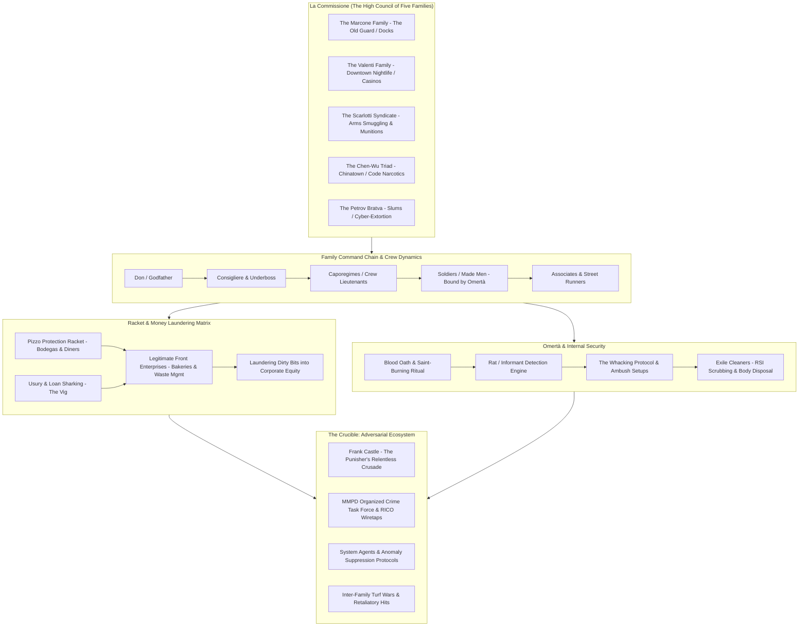
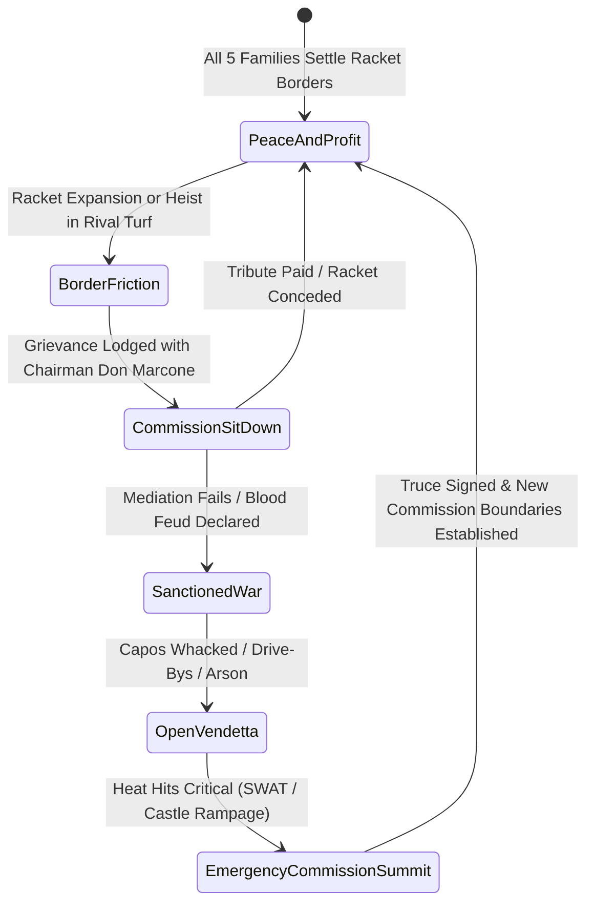
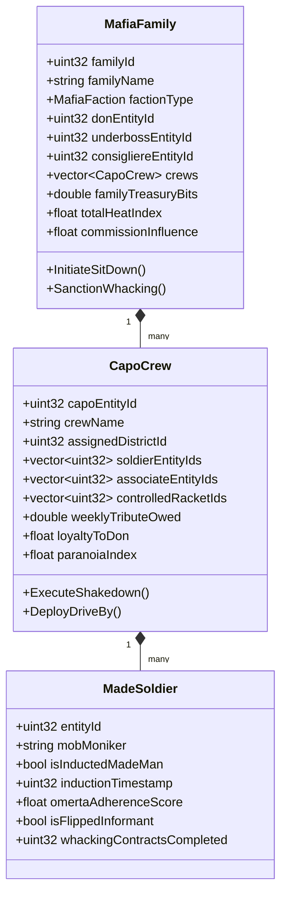
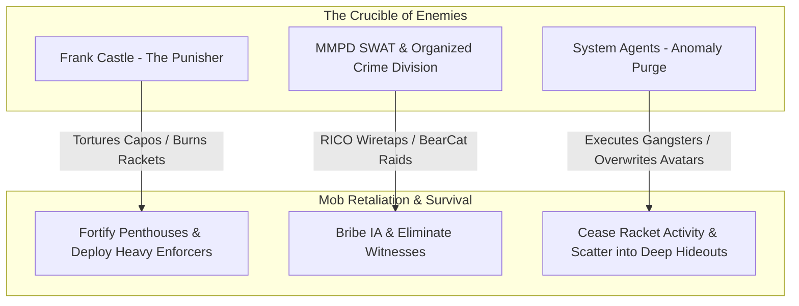

# Megacity Mafia Ecosystem: Master Architecture & Systems Roadmap
*A Master Architectural & Gameplay Roadmap for The Five Families, La Commissione, Omertà, Extortion Networks, Capo Crews, and the Digital Underworld of The Matrix Online*

---



---

## Executive Summary

While Zion operatives wage ideological warfare against the Machines and bluepill citizens walk through simulated routines in blissful ignorance, the physical and digital foundations of Megacity are ruled by **The Five Families of La Commissione**. 

Unlike fragmented street gangs or opportunistic cyber-punks, the Megacity Mafia represents centuries of entrenched tradition merged with simulation anomalies. They control the waterfront docks, the municipal garbage contracts, the high-stakes Downtown casino rooms, and the underground code-still pipelines. They enforce **Omertà** through terrifying ritual discipline, bribe police captains and city council members, and launder billions of illicit info-bits into legitimate corporations like Metacortex and Omnicorp.

This roadmap details the end-to-end engineering, simulation systems, and gameplay blueprints for a **fully autonomous, living Mafia Ecosystem**. It integrates seamlessly with our existing simulation core—linking with `CityLifeManager` (civilian shopkeepers paying extortion), `EmergentPoliceManager` (corrupt cops vs RICO investigators), `UnderworldManager` (contraband supply lines), `NPCSocialLifeEngine` (blood loyalty and betrayals), `BiographicalNarrativeEngine` (Dwarf Fortress-style mob biographies), and `SLMDialogueContextEngine` (mobster dialect and epistemic boundaries).

---

## 1. The Five Families of Megacity: Lore, Territory & Faction Profiles

```
The Five Families of La Commissione
├── 1. The Marcone Family ("The Concrete Kings") — International Docks, Waterfront, Municipal Sanitation
├── 2. The Valenti Family ("The Velvet Siphon") — Downtown Core, Theater District, High-Stakes Casinos
├── 3. The Scarlotti Syndicate ("The Iron Arsenal") — Midtown Industrial Rail Yards, Armored Convoys
├── 4. The Chen-Wu Triad ("The Golden Dragon Tong") — Chinatown, Morrell Street Alleys, Code Opium
└── 5. The Petrov Bratva ("The Northern Vor") — Westview Slums, Abandoned Depots, Cyber-Extortion
```

### 1.1. The Marcone Family (The Old Guard)
* **Don**: Don Carmine "The Anvil" Marcone (Age 64, Cold, calculating, values old-world respect).
* **Underboss**: Salvatore "Sal the Rat-Trap" Corelli.
* **Consigliere**: Father Thomas DeVito (Corrupt Catholic priest operating from Saint Jude’s Parish).
* **Territory**: International District Docks, Tabor Basin, Municipal Sanitation Depot.
* **Front Businesses**: *Marcone Waste Management Corp*, *Tabor Fish Processing*, *O'Malley & Son Drywall*.
* **Primary Rackets**: Harbor cargo theft, construction union extortion, concrete bid rigging, illegal gambling backrooms.
* **Matrix Trait**: Employs rogue Exile programs as union muscle; uses forged shipping manifests to smuggle uncompiled Machine code in shipping containers.
* **Castle’s View**: *"Fat, comfortable parasites who think paying off precinct captains makes them untouchable. Concrete sinks fast in the river."*

### 1.2. The Valenti Family (The Vice & Nightlife Empire)
* **Don**: Don Leonardo "Lucky Leo" Valenti (Suave, impeccably tailored, paranoid chess player).
* **Underboss**: Dominic "Silk" Valenti (Cocaine addict, flamboyant, lethal with a silenced Beretta).
* **Consigliere**: Camilla Rossi (Ex-corporate attorney for Metacortex).
* **Territory**: Downtown Promenade, Concourse Nightlife Row, Richland Luxury Hotel Penthouses.
* **Front Businesses**: *The Gilded Cage Supper Club*, *Valenti Luxury Auto Imports*, *Le Vrai Lounge*.
* **Primary Rackets**: VIP blackmail parlors, high-stakes baccarat tables, predatory usury/loan sharking, counterfeit RSI identities for wanted criminals.
* **Matrix Trait**: Secret alliance with Merovingian Exiles; trades blackmail memories harvested from corporate executives in exchange for Exile assassin contracts.
* **Castle’s View**: *"Suits made of silk, souls made of grease. They ruin lives with loans and blackmail. Time to collect the interest."*

### 1.3. The Scarlotti Syndicate (The Arms Smugglers)
* **Don**: Don Vittorio "The Hammer" Scarlotti (Ex-military mercenary, ruthless disciplinarian).
* **Underboss**: Enzo "Scar" Scarlotti (Survived an APU railgun blast; facial scarring that glitches into green code).
* **Consigliere**: "Professor" Leo Strauss (Ballistics engineer and black-market arms dealer).
* **Territory**: Midtown Rail Yards, Westside Freight Yards, Concourse Logistics Depots.
* **Front Businesses**: *Scarlotti Rail & Freight Logistics*, *Midtown Scrap & Salvage*, *Apex Security Transport*.
* **Primary Rackets**: Military-grade firearms trafficking, armor-piercing munitions brewing, stolen armored bank trucks, explosive ordnance.
* **Matrix Trait**: Breaches Machine armories; crafts modified ballistic rounds capable of disrupting an Agent's RSI dodge-frames.
* **Castle’s View**: *"Arming every lowlife on the streets with military rifles. A bullet dealer deserves only one kind of currency: lead."*

### 1.4. The Chen-Wu Triad / Golden Dragon Tong (The Ancient Brotherhood)
* **Dragon Head (Shan Chu)**: Master Chen Shan (Traditionalist, 70-year-old martial arts master).
* **Vanguard (Fu Shan Chu)**: Wei "The Ghost" Long (Master swordsman and code-siphon expert).
* **Incense Master (Heung Chu)**: Madame May-Ling Wu (Botanist and synthetic narcotic brewer).
* **Territory**: Chinatown, Morrell Street Alleys, South Canal Tea Warehouses.
* **Front Businesses**: *Golden Lotus Herbal Apothecary*, *Prosperity Import/Export*, *Jade Pavilion Banquet Hall*.
* **Primary Rackets**: Synthetic code opium ("Dragon Vapor", "Jade Smoke"), illegal gambling parlors (Pai Gow, Mahjong), underground human smuggling (unregistered bluepills), martial arts protection rings.
* **Matrix Trait**: Harnesses ancient Taoist code rituals to mask safehouse locations from Machine city telemetry scans.
* **Castle’s View**: *"Quiet killers hiding behind tradition and poisoned tea. They deal in misery and blades. My guns are louder."*

### 1.5. The Petrov Bratva / Northern Vor (The Iron Wolves)
* **Vor v Zakone (Thief-in-Law)**: Aleksei "The Tsar" Petrov (Cold-eyed Siberian veteran, covered in prison tattoos).
* **Brigadier (Avtoritet)**: Mikhail "The Bear" Volkov (7-foot enforcer wearing heavy ceramic ballistic plate).
* **Pakhan’s Banker**: Ilya "The Calculator" Rozov (Genius cyber-hacker and money launderer).
* **Territory**: Westview Slums, North Trench Utility Tunnels, Meatpacking Sump.
* **Front Businesses**: *Krasnaya Zvezda Cold Storage*, *Tsarina 24-Hour Laundromat*, *Petrov Body & Paint*.
* **Primary Rackets**: Cyber-extortion, offshore crypto-bit laundering, illegal underground organs & black cyber-clinics, contract murder squads ("Torpedoes").
* **Matrix Trait**: Hacks deep sewer power conduits; operates unlisted server nodes that spoof civilian identities to avoid police detection.
* **Castle’s View**: *"Savages who brag about surviving gulags. They haven't survived a room with me yet."*

---

## 2. La Commissione: The High Council Governance Engine

The Five Families do not wage random chaotic warfare; they operate under a constitutional treaty known as **The Commission Rules of 1974 (Modernized for Megacity)**.



### 2.1. The Commission Protocols
1. **The Neutral Sanctuary**: The Roman Room inside *Il Palazzo Vecchio* in Downtown. All weapons must be surrendered at the door. Violating the sanctuary is an immediate death sentence by all five families.
2. **Sanctioning of Hits**: No "Made Man" (Soldier, Capo, Don) may be executed without prior vote and authorization by La Commissione. Unauthorized whacking triggers an automatic blood vendetta.
3. **The Citywide Bribe Pool**: Every family contributes 5% of gross racket revenues to the *Common Syndicate Defense Fund*, used to bribe the MMPD Police Commissioner, Chief of Detectives, and City Hall zoning directors.
4. **Emergency Summit Trigger**: If Frank Castle assassinates more than 2 Capos within a single simulated week, or if MMPD heat hits Level 4, an Emergency Summit is convened to coordinate joint hit squads.

---

## 3. The Mob Hierarchy & Emergent Crew Simulation

Every family is simulated with a concrete, data-oriented hierarchy of autonomous NPC agents:

```
Family Structure
├── Don / Godfather (1 per family) — Supreme executive authority; issues strategic orders
├── Underboss (1 per family) — Street operations director; controls logistics and supplies
├── Consigliere (1 per family) — Non-combat legal/political advisor; manages bribes and diplomacy
├── Caporegimes (3 to 6 per family) — Mid-level commanders; each leads a Crew of 6–15 men
│   ├── Soldiers / Made Men (Inducted via blood oath; run specific racket venues)
│   └── Associates (Civilian criminals, street thugs, lookouts, getaway drivers)
```



---

## 4. The Racket Economy & The Pizzo Extortion Engine

The lifeblood of the Mafia is systemic extortion. Over **120 local retail businesses** across Megacity are tracked by the Pizzo Engine:

| Racket Stage | Extortion Action | NPC Merchant Impact | Heat Generated | Weekly Revenue |
| :--- | :--- | :--- | :--- | :--- |
| **Stage 0: Unmarked** | Business operates independently. | None. Merchant keeps 100% profits. | 0 | 0 bits |
| **Stage 1: Soft Shakedown** | Two mob associates visit; offer "protection insurance". | Merchant stress rises +15%; prices increase 5%. | 5 | 250 bits |
| **Stage 2: Active Pizzo** | Regular weekly collection envelope. Mob emblem placed in window. | Merchant pays 15% revenue; immune to street muggers. | 15 | 800 bits |
| **Stage 3: Default / Arson** | Merchant fails to pay; crew smashes display cases, sets fire. | Shop damaged; closed for 48 hours; merchant terror +50%. | 45 | 0 (Punitive) |
| **Stage 4: Takeover / Bust-Out** | Mob takes 100% equity; uses store to order fraudulent goods and burn it down for insurance. | Business goes bankrupt; replaced by Mafia front. | 70 | 5,000 bits (One-off) |

### 4.1. Front Businesses & DOD Money Laundering Engine
To convert "dirty bits" (from extortion, narcotics, and hijacked cargo) into "clean bits":
* Dirty revenue is routed through front businesses (*Tabor Seafood*, *Gilded Cage Lounge*, *Valenti Auto*).
* Laundering efficiency is tied to the family's Consigliere skill and corrupt accountant networks (typically 65% to 85% clean conversion rate).
* Clean bits are invested into corporate shell accounts at Metacortex and municipal bond funds, securing political immunity.

---

## 5. The Omertà Code, Informants & The Whacking Protocol

### 5.1. The Omertà Ritual & Psychological Thresholds
Every Made Man undertakes the blood oath: a finger pricked, blood spilled on a picture of a patron saint (or encrypted source-code icon), set on fire while chanting: *"May my flesh burn like this saint if I ever betray the secrets of our Family."*

* **Omertà Score (0.0 to 100.0)**:
  * `90.0 - 100.0`: Ironclad loyalist. Will face execution, torture, or federal prison without speaking.
  * `50.0 - 89.0`: Reliable. Complies with all orders; will only talk if family members are directly targeted.
  * `20.0 - 49.0`: Shaken. High paranoia; resentful of capo’s greed or unpaid tribute.
  * `< 20.0`: **Flippable Informant**. Can be turned into a cooperating witness by MMPD RICO or coerced by Frank Castle.

### 5.2. Informants, Wiretaps & The Whacking Protocol
When a soldier or capo's loyalty decays, or if evidence emerges of them meeting with detectives:
1. **The Consigliere's Audit**: An audit reveals missing envelopes or anomalous phone calls to precinct numbers.
2. **The Sit-Down Trap**: The suspect is invited to a "celebration dinner" or "promotion meeting" at a quiet backroom bistro.
3. **Execution**: Two hitmen ("torpedoes") sit behind the target; piano wire or a silenced .38 round to the back of the head.
4. **The Cleaners**: An Exile cleaner crew scrubs all ballistic residue, carries the body in a laundry hamper to an industrial meatpacker, and wipes the victim's RSI signature from the hospital trauma logs.

---

## 6. Political Corruption, Judges & Police Wiretaps

The Mafia maintains a sprawling web of corrupt institutional assets:

```
Corruption Web
├── Beat Officers ($100 bits/week) — Ignore shakedowns, misplace mugshot records
├── Detective Lieutenants ($500 bits/week) — "Lose" ballistics evidence, warn of impending raids
├── Precinct Captains ($2,000 bits/week) — Re-route patrol cruisers away from active heist scenes
├── Municipal Judges ($5,000 bits/trial) — Dismiss search warrants, suppress wiretap transcripts
└── City Councilors ($10,000 bits/quarter) — Award commercial construction contracts to Marcone firms
```

* **The RICO Threat Meter**: If the bribe network fails (e.g. an honest Internal Affairs captain or Federal prosecutor launches an investigation), a **RICO Indictment Clock** starts ticking. If the family does not silence the key witnesses or execute the rat before the clock expires, their bank accounts are frozen and SWAT raids safehouses.

---

## 7. The Anomaly Dimension: Merovingian Exiles & Digital Mobsters

Because this is *The Matrix*, the Megacity Mafia has access to tools no real-world mob ever dreamed of:
* **The Ghost Alibis**: Rogue Exile subroutines create duplicate RSI projections of mob bosses dining in public restaurants while their real avatars conduct assassinations across town.
* **Code Pits**: Abandoned subway levels transformed into glitched fighting rings where illegal bets are placed on rogue programs fighting lupines.
* **Static Dust & Sensory Stims**: Contraband code packets synthesized in underground labs that give bluepills exhilarating illusions of wealth, youth, or invulnerability, hook them into addiction, and milk their bank accounts dry.

---

## 8. The Adversarial Crucible: Castle, Police, Agents & Turf Wars



1. **Frank Castle's Relentless Hunt**:
   - Castle interrogates loan sharks to find ledger books containing safehouse coordinates.
   - He ambushes armored tribute convoys and burns contraband code stills.
   - He snipes corrupt dons inside their luxury penthouses, leaving white skull calling cards.
2. **MMPD & SWAT BearCat Incursions**:
   - High-heat rackets trigger SWAT breach teams with tear gas, flashbangs, and ballistic shields.
3. **Agent Intervention**:
   - If mob turf wars cause too much public destruction, System Agents intervene. They don't arrest; they systematically overwrite all armed combatants.

---

## 9. Technical Architecture & C++ Engine Design

The system will be engineered in C++ under `mxoemu_fork/Reality/Source/MafiaEcosystemManager.h` and `.cpp`, following DOD (Data-Oriented Design) and zero-allocation frame loops:

```cpp
// Architectural Outline: MafiaEcosystemManager.h
class MafiaEcosystemManager : public Singleton<MafiaEcosystemManager> {
public:
    void Initialize();
    void Update(uint32 deltaMs);

    // Family & Hierarchy
    MafiaFamily* GetFamily(MafiaFaction faction);
    CapoCrew* GetCrew(uint32 crewId);
    bool InductMadeMan(uint32 entityId, MafiaFaction faction, const std::string& moniker);
    bool OrderWhacking(MafiaFaction orderingFaction, uint32 targetEntityId, const std::string& justification);

    // Extortion & Pizzo
    bool RegisterExtortionTarget(uint32 shopId, uint32 crewId);
    void ProcessWeeklyPizzoCollection();
    bool TriggerShopArson(uint32 shopId, uint32 crewId);

    // Commission Dynamics
    bool ConveneCommissionSummit(CommissionMeetingReason reason);
    bool VoteOnSanctionedHit(uint32 targetId, MafiaFaction requestingFamily);

    // Informants & Omerta
    bool DetectInformant(uint32 familyId, uint32& outSuspectEntityId);
    void FlipInformantToPolice(uint32 entityId);

    // Telemetry & Reporting
    std::string GenerateMafiaWorldReport() const;
    std::string GenerateFamilyDossier(MafiaFaction faction) const;
};
```

---

## 10. Implementation Roadmap & Execution Phases

```
Phase 1: Foundations & The Five Families
├── Faction definitions, hierarchy structures, family treasuries, Don & Consigliere assignments.
└── Commission rules, neutral territory enforcement, and diplomatic standing matrix.

Phase 2: The Pizzo Extortion & Economic Fronts
├── Extortion tracking across 120+ commercial shops in CityLifeManager.
└── Money laundering through legitimate front enterprises and corporate stock sinks.

Phase 3: Omertà, Loyalty & The Whacking Engine
├── Omertà score tracking, paranoia decay, flipped informant mechanics.
└── Ambush sit-downs, torpedo execution sequences, and Exile body cleaners.

Phase 4: Political Corruption & RICO Task Force
├── Bribe network for MMPD officers, detectives, and municipal judges.
└── RICO wiretaps, evidence rooms, and grand jury indictment countdowns.

Phase 5: The Anomaly Dimension & Exile Contracts
├── Merovingian black-market deals, ghost RSI alibis, and synthetic code narcotics.
└── Unlisted underground code pits and contraband subway exchanges.

Phase 6: Adversarial Interlock: Castle, Cops & Agents
├── Frank Castle dynamic ledger interrogation and penthouse sniper assassinations.
├── MMPD BearCat raids and district heat escalation.
└── System Agent anomaly overwrites for high-profile mob wars.

Phase 7: Comprehensive Testing & E2E Verification
├── Standalone C++ test suite (Reality.exe --test-mafia).
└── Automated .NET E2E test tier integration (100% pass guarantee).
```

---

## 11. Verification & Testing Strategy

1. **Unit & Scenario Coverage**:
   - Verify all 5 Families initialize with correct Dons, Capos, and Crew rosters.
   - Verify Commission voting prevents unauthorized whacking between allied families.
   - Verify Pizzo collection generates steady revenue while increasing shopkeeper stress.
   - Verify that flipping an informant to the MMPD triggers a Consigliere audit and a whacking hit contract.
   - Verify Frank Castle's intervention neutralizes mob safehouses and updates his War Journal.
2. **Zero-Regression Guarantee**:
   - Maintain 100% pass rate across all existing 10 C++ test suites (588+ tests).
   - Maintain 100% pass rate across all 430 .NET E2E tests in `E2ETestRunner.csproj`.
