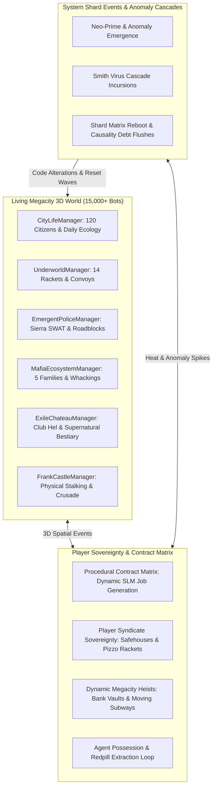
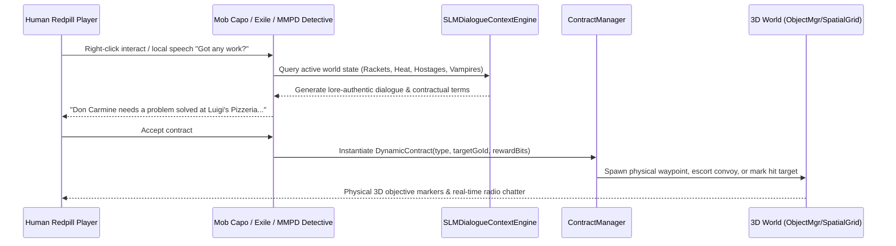
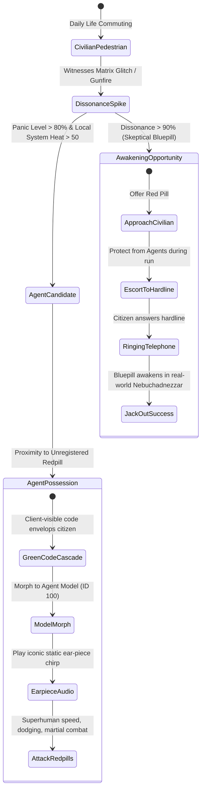
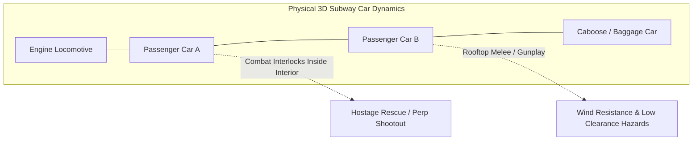
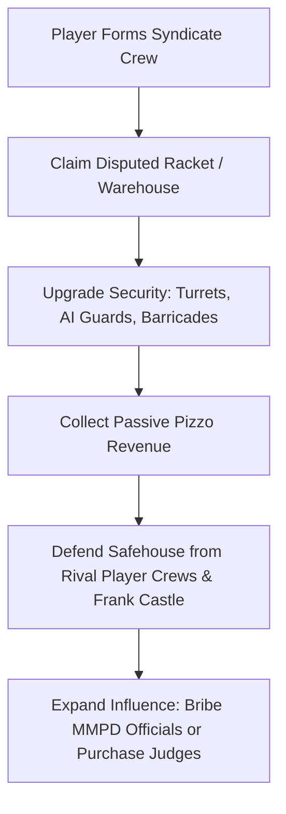

# Megacity: The Living Matrix & Player Sovereignty Roadmap
*A Master Systems Architecture & Gameplay Blueprint for Player-Driven Emergence, Dynamic Contracts, Agent Possessions, Syndicate Sovereignty, and Full 3D World Interaction*

---



---

## Executive Summary

Over previous epochs, the Matrix Online server emulator evolved from a legacy static MMO server into a **living, breathing 15,000+ entity autonomous simulation**. Citizens work, commute, dine, and date; 5 Mafia families extort shopkeepers and sanction hits; Sierra SWAT executes tactical room breaches; Exiles haunt Club Hel with supernatural abilities; and Frank Castle physically hunts the underworld in real-time 3D combat.

Now that the world is physically manifested in 3D space, the next frontier is **Player Sovereignty & Living Sandbox Interactivity**. Players must not merely be spectators in an aquarium; they must be capable of:
1. **Taking living, procedural contracts** issued dynamically by any faction or NPC via SLM dialogue.
2. **Witnessing and triggering real-time Agent possessions** of civilian pedestrians when heat thresholds spike.
3. **Extracting awakened Bluepills** to ringing hardlines to recruit new Zion operatives.
4. **Planning and executing multi-stage bank, convoy, and moving subway heists**.
5. **Carving out their own player syndicates**, capturing physical rackets, extorting pizzo, and defending fortified safehouses from rival player crews and Frank Castle.
6. **Triggering and surviving world-ending Anomaly Cascades** (Agent Smith virus pandemics, Neo-Prime reality-bending incursions, and System Matrix Reboots).

---

## Master Architectural Roadmap: 6 Core Pillars

```
MEGACITY PLAYER SOVEREIGNTY ROADMAP
├── Pillar I: Procedural Contract Matrix (Living SLM-Driven Jobs)
├── Pillar II: Real-Time Agent Possession & Redpill Extraction Cycle
├── Pillar III: Dynamic Megacity Heists, Infrastructure Hacking & Subway Battles
├── Pillar IV: Player Syndicate Sovereignty & Safehouse Turf Wars
├── Pillar V: World-Ending Anomaly Cascades (Smith Outbreak & System Reboots)
└── Pillar VI: Remaster Client Real-Time FX, Spatial Netcode & VR Bridge
```

---

## Pillar I: Procedural Contract Matrix (Living SLM-Driven Jobs)

### Concept & Philosophy
Legacy MMOs rely on static quest givers with fixed text trees. The **Procedural Contract Matrix** leverages our `SLMDialogueContextEngine`, `UnderworldManager`, `EmergentPoliceManager`, and `MafiaEcosystemManager` to generate contextual, living jobs based on the exact state of the 3D world.



### Contract Archetypes
1. **The Mob Shakedown (Mafia)**: Accompany an enforcer bot to collect overdue Pizzo from an obstinate shopkeeper; if the shopkeeper refuses, torch the venue or intimidate them.
2. **Tactical Contractor (MMPD Sierra SWAT)**: Receive an emergency 10-8 dispatch page; provide exterior perimeter overwatch, snipe hostage-takers, or lead the dynamic room breach.
3. **Exile Smuggling Run (Club Hel / The Merovingian)**: Escort a contraband code parcel onto the Mobil Ave Ghost Train or across downtown rooftops while evading Cypherite snipers.
4. **Vampire Exorcism (Zion / Vigilante)**: Infiltrate a Club Hel VIP suite armed with wooden stakes and silver munitions; neutralize an Exile Aristocrat before they siphon civilian code.
5. **Frank Castle Reconnaissance (Castle War Journal)**: Locate an underworld convoy or syndicate safehouse; tag targets with RFID trackers for Frank to assault.

---

## Pillar II: Real-Time Agent Possession & Redpill Extraction Cycle

### The Canonical Matrix Possession Mechanic
In authentic Matrix lore, Agents of the System do not merely spawn from thin air; they overwrite the digital RSI of nearby Bluepill civilians.



### Technical Blueprint: `AgentPossessionManager`
- **Class**: `AgentPossessionManager`
- **Trigger**: Whenever local district heat spikes or an unregistered redpill uses high-tier abilities (Bullet Time, Wire-Fu Jumps) near civilians.
- **Morph Sequence**:
  1. Capture victim citizen GoId (`citizen->getGoId()`).
  2. Broadcast `AgentTakeoverMsg` containing green code rain FX to all nearby clients within 100m.
  3. Swap RSI mesh to Agent suit (Model ID `0x00000064`), set handle to `"Agent Johnson"` or `"Agent Jackson"`, upgrade health to 10,000, and grant Matrix martial arts and evasion buffs.
  4. Once killed, the Agent body demorphs back into the original civilian corpse.

---

## Pillar III: Dynamic Megacity Heists, Infrastructure Hacking & Subway Battles

### 1. The Federal Reserve / Megacity Vault Heist
- **Location**: Downtown Financial District subterranean bank vaults.
- **Phases**:
  1. **Infiltration**: Bypass laser sensor grids using Hacker subroutines or silent takedowns.
  2. **Thermal Drill / Code Override**: Hold off waves of MMPD Highway Patrol and Sierra SWAT while drilling the vault door (3-minute holdout).
  3. **Loot Securing**: Bag dirty bits, rare code fragments, and uncompiled weapon compilers.
  4. **The Hot Escape**: Fight through police cordons to an armored getaway van or subway escape tunnel.

### 2. Physical Moving Subway Battles
- **System**: Subway trains running on physical tracks across Westview, Morrell, and Downtown.
- **Gameplay**:
  - Players and bots can physically walk through moving train cars at 60 mph.
  - Rooftop train surfing with physical wind resistance and overhead tunnel collision hazards.
  - Hostage takeovers and runaway train brake sabotage scenarios.



### 3. Grid Infrastructure Hacking & City Blackouts
- Siphoning or sabotaging electrical substations in International or Westview cuts streetlamps, neon signage, and building interior lighting across entire blocks.
- Forces MMPD to deploy tactical searchlights and gives stealth operatives +50% stealth camouflage detection resistance.

---

## Pillar IV: Player Syndicate Sovereignty & Safehouse Turf Wars

### Player-Owned Syndicates & Territory Control
Players can transition from street mercenaries to underworld kingpins.



### Key Mechanics
1. **Safehouse Fortification**:
   - Buy physical real-estate in back-alleys, abandoned hotels, or luxury penthouses.
   - Install security cameras, laser tripwires, armed AI sentries, and illicit code distilleries.
2. **Pizzo Extortion Warfare**:
   - Compete against AI families (Marcone, Valenti) for merchant loyalty in commercial sectors.
   - Run counter-extortion hits to flip enemy revenue streams.
3. **The Castle Threat**:
   - If player syndicate heat crosses 80%, Frank Castle designates player safehouses for assault.
   - Players must prepare physical defenses or face a sudden breach by The Punisher armed with high-explosive claymores and sniper rifles.

---

## Pillar V: World-Ending Anomaly Cascades (Smith Outbreak & System Reboots)

### 1. Agent Smith Virus Pandemic Cascade
- A corrupted Agent subroutine goes rogue in the slums, replicating exponentially by assimilating civilians, police officers, and redpills alike into Smith clones.
- World state shifts to **Red Alert**: Skies darken into sickly viridian matrix code; sirens wail across Megacity.
- Players of all factions (Zion, Machines, Merovingians) must form uneasy truces to push back the swarm before the district reaches 100% assimilation.

### 2. Neo-Prime Anomaly Emergence
- An entity of pure source code materializes in the skies above Downtown.
- Grants localized anti-gravity, hypersonic flight capabilities, and instant de-rezzing of hostiles.
- Culminates in monumental aerial battles against Machine Sentinels breaching through the Megacity skybox.

### 3. The 7th Matrix Reboot (Shard Reset Event)
- When global entropy and causality debt reach critical mass, the Architect initiates the Reload Protocol.
- Emergency countdown sirens trigger across all hardlines.
- Players must fight their way to broadcast nodes to preserve their character memory cores before the simulation flushes and resets.

---

## Pillar VI: Next-Gen Remaster Audio-Visual & 3D Spatial Netcode Hardening

### Modern Engine Features
1. **Low-Latency RHI & Modern Shaders**:
   - DX12 / WebGPU modern graphics pipeline with screen-space reflections on wet asphalt.
   - Dynamic real-time Matrix digital code rain post-process shaders cascading across building facades.
2. **SDF Glyph UI & Vector HUD**:
   - Zero-allocation high-resolution user interface with responsive tactical targeting reticles.
3. **Full 3D Spatial Audio & DSP**:
   - Real-time environmental occlusion: sound muffles when stepping inside subway concourses or luxury speakeasies.
   - Authentic Doppler effect for police cruiser sirens, roaring muscle cars, and whizzing sniper rounds.

---

## 12-Phase Implementation Roadmap & Milestones

| Phase | System / Feature Area | Key Deliverables & Systems | Target Completion |
|---|---|---|---|
| **Phase 1** | **Agent Possession Engine** | `AgentPossessionManager.h/.cpp`, civilian morph pipeline, Green Code FX packet broadcast, audio earpiece cues. | Epoch 1 |
| **Phase 2** | **Redpill Awakening & Extraction** | Cognitive dissonance tracking, red pill item interaction, hardline escort pathing, Nebuchadnezzar rebirth sequence. | Epoch 1 |
| **Phase 3** | **Procedural Contract Matrix** | `ContractManager.h/.cpp`, dynamic SLM mission generation, mafia extortion, SWAT tactical support, assassination contracts. | Epoch 2 |
| **Phase 4** | **Subway Dynamics & Moving Train Combat** | Moving physical collision car bounds, rooftop train-surfing physics, station scheduled stops, runaway brake sabotage. | Epoch 2 |
| **Phase 5** | **Federal Reserve & Bank Heists** | Subterranean vault infiltration, 3-minute thermal drill holdout, Sierra SWAT wave escalation, getaway van escapes. | Epoch 3 |
| **Phase 6** | **Infrastructure Sabotage & Blackouts** | Electrical substations, localized block power outages, emergency lighting, stealth camouflage modifier hooks. | Epoch 3 |
| **Phase 7** | **Player Syndicate Creation & Rackets** | Crew formation, racket claiming, Pizzo passive revenue, merchant terror/protection negotiation mechanics. | Epoch 4 |
| **Phase 8** | **Safehouse Customization & Raids** | Real-estate purchasing, deployable AI guards, turret mounts, Frank Castle safehouse assault retaliation loops. | Epoch 4 |
| **Phase 9** | **Smith Virus Pandemic Invasions** | Contagious RSI assimilation, district viral infection counters, viridian code skies, multi-faction truce defense. | Epoch 5 |
| **Phase 10** | **Neo-Prime Aerial Combat & Sentinels**| Anti-gravity flight mechanics, skybox aerial interlocks, Sentinel swarm atmospheric incursions. | Epoch 5 |
| **Phase 11** | **The 7th Matrix Reload & Reboot** | Causality debt threshold tracking, reload sirens, broadcast node memory salvation, world flush & reincarnation. | Epoch 6 |
| **Phase 12** | **DirectMatrix Remaster Engine Bridge**| DX12/WebGPU shaders, wet asphalt SSR, SDF vector HUD, environmental spatial audio DSP occlusion. | Epoch 6 |

---

## Verification & Validation Standards

Every phase in this roadmap must adhere to our non-negotiable engineering mandates:
1. **Zero Compilation Warnings or Link Errors** under MSVC 2026 Developer Command Prompt x64 (`run_ninja.bat Reality`).
2. **100% C++ Headless Test Suite Pass Rate** across all test suites in `Reality.exe --test-all`.
3. **100% .NET E2E Test Suite Pass Rate** across all 7 tiers (456+ tests) in `E2ETestRunner.csproj`.
4. **Zero Production Regression**: 24-25 TPS sustained under 15,000+ active bots on the live OVH VPS (`15.204.82.250`).
5. **Zero Memory Leaks & Lock-Free Thread Safety**: Safe lock acquisition ordering, no deadlock potentials, and zero unhandled exceptions on UDP margin channels.
