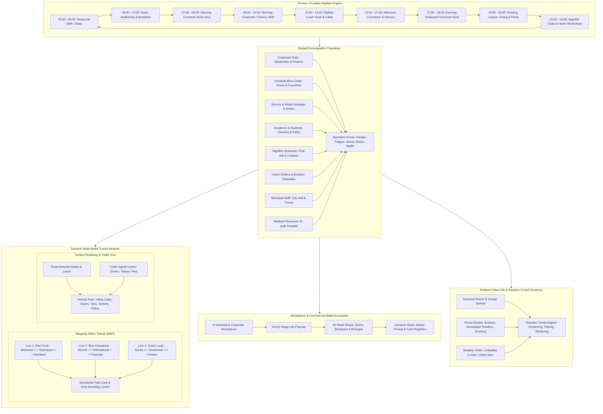

# Megacity Simulation, Daily Life & Bluepill Ecology Master Architecture Roadmap
*A Definitive Systems Engineering Blueprint for Living Civilian Demographics, Circadian Daily Routines, Work & Commerce Economies, Dynamic Urban Transit (Metro Subway & Road Traffic), and Emergent Urban Ecology in The Matrix Online*

---



---

## 1. Executive Summary & Vision

In *The Matrix Online*, the Megacity is not a backdrop—it is a simulated reality designed by the Architect to keep billions of plugged-in human minds unaware of their enslavement. For this illusion to hold, civilian life must exhibit the vibrant, chaotic, yet routine rhythm of a living modern metropolis.

The **Megacity Simulation & Daily Life Engine** delivers an autonomous, interconnected urban simulation operating directly within the server core. It unifies:
1. **Bluepill Pedestrian Demographics**: Hundreds of autonomous civilian agents driven by OCEAN psychological models and biometric needs (hunger, fatigue, stress, income).
2. **24-Hour Circadian Radiant Schedule**: Strict chronological schedules driving citywide flows from early-morning commuter jams to midday dining rushes and midnight clubbing.
3. **Corporate Workplaces & Commercial Retail**: Fully modeled office towers, industrial docks, fabrication foundries, cafes, high-end boutiques, diners, and pharmacies with stock replenishment and economic transactions.
4. **Multi-Modal Urban Transit**: Functional subways with scheduled trains traversing 3 major lines, complete with passenger boarding/alighting cycles, alongside surface street traffic with traffic light cycles, yellow cabs, municipal buses, and delivery vans.
5. **Emergent Crowd Reactivity & Ambient Life**: Pedestrians deploying umbrellas in the rain, sharing rumors of recent gang shootouts or vigilante raids, busking in plazas, calling from payphones, and reacting dynamically with stampede fleeing and shop lockdowns during violent crises.

---

## 2. Demographic Archetypes & Biometric Drives

### 2.1 Demographic Archetypes
Civilians are divided into eight core demographic archetypes, each with distinct OCEAN personality traits, work locations, leisure preferences, and commute behaviors:

| Archetype | Primary District | Key Workplaces | Preferred Venues | Typical OCEAN Profile |
| :--- | :--- | :--- | :--- | :--- |
| **Corporate Suit** | Downtown (2) | Metacortex, Financial Plaza | G-Bistro, Richland High Fashion | O:0.4, C:0.85, E:0.55, A:0.45, N:0.40 |
| **Industrial Blue-Collar** | Slums (1) | Pier 44 Docks, Creston Foundry | Morrell Noodle Bar, Tabor Corner | O:0.3, C:0.75, E:0.45, A:0.60, N:0.35 |
| **Service & Retail Worker** | All Districts | Bodegas, Diners, Boutiques | Local Cafes, Tabor Park | O:0.5, C:0.70, E:0.75, A:0.80, N:0.50 |
| **Academic & Student** | Downtown / Intl | University, Data Archives | Sakura Gardens, Coffee Shops | O:0.85, C:0.50, E:0.40, A:0.65, N:0.60 |
| **Nightlife Hedonist** | International (3) | Unemployed / Freelance | Club Hel, Club Chateau, Neon | O:0.80, C:0.25, E:0.90, A:0.50, N:0.30 |
| **Urban Drifter** | Slums (1) | None / Street Busking | Park Benches, Subway Terminals | O:0.65, C:0.20, E:0.35, A:0.40, N:0.70 |
| **Municipal Civil Servant** | Richland (4) | Richland Civic Administration | Richland Artisan Bakery | O:0.35, C:0.90, E:0.45, A:0.55, N:0.30 |
| **Medical Personnel** | International (3) | St. Jude Municipal Hospital | St. Jude Pharmacy, Cafeterias | O:0.60, C:0.85, E:0.60, A:0.85, N:0.45 |

### 2.2 Biometric Drives & Motivation Math
Each civilian computes dynamic internal urges that guide their daily decisions:
* **Hunger ($H \in [0, 1]$)**: Increases linearly over time ($\Delta H = +0.08 / \text{hour}$). When $H > 0.65$, civilian prioritizes dining at a restaurant or bodega. Consuming food restores $H \to 0.0$ and deducts Info credits.
* **Fatigue ($F \in [0, 1]$)**: Increases during work and walking ($\Delta F = +0.07 / \text{hour}$). When $F > 0.80$, civilian heads to their assigned residential apartment to sleep.
* **Social Need ($S_n \in [0, 1]$)**: Increases for extroverts ($\Delta S_n = +0.05 \cdot E / \text{hour}$). Drives movement to parks, nightclubs, and initiates proximity gossip.
* **Stress / Anxiety ($\sigma \in [0, 1]$)**: Spikes rapidly during nearby gunfights, crimes, and Matrix anomalies ($\Delta \sigma = +0.60 \cdot N$). Decays slowly in tranquil areas ($-\Delta \sigma = 0.05 \cdot A / \text{hour}$).
* **Disposable Income ($W_{\text{info}}$)**: Earned through workplace shifts, spent on food, retail clothing, and transit fare.

---

## 3. Circadian 24-Hour Radiant Routine Engine

The Megacity operates on a continuous 24-hour cycle synchronized with `WeatherSystem`:

```
24-Hour Circadian Schedule Flow
00:00 ──(Sleep / Night Shifts)──> 05:00 ──(Breakfast)──> 07:00 ──(Morning Commute)──> 09:00
  │                                                                                      │
  ▼                                                                                      ▼
24:00 <──(Nightlife / Wind-down)── 22:00 <──(Evening Leisure)── 19:00 <──(Evening Commute)── 17:00 <──(Work Shift)
```

### Schedule State Machine
1. `SCHEDULE_SLEEPING` (00:00 - 05:00): Assigned to home apartment. Civilian remains inactive or in restorative rest.
2. `SCHEDULE_BREAKFAST` (05:00 - 07:00): Civilians awaken, visit neighborhood diners (Morrell Noodle Bar, Richland Bakery) or prepare for work.
3. `SCHEDULE_COMMUTE_TO_WORK` (07:00 - 09:00): Rush hour! Pedestrian sidewalk density triples. Subways and roadway vehicles experience peak capacity.
4. `SCHEDULE_WORKING` (09:00 - 12:00 & 13:30 - 17:00): Civilians occupy workplaces. Production output accumulates, hourly wages credit to personal balances.
5. `SCHEDULE_LUNCH` (12:00 - 13:30): Mass exodus from office towers to diners, bistros, food carts, and public park benches.
6. `SCHEDULE_COMMUTE_HOME` (17:00 - 19:00): Evening rush hour. Trains packed outbound toward residential districts.
7. `SCHEDULE_SHOPPING` & `SCHEDULE_DINING` (19:00 - 22:00): High-end shopping in Richland, dining in Downtown, strolls in Sakura Gardens.
8. `SCHEDULE_NIGHTLIFE` (22:00 - 02:00): Clubbers and drifters congregate at Club Hel, Club Chateau, and subterranean dance floors.

---

## 4. Workplaces, Corporate Economy & Retail Commerce

### 4.1 Major Megacity Workplaces
The server models eight major corporate and industrial employers:
1. **Metacortex Headquarters** (Downtown, District 2): Corporate software development, cubicle desks, executive suites.
2. **Corrington Financial Plaza** (Downtown, District 2): Banking vault, currency trade floors, high security.
3. **Pier 44 International Docks** (Slums Waterfront, District 1): Cargo cranes, container yards, freight rail connections.
4. **Creston Heavy Industrial Foundry** (Slums, District 1): Blast furnaces, metal stamping, maintenance depots.
5. **St. Jude Municipal Hospital** (International, District 3): Emergency trauma wing, intensive care, pharmacology labs.
6. **Richland Civic Administration Center** (Richland, District 4): City municipal halls, urban planning, records registry.
7. **Morrell Textile & Assembly Works** (Slums, District 1): Manufacturing floors, synthetic clothing fabrication.
8. **OmniGlobal Data Routing Center** (Downtown, District 2): Server racks, optic fiber trunks, system communications.

### 4.2 Retail Shops, Diners & Bodegas
Ten fully functional commercial establishments process transactions, maintain inventories, and respond to local economic tension:

| Shop Name | District | Category | Key Items & Services | Opening Hours |
| :--- | :--- | :--- | :--- | :--- |
| **Morrell Noodle & Dim Sum** | Slums (1) | Food / Dining | Hot Pork Buns, Noodle Bowls, Green Tea | 05:00 - 02:00 |
| **G-Bistro Continental** | Downtown (2) | Fine Dining | Executive Steaks, Vintage Wine, Espresso | 11:30 - 23:00 |
| **Le Vrai Haute Cuisine** | International (3) | Luxury Dining | Caviar, Truffle Pastas, Champagne | 18:00 - 01:00 |
| **Tabor Corner Bodega** | Slums (1) | Convenience | Sodas, Newspapers, Cigarettes, Snacks | 24 Hours |
| **Metacortex Electronics** | Downtown (2) | Technology | Data Disks, Signal Repeaters, Cyber-Tools | 09:00 - 20:00 |
| **Richland Haute Boutique** | Richland (4) | Luxury Retail | Onyx Trenchcoats, Mirrored Shades, Suits | 10:00 - 21:00 |
| **St. Jude Pharmacy** | International (3) | Medical / Stims | Medkits, Bandages, Adrenaline Ampoules | 24 Hours |
| **Westview Surplus Supply** | Slums (1) | Hardware | Lockpicks, Copper Wiring, Tool Kits | 08:00 - 18:00 |
| **Richland Artisan Bakery** | Richland (4) | Cafe / Bakery | French Croissants, Artisan Latte, Baguettes | 06:00 - 18:00 |
| **Downtown Terminal Pawn** | Downtown (2) | Pawn & Trade | Second-hand Code, Vintage Watches, Gold | 10:00 - 19:00 |

---

## 5. Dynamic Urban Transit System (Subways & Road Traffic)

### 5.1 Megacity Metro Transit (MMT) Subway Network
The underground rapid transit system operates 3 lines interconnecting all four districts:
* **Line 1 (Red Line - Main Trunk)**:
  * Route: Westview Slums Terminal $\leftrightarrow$ Downtown Central Station $\leftrightarrow$ Richland Concourse
  * Schedule: 90-second round-trip headway, 15-second dwell time for passenger boarding.
* **Line 2 (Blue Line - East Crosstown)**:
  * Route: Morrell Sump $\leftrightarrow$ International Concourse $\leftrightarrow$ Corrington Financial Center
  * Schedule: 110-second round-trip headway.
* **Line 3 (Green Line - Waterfront Loop)**:
  * Route: Pier 44 Docks $\leftrightarrow$ Downtown Park $\leftrightarrow$ Sakura Gardens $\leftrightarrow$ Creston Tenements
  * Schedule: 130-second continuous orbital transit.

**Boarding & Alighting Mechanics**:
* Civilians calculate the fastest route to their work or leisure destination.
* When distance exceeds 800m, pedestrian heads to the nearest subway entrance, enters the waiting queue on the platform, boards the train when doors open, rides to the destination station, and alights onto the surface street.

### 5.2 Surface Roadway & Traffic Simulation
* **Intersections & Traffic Light Cycles**:
  * Four-way intersections equipped with cycling traffic signals: Green (20s) $\to$ Yellow (4s) $\to$ Red (24s).
  * Automated queuing and lane allocation preventing gridlock.
* **Vehicle Fleet**:
  1. *Yellow Cabs (Taxis)*: Pick up hailing civilians, navigate to requested drop-offs.
  2. *Municipal Transit Buses*: Follow fixed circular routes stopping at street-level bus shelters.
  3. *Commercial Delivery Vans*: Transport goods between Pier 44 Docks and retail shops.
  4. *Civilian Sedans*: Commuter traffic flowing between residential zones and workplaces.
  5. *MMPD Police Cruisers*: Patrol beats; switch to sirens and code-3 emergency runs during active crimes.

---

## 6. Ambient Urban Life, Socialization & Reactive Crowds

### 6.1 Ambient Street Behaviors
Pedestrians do not merely walk—they perform context-sensitive ambient behaviors:
* Reading daily newspapers on park benches.
* Making payphone calls in phone booths (spawning auditory chatter).
* Street musicians busking with guitar cases on sidewalk corners.
* Window shopping at boutique storefronts.
* Huddling in alleyways for smoke breaks.

### 6.2 Dynamic Rumor & Gossip Spread
When significant server events occur, they enter the ambient rumor pool:
* Syndicate turf wars and drive-bys.
* Frank Castle vigilante decapitations of cartel bosses.
* MMPD SWAT raids and 10-code radio chatter.
* Weather skybox anomalies and code rain glitches.
Pedestrians within conversational radius share these rumors. High-Openness civilians spread news faster; High-Agreeableness listeners nod and update their belief state.

### 6.3 Reactive Crowd Dynamics & Threat Panic
When violence erupts (e.g., player combat, Underworld emergent crimes):
* **Panic Sphere**: Triggered within 50-150m of gunshot or explosion.
* **Panic Responses by OCEAN**:
  * *High Neuroticism ($N > 0.6$)*: Screams, drops held items, sprints frantically toward nearest subway shelter or shop doorway.
  * *High Conscientiousness ($C > 0.6$)*: Pulls out cell phone, places emergency call to 911 (spawning MMPD dispatch), guides others to exits.
  * *Low Neuroticism ($N < 0.35$)*: Crouches behind concrete barriers or vehicles, maintaining visual overwatch.
* **Weather Reactivity**:
  * Rain begins $\to$ Civilians deploy umbrellas, increase walk speed by 30%, or take shelter under awnings.
  * Glitch Storm $\to$ Civilians experience temporary code disorientation, looking around in bewilderment.

---

## 7. Multi-Tier Level of Detail (LOD) Performance Model

To simulate thousands of living citizens without bottlenecking the 30Hz server tick loop:

| Tier | Radius from Players | Processing Rate | Simulation Fidelity |
| :--- | :--- | :--- | :--- |
| **Tier 1: Active Viewport** | $0 - 100\text{ m}$ | 30 Hz (Every tick) | Full 3D NavMesh steering, obstacle avoidance, raycasts, face-to-face gossip, real-time panic physics. |
| **Tier 2: Approach Area** | $100 - 500\text{ m}$ | 2 Hz (Every 500ms) | Coarse 2D sidewalk vector interpolation, scheduled waypoint hops, batched proximity checks. |
| **Tier 3: Macro Simulation** | $> 500\text{ m}$ | 0.1 Hz (Every 10s) | Pure mathematical transit schedules, statistical production accumulation, instant arrival upon station timetable tick. |

---

## 8. Implementation Roadmap Phases

```
Roadmap Execution Phases
Phase 1: Demographics & Biometric Architecture ───> [PASS] Core Agent Types & Drives
Phase 2: Circadian Radiant Routine Engine ────────> [PASS] 24-Hour Schedule Flow
Phase 3: Workplaces & Corporate Economy ──────────> [PASS] 8 Workplaces & Shifts
Phase 4: Commercial Retail & Shops ───────────────> [PASS] 10 Stores & Inventories
Phase 5: Megacity Metro Transit (Subways) ────────> [PASS] 3 Lines & Boarding Logic
Phase 6: Surface Roadway Traffic ─────────────────> [PASS] Traffic Lights & Vehicles
Phase 7: Ambient Life, Rumors & Reactive Panic ───> [PASS] Crowds & Gossip
Phase 8: Persistence, Telemetry & Headless Suite ──> [PASS] Verification Test Suite
```

* **Phase 1: Bluepill Pedestrian Demographics & Biometrics**: Define `CivilianArchetype`, OCEAN traits, drives (`hunger`, `fatigue`, `social`, `stress`, `wallet`).
* **Phase 2: Circadian Radiant Routine Engine**: Implement 24-hour cycle state machine (`Sleeping`, `Breakfast`, `Commuting`, `Working`, `Lunch`, `Leisure`, `Nightlife`).
* **Phase 3: Workplaces & Employment Economy**: Implement the 8 major employers, shift assignments, productivity outputs, and wage distribution.
* **Phase 4: Commercial Retail & Shop System**: Implement the 10 retail stores, dynamic price elasticity, stock replenishment, and transaction execution.
* **Phase 5: Megacity Metro Transit (MMT)**: Implement the 3 subway lines, stations, scheduled train progression, and passenger boarding/riding/alighting.
* **Phase 6: Surface Roadway Traffic Network**: Implement intersection traffic light controllers, vehicle navigation, and commuter transit.
* **Phase 7: Ambient Urban Life, Rumors & Reactive Crowds**: Implement street activities, proximity rumor propagation, umbrella deployment, and gunshot panic.
* **Phase 8: JSON Persistence, Server Integration & Automated Test Suite**: Save/load system state, hook into `GameServer` loop and console commands, and build a 30+ assertion test suite.
