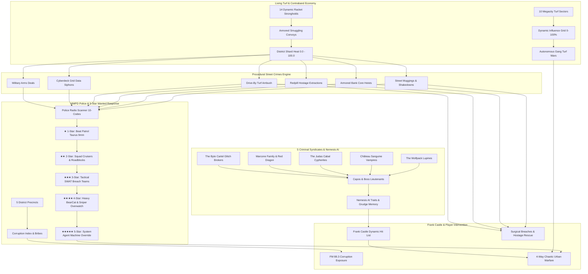
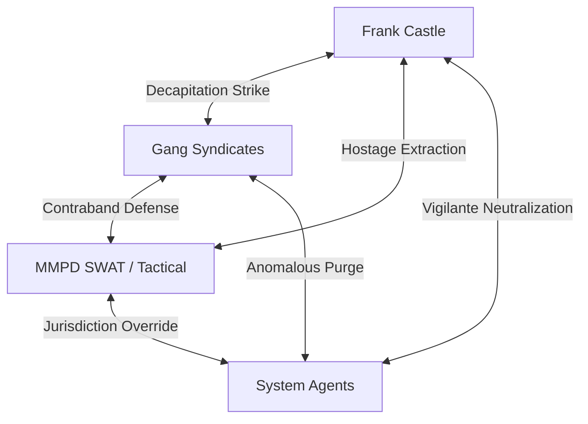

# Megacity Underworld, Ecosystems, Emergent Crimes, Gangs & Police Master Architecture Roadmap
*A Definitive Systems Engineering Blueprint for Living Criminal Syndicates, Dynamic Gang Turf Wars, Procedural Street Crimes, and Municipal Police (MMPD) Escalation in The Matrix Online*

---



---

## 1. Executive Systems Summary

In the Megacity simulation, control is perpetually fractured. Beyond the ideological war between Zion Redpills and the Machines, human society and exiled programs generate an autonomous criminal ecosystem. Syndicates seize city blocks, run synthetic sensory code stills, extort businesses, hijack power lines, and bribe municipal authorities.

To simulate an authentic, responsive cyber-noir urban metropolis, the server implements four interlocking dynamic pillars:
1. **The Criminal Underworld & Nemesis Lieutenants**: Five distinct cartels controlling physical racket nodes, contraband convoys, and personalized Nemesis bosses.
2. **Gang Turf Ecosystem**: Territorial partitioning across Megacity where gangs contest, raid, and shift sector control autonomously.
3. **Emergent Crimes Engine**: Dynamic high-stakes procedural crimes (hostages, depository heists, drive-bys) that evolve in real time, triggering pedestrian panic and police intervention.
4. **Megacity Metropolitan Police Department (MMPD)**: A fully modeled municipal law enforcement response system with 5-star wanted levels, procedural 10-code radio dispatches, precinct evidence lockers, and a deep crooked badge / Internal Affairs investigation loop.
5. **Frank Castle (The Punisher) Integration**: Frank Castle stalks, breaches, and decapitates these syndicates while rescuing hostages and exposing dirty cops via pirate radio broadcasts.

---

## 2. The 5 Major Crime Syndicates

```
Megacity Crime Cartels & Faction Matrix
├── 1. The Wolfpack (Merovingian Lupines)
│   ├── Territory: Westview Slums, Morrell Sump, Canal Waterfront
│   ├── Business: Illegal code fight pits, extortion shakedowns, body harvesting
│   └── Doctrine: Pack lunges, feral melee regeneration, pincer assaults
│
├── 2. Château Sanguine (Vampire Aristocracy & Le Vrai)
│   ├── Territory: Downtown Penthouses, Club Hel VIP lounges, Richland
│   ├── Business: High-end blackmail, memory siphoning, forged RSI credentials
│   └── Doctrine: Phase-shifting evasion, ultrasonic shrieks, silenced handguns
│
├── 3. The Judas Cabal (Cypherite Turncoat Front)
│   ├── Territory: Financial Towers, Data Switching Hubs, Park East High-Rises
│   ├── Business: Redpill bounties, Machine technology trafficking, node sabotage
│   └── Doctrine: Barrett .50 Cal sniper overwatch, optical cloaking, EMP traps
│
├── 4. The Marcone Family & Red Dragon (Corrupt Human Mobs)
│   ├── Territory: Pier 44 International Docks, Freight Terminals, Chop Shops
│   ├── Business: Military AP weapons trafficking, stolen vehicle smuggling, racketeering
│   └── Doctrine: Heavy machine guns, armored sedans, overwhelming squad numbers
│
└── 5. The Byte Cartel (Rogue Exile Glitch Brokers)
    ├── Territory: Abandoned Subway Tunnels, Industrial Foundry Ducts
    ├── Business: Synthetic narcotics ("Static Dust", "Blue Bliss"), uncompiled memory exploits
    └── Doctrine: Proximity EMP minefields, deployable turrets, suicide overload drones
```

---

## 3. Dynamic Racket Strongholds & Supply Chain Logistics

Rackets are not static spawn points—they are active nodes within an interconnected economic simulation.

```
Racket Supply Line Topology
[Pier 44 Munitions Depot] ────────(Armored Van Convoy)───────> [Club Hel Penthouse]
         │                                                            │
   (Subway Courier)                                             (Dead-Drop)
         ▼                                                            ▼
[Industrial Foundry Lab] ────────────────────────────────────> [Slums Extortion Hub]
```

### Racket Typology & Defenses
| Racket Type | Syndicate Owner | Primary Locations | Yield | Defense Systems | Decapitation Result |
| :--- | :--- | :--- | :--- | :--- | :--- |
| **Code Still** | Byte Cartel | Morrell Sump, Foundry Sub-7 | "Static Dust" Narcotic | Gas vents, laser tripwires, EMP mines | Vat detonation, area decontamination |
| **Munitions Depot** | Marcone Family | Pier 44 Docks, Freight Rail | AP Ammo, RPGs, C4 satchels | Blast doors, sniper nests, guard dogs | Armory explosion, loot resupply |
| **Nightclub Front** | Château Sanguine | Club Hel, Le Vrai Downtown | Blackmail dossiers, memory keys | Phase bodyguards, CCTV surveillance | Skylight breach, ledger broadcast |
| **Chop Shop** | Red Dragon | Industrial Garages, Slums | Armored SUVs, modified engines | Hydraulic traps, barricaded perimeter | Vehicle bay torching, convoy disruption |
| **Extortion Hub** | The Wolfpack | Westview Tenements | Cash tribute, captive redpills | Feral lupines, barbed wire fences | Breach and clear, captive liberation |
| **Black Clinic** | Marcone Family | St. Jude's International | Unregistered cyber-stims | Sentry turrets, toxic defoliant traps | Supply seizure, medical cache raid |

### Racket Lifecycle State Machine
```
[Incubating] ──(Investment)──> [Active] ──(Profit / Fortification)──> [Fortified]
                                   │                                      │
                                   └──────────────(Castle Raid)───────────┘
                                                      │
                                                      ▼
                                            [Under Siege by Castle]
                                                      │
                                             (Defenses Broken)
                                                      ▼
                                           [Decapitated (Cooldown)]
                                                      │
                                            (Timer: 120-180s)
                                                      ▼
                                           [Re-seeding / Active]
```

---

## 4. Street Nemesis AI & Boss Lieutenants

Each syndicate deploys procedural Boss Lieutenants with unique personality traits, combat behaviors, and tactical memories:

### Procedural Trait Pool
* `Ironclad`: Heavy Kevlar armor with ceramic ballistic plates; immune to headshot one-shots.
* `Hostage Taker`: Immediately grabs closest civilian or captive redpill as a human shield.
* `Cowardly Tactician`: Sprints for escape tunnels while commanding bodyguards to suppress pursuers.
* `Pyromaniac`: Deploys incendiary grenade launchers, coating rooms in persistent fire.
* `Phase Glitcher`: Teleports 10 meters when struck, leaving behind blinding flashbang after-images.
* `Blood Frenzy`: At under 30% HP, melee attack speed doubles and damage increases by 75%.
* `Sniper Overwatch`: Perches on elevated scaffolding, targeting threats from 80+ meters with armor-piercing rounds.

### Nemesis Memory & Retaliation Loop
1. **Grudge Accumulation**: If Frank Castle or a player eliminates a lieutenant's enforcers, the boss's grudge score increases (+25 per kill).
2. **Underworld Bounties**: When grudge exceeds threshold, the lieutenant places a contract on the vigilante's head.
3. **Hit Squad Ambush**: 4–6 elite hunters intercept the player or Castle at safehouses or in transit.

---

## 5. Living Gang Turf Ecosystem & Territory Grid

Megacity is partitioned into **10 distinct territorial sectors** (2 per district). Each sector tracks real-time influence (0.0% to 100.0%) for all 5 syndicates.

```
Megacity Turf Map
├── District 1: The Slums
│   ├── Sector 1: Westview Tenement Strip (Controlling: Wolfpack Lupines)
│   └── Sector 2: Morrell Industrial Canal (Controlling: Byte Cartel)
│
├── District 2: Downtown
│   ├── Sector 3: Club Hel Entertainment Strip (Controlling: Château Sanguine)
│   └── Sector 4: Financial District Data Switch (Controlling: Judas Cabal)
│
├── District 3: International
│   ├── Sector 5: Pier 44 Deepwater Cargo Terminal (Controlling: Marcone Family)
│   └── Sector 6: International Chop-Shop Corridor (Controlling: Marcone / Red Dragon)
│
├── District 4: Industrial
│   ├── Sector 7: Foundry Sub-Level 7 Ducts (Controlling: Byte Cartel)
│   └── Sector 8: Freight Rail Shunting Yard (Controlling: Marcone Family)
│
└── District 5: Park East
    ├── Sector 9: Conservatory Glasshouses (Controlling: Judas Cabal)
    └── Sector 10: Reservoir Pumping Tunnels (Controlling: Château Sanguine)
```

### Dynamic Turf War Mechanics
* **Triggering Incursions**: Rival gangs periodically launch turf incursions into adjacent sectors.
* **Skirmish Resolution**: Gunfights erupt on street corners. The victor gains +25% influence while the loser drops by -20%.
* **Control Shift**: When an attacking faction's influence surpasses the incumbent's, the sector's controlling flag flips, shifting guard uniforms, black market prices, and ambient music.

---

## 6. Emergent Street Crimes Engine

Crimes are generated procedurally based on district Shard Heat, pedestrian traffic, and syndicate dominance:

```
Emergent Crime Lifecycle
[Emerging] ──(Lookout Spot)──> [In Progress] ──(Timer 50%)──> [Escalated] ──(Timeout)──> [Escaped]
                                     │                              │
                                     ├──(MMPD Responds)─────────────┤
                                     │                              ▼
                                     └──(Castle Intervenes)─> [Neutralized]
```

### Procedural Crime Catalog
1. **Street Shakedown & Mugging**: Low-tier thugs extorting pedestrians in alleyways. Quick response window (30s).
2. **Armored Bank Core Heist**: Heavy crew breaching an automated cash depository. Includes 2–4 hostages and high credit payoff.
3. **Redpill Hostage Extraction**: Cartel operatives kidnapping a Zion operative for memory extraction. High-risk breach.
4. **Gang Turf Drive-By Ambush**: Two vehicles strafing a rival syndicate hideout with submachine guns.
5. **Illegal Code Contraband Dead-Drop**: Midnight exchange of military code fragments at a subway vent.
6. **Grid Cyberdeck Data Siphon**: Exile hackers splicing into municipal power switching transformers.
7. **Military Weapons Arms Deal**: Dockside exchange of heavy munitions and rocket launchers.

---

## 7. Metropolitan Police Department (MMPD) & 5-Star Wanted Escalation

The Megacity Metropolitan Police Department (MMPD) operates autonomously, responding to 911 calls, crime scenes, and gang shootouts.

```
MMPD 5-Star Wanted Escalation Matrix
├── ★ 1-Star: Beat Patrol
│   ├── Units: 2 patrol officers in standard cruisers
│   ├── Armament: Taurus 9mm handguns, batons, body armor
│   └── Tactics: Perimeter containment, calling for municipal backup
│
├── ★★ 2-Star: Cruiser Pursuit Squad
│   ├── Units: 2-3 squad cars + canine unit
│   ├── Armament: Remington 870 12-gauge shotguns, Colt AR-15s
│   └── Tactics: Roadblock cordons, PIT maneuvers, spike strip deployment
│
├── ★★★ 3-Star: Tactical SWAT Breach Team
│   ├── Units: Heavy SWAT tactical van with 6-man team
│   ├── Armament: M4A1 carbines, MP5 submachine guns, ballistic shields, flashbangs
│   └── Tactics: Dynamic room breach, tear gas dispersal, sniper overwatch
│
├── ★★★★ 4-Star: Heavy Tactical BearCat Assault
│   ├── Units: Lenco BearCat armored vehicle + Air Support helicopter
│   ├── Armament: Heavy armor-piercing machine guns, .50 Cal Barrett rooftop snipers
│   └── Tactics: Full district lockdown, searchlights, aggressive suppression fire
│
└── ★★★★★ 5-Star: System Agent Override
    ├── Units: System Agents (Agent Gray, Agent Pace, Agent Skinner)
    ├── Armament: Superhuman strength, bullet deflection, anomalous deletion algorithms
    └── Tactics: Override all municipal communications, total anomalous purge
```

### Police Radio Scanner 10-Codes & Mutual Aid Protocols
* `10-31`: Crime in progress (1-Star response)
* `10-71`: Shots fired / active firearm engagement (2-Star response)
* `10-99`: Officer in distress / high-risk warrant (3-Star SWAT response, or Mutual-Aid overflow)
* `10-100`: Hostile civil riot / heavy tactical containment (4-Star BearCat response)
* `10-00`: Code Black simulation anomaly / Agent override (5-Star Agent purge)

### Precinct Unit Saturation & Mutual Aid Protocol
Each municipal precinct maintains a rapid-response patrol fleet (`maxPatrolUnits = 8`). When dispatches surge under high Shard Heat or simultaneous street crimes:
1. **Roster Depletion**: Each active dispatch locks 1 patrol squad. If all 8 units are committed, the local precinct enters **Saturation State**.
2. **Mutual Aid Escalation**: Overflow emergency calls flag `isMutualAid = true`, automatically routing tactical squads from adjacent district divisions with extended arrival windows (12s vs 8s) and priority radio broadcasts.
3. **Autonomous Unit Replenishment**: Every 15 seconds, off-duty and returning squads replenish the active roster back to full readiness.

---

## 8. Precinct Corruption, Evidence Vaults & Internal Affairs System

Megacity's five police precincts suffer from differing levels of syndicate corruption:

| Precinct | District | Commander | Corruption Index | Corrupt Faction Tie | Modus Operandi |
| :--- | :--- | :--- | :--- | :--- | :--- |
| **1st Precinct** | Slums | Captain Marcus Vance | 35% | The Wolfpack | Turning a blind eye to alley fight rings |
| **Central Metro** | Downtown | Captain Jonathan Cross | 65% | Château Sanguine | Blackmailed with VIP club memory recordings |
| **Harbor Division**| International | Captain Frank 'Bull' O'Malley| 80% | Marcone Family | Smuggling dock contraband; delayed response |
| **Industrial Div.**| Industrial | Captain Viktor Ramos | 45% | Byte Cartel | Selling confiscated electronics back to cartels |
| **Uptown 5th** | Park East | Captain Evelyn Reed | 15% | Judas Cabal | Minor infiltration; largely uncorrupted |

### Dynamic Corruption & Clean Leadership Lifecycle
1. **Active Syndicate Graft**: As long as syndicate rackets in the district remain active and profitable, dirty officers receive regular kickbacks, raising precinct corruption (+0.25% per minute per active racket).
2. **Crooked Stand-Downs**: In corrupt precincts (corruption > 50%), responding officers roll to intentionally stand down at crime scenes, allowing cartel suspects to escape while skimming 15% of stolen loot into dirty slush funds.
3. **The Pirate Radio Leak**: Frank Castle or players leak incriminating ledgers over **FM 88.3 Pirate Radio**.
4. **Internal Affairs Purge**: Internal Affairs arrests the corrupt captain, immediately reducing corruption to 0.0%.
5. **Clean Leadership Vigilance Window**: Clean interim leadership maintains a 5-minute immunity window (`cleanLeadershipTimerMs`) during which cartel bribes are flatly rejected. After 5 minutes, if syndicates still control adjacent rackets, low-level corruption pressure gradually resumes.
6. **Evidence Vault & Holding Cells**: Clean police interventions apprehend suspects into precinct holding cells and seize contraband into evidence lockers. Inmates are processed and transferred to penitentiaries on a periodic 45-second cycle.

---

## 9. 4-Way Urban Warfare Engine

When Shard Heat exceeds **85.0%** and district wanted level reaches **4+ Stars**, the simulation triggers a **Four-Way Urban War**:



1. **Syndicate Goons**: Fire at both SWAT and System Agents to protect stash houses and contraband.
2. **MMPD Tactical SWAT**: Fight syndicate gunners while attempting to evacuate trapped civilians.
3. **System Agents**: Disregard local municipal authority, executing both criminals and vigilantes.
4. **Frank Castle**: Exploits the multi-sided chaos, using smoke and flashbangs to slip behind enemy lines, assassinate cartel lieutenants, and rescue innocent bystanders.

---

## 10. Player Progression & Underworld Careers

Players choose from four distinct gameplay pathways within the living Underworld:

```
Player Career Paths
├── The Vigilante Path (Allied with Frank Castle)
│   ├── Missions: Safehouse defense, convoy ambushes, hostage rescue, precinct exposés
│   ├── Reputation: Vigilante Karma
│   └── Rewards: Microchip AP ammunition, ballistic trench coats, Frank Castle call-in support
│
├── The Cartel Enforcer Path (Allied with a Crime Syndicate)
│   ├── Missions: Convoy protection, racket fortification, assassinating rival lieutenants
│   ├── Reputation: Syndicate Standing (Wolfpack, Château, Judas, Marcone, Byte)
│   └── Rewards: Vampire phase abilities, illicit cyber-stims, customized black-market sedans
│
├── The MMPD Detective Path (Law Enforcement Career)
│   ├── Missions: 911 dispatch response, crime scene evidence analysis, SWAT breach raids
│   ├── Reputation: MMPD Commendation Rank
│   └── Rewards: Police cruiser authorization, SWAT body armor, tactical flashbang equipment
│
└── The Corrupt Double Agent Path (Shifting Loyalties)
    ├── Missions: Leaking dispatch logs to cartels, taking kickbacks, sabotaging IA probes
    ├── Reputation: Underworld Black Market Favor
    └── Rewards: Forged police credentials, contraband laundering, illegal credit wealth
```

---

## 11. Technical Architecture & Data Schema

### Server-Side C++ Class Hierarchy
```
Reality/Source/
├── UnderworldManager.h/.cpp        // Core Underworld singleton, ecosystem & coordination
├── FrankCastleManager.h/.cpp       // Frank Castle 7-phase AI, Hit List & Hunt Loop
├── RadioDispatchSystem.h/.cpp      // Procedural scanner chatter, 10-codes & squelch audio
├── GameServer.cpp                  // 30Hz Simulation loop integration & ticking
└── ConsoleThread.cpp               // Operator debugging & control command suite
```

### Core Data Models
```cpp
// Turf Sector Model
struct TurfSector {
    uint32 sectorId;
    std::string name;
    uint32 districtId;
    LocationVector centerCoordinates;
    float radiusUnits;
    SyndicateFaction controllingFaction;
    float factionInfluence[5]; // Wolfpack, Chateau, Judas, Marcone, ByteCartel
    bool isContested;
    SyndicateFaction attackingFaction;
    uint32 turfWarTimerMs;
    uint32 totalSkirmishes;
};

// Emergent Crime Model
struct EmergentCrimeEvent {
    uint32 crimeId;
    EmergentCrimeType type;
    EmergentCrimeState state;
    uint32 districtId;
    LocationVector location;
    SyndicateFaction perpFaction;
    uint32 perpCount;
    uint32 hostageCount;
    float lootValue;
    uint32 durationMs;
    uint32 timeLimitMs;
    bool policeDispatched;
    bool castleIntervening;
    uint32 linkedDispatchId;
};

// Police Precinct Model
struct PolicePrecinct {
    uint32 precinctId;
    std::string name;
    uint32 districtId;
    LocationVector precinctLocation;
    float corruptionIndex;
    SyndicateFaction bribingFaction;
    std::string precinctCaptainName;
    bool isExposedByCastle;
    uint32 activePatrolUnits;
    uint32 maxPatrolUnits;
    uint32 holdingCellInmates;
    float confiscatedContrabandValue;
    uint32 cleanLeadershipTimerMs;
};

// Police Dispatch Call Model
struct PoliceDispatchCall {
    uint32 dispatchId;
    uint32 districtId;
    LocationVector sceneLocation;
    uint32 wantedLevelStars;
    PoliceUnitType respondingUnitType;
    std::string callsign;
    std::string tenCode;
    std::string dispatchChatter;
    bool isArrived;
    bool isCompromisedByCorruption;
    uint32 responseTimerMs;
    uint32 linkedCrimeId;
    uint32 respondingPrecinctId;
    bool isMutualAid;
};
```

---

## 12. 12-Phase Master Engineering Roadmap

```mermaid
gantt
    title Megacity Underworld & Police Engineering Phases
    dateFormat  YYYY-MM-DD
    section Phase 1-3: Core Crime
    P1: Rackets & Command Hierarchy        :done, p1, 2026-09-01, 20d
    P2: Contraband Supply & Convoys        :done, p2, 2026-09-21, 20d
    P3: Nemesis AI & Boss Traits           :done, p3, 2026-10-11, 20d
    section Phase 4-6: Gangs & Turf
    P4: Gang Turf Grid & Territory Wars    :active, p4, 2026-10-31, 20d
    P5: Emergent Street Crimes Engine      :p5, 2026-11-20, 20d
    P6: Pedestrian Panic & Hostage Systems :p6, 2026-12-10, 20d
    section Phase 7-9: Law Enforcement
    P7: MMPD 5-Star Wanted Escalation      :p7, 2026-12-30, 20d
    P8: Police Radio Scanner & 10-Codes    :p8, 2027-01-19, 20d
    P9: Precinct Corruption & IA Exposés   :p9, 2027-02-08, 20d
    section Phase 10-12: Warzone & Players
    P10: 4-Way Urban Warfare Simulation    :p10, 2027-02-28, 20d
    P11: Player Underworld Careers         :p11, 2027-03-20, 20d
    P12: Remaster UI Radar & Telemetry     :p12, 2027-04-09, 20d
```

### Detailed Phase Specifications

#### Phase 1: Rackets & Syndicate Command Infrastructure (Completed)
* 14 distinct underworld strongholds across all 5 districts.
* Full racket lifecycle: Incubating -> Active -> Fortified -> Decapitated.
* Defense health pools, security tiers, and dynamic goon counts.

#### Phase 2: Living Contraband Economy & Convoys (Completed)
* Smuggling routes moving narcotics, weapons, and forged code shards.
* Autonomous convoy vehicle simulation along road navmeshes.
* Interception points, spike strip booby traps, and cargo looting.

#### Phase 3: Nemesis AI & Boss Traits (Completed)
* 9 Boss Lieutenants across all 5 syndicates.
* Trait system: `Ironclad`, `Hostage Taker`, `Cowardly Tactician`, `Pyromaniac`, `Phase Glitcher`, `Blood Frenzy`, `Sniper Overwatch`.
* Grudge tracking and cartel bounties placed on Frank Castle and player vigilantes.

#### Phase 4: Gang Turf Grid & Dynamic Territory Wars (Completed)
* 10 Megacity Turf Sectors with percentage-based faction influence (0–100%).
* Autonomous gang incursions with live skirmish resolutions.
* Dynamic control flips shifting local ambient conditions and gang dominance.

#### Phase 5: Emergent Street Crimes Engine (Completed)
* 7 procedural crime types: Muggings, Bank Heists, Hostage Sieges, Drive-bys, Contraband Drops, Data Siphons, Arms Deals.
* Dynamic progression: Emerging -> In Progress -> Escalated -> Resolved / Escaped.
* Automatic 911 dispatch notification and vigilante radio scanner alerts.

#### Phase 6: Pedestrian Panic & Hostage Extraction (Completed)
* Civilian reaction state machines: running, screaming, reporting crimes.
* Hostage liberation mechanics awarding vigilante karma and experience.
* Evidence markers spawned at neutralized crime scenes.

#### Phase 7: MMPD 5-Star Wanted Escalation System (Completed)
* 1-Star (Beat Patrol) to 5-Star (System Agent Lockdown) escalation pipeline.
* Tactical AI: Squad cruisers, roadblocks, SWAT tear gas, BearCat armored assault.
* Integration with district Shard Heat and player infraction scores.

#### Phase 8: Police Radio Scanner & Procedural 10-Codes (Completed)
* Radio scanner chatter engine featuring authentic municipal 10-codes (`10-31`, `10-71`, `10-99`, `10-100`, `10-00`).
* Real-time audio squelch and callsign announcements across client channels.

#### Phase 9: Precinct Corruption & Pirate Radio Exposés (Completed)
* 5 Municipal Police Precincts with individual corruption indexes (0.0% to 100.0%).
* Crooked badge mechanics: delayed response times and cartel payoffs.
* Frank Castle investigation and pirate radio leaks purging corruption.

#### Phase 10: 4-Way Urban Warfare Simulation (Completed)
* Multi-faction combat coordination: Syndicates vs MMPD SWAT vs Frank Castle vs System Agents.
* Critical heat threshold (>85%) triggering full-district city warfare.

#### Phase 11: Player Underworld Careers & Reputation (Next Milestone)
* Underworld bounty boards in Club Hel and Slums dive bars.
* Career tracks: Vigilante Irregular, Cartel Enforcer, MMPD Detective, Rogue Corrupt Informant.
* Payphone network informant tip line on FM 88.3.

#### Phase 12: Remaster Client UI Radar & Underworld Telemetry (Next Milestone)
* Real-time tactical map layer showing contested turf sectors, active convoys, and emergent crimes.
* Scanner audio HUD widget with active 10-code ticker.
* Remaster telemetry export via `GenerateUnderworldStatusReport()`.

---

## 13. Operator Command Suite Reference

| Command | Arguments | Description |
| :--- | :--- | :--- |
| `underworldStatus` | None | Prints district-by-district heat, wanted levels, rackets, and active crimes |
| `underworldBossList` | None | Displays all 9 Cartel Lieutenants, traits, bounties, and grudge scores |
| `underworldRaid` | `<racketId>` | Orders Frank Castle to immediately launch an assault on a racket |
| `underworldSpawnConvoy` | `<factionId>` | Deploys an armed smuggling convoy across city streets |
| `underworldSetHeat` | `<district> <heat>` | Manually overrides district Shard Heat (0.0 to 100.0) |
| `underworldClearCooldowns`| None | Resets all decapitated racket cooldowns back to Active |
| `underworldTurfStatus` | None | Displays live gang turf ownership and influence percentages |
| `underworldTriggerTurfWar`| `<sectorId> <attackerFaction>` | Triggers a gang war incursion into a designated sector |
| `underworldSpawnCrime` | `<crimeType> <districtId>` | Spawns an emergent street crime (0=Mugging, 1=Bank, 2=Hostage...) |
| `underworldCrimesList` | None | Lists all active emergent crimes, hostage counts, and loot valuations |
| `policeStatus` | None | Displays all 5 MMPD precincts, corruption indexes, and captain names |
| `policeDispatch` | `<districtId> <stars>` | Dispatches MMPD units (1-5 stars) to scene coordinates |
| `policeExposeCorruption` | `<precinctId>` | Leaks corrupt precinct ledgers, purging dirty captain and corruption |
| `policeRestock` | `<precinctId>` | Restocks precinct patrol roster to full operational capacity (8 units) |
| `underworldSaveState` | None | Exports full living underworld ecosystem to UnderworldEcosystem.json |
| `underworldLoadState` | None | Restores full living underworld ecosystem from UnderworldEcosystem.json |

---

*“The police look the other way because they're paid to. The syndicates think they own the blocks because nobody stops them. But when the smoke clears, there’s only one law that matters: punishment.”* — Frank Castle
